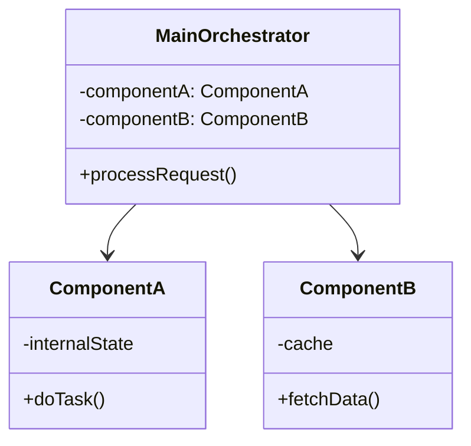
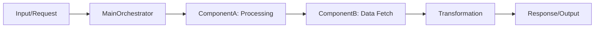

# Deep Codebase Research Skill

Systematic methodology for performing deep-dive technical research on open source codebases using **codemap** approach. Codemaps help understand codebases by showing how components work together: execution order of code and files, relationships between different components, component class diagrams, data flow diagrams, and algorithms described with concise code examples.

## When to use this skill

- User asks to **research how a GitHub project implements specific features**
- User asks to **compare architectural implementations across multiple projects**
- User asks to **create a codemap / code map** of a codebase or specific feature
- User wants **technical analysis with source code references and line numbers**
- User asks to **include community analysis from Chinese tech platforms** (juejin.cn, CSDN)
- User wants the output **organized as markdown documents ready for GitHub publication**

## Core Research Methodology - Codemap Approach

Follow this systematic process step-by-step:

---

### Step 1: Clarify Research Scope

1. **Identify the target codebase(s)**: Get the GitHub repository URL(s)
2. **Identify the specific features/architectural components** to research
3. **List all research questions/topics** that need coverage
4. Confirm output format and any special requirements with user if unclear

---

### Step 2: Parallel Research with Subagents

When researching **multiple codebases** or **multiple independent features**:

1. **Spawn a separate subagent** to research each codebase independently
2. Each subagent focuses on gathering information about its assigned codebase/feature
3. All research findings are collected and consolidated into the final documentation

For **single codebase**, research directly with the codemap process.

---

### Step 3: Gather Information

If the user provides **article links, text, or markdown**:
- First evaluate whether the information contained within is sufficient for creating the codemap
- If information is sufficient, directly use it to create the codemap
- If information is insufficient, proceed with the following gathering steps to supplement

All gathering approaches below share the **same actual goal**: collect the information needed to create the codemap document. Use them in this **priority order**:

1. **First Priority: Use DeepWiki MCP tools**
   - Use the DeepWiki MCP (Model Context Protocol) tools to query the repository
   - Focus on using the `ask_question` tool to ask specific technical questions about the feature implementation
   - Get structured repository documentation and find the correct source file locations
   - Locate the exact source files for each feature being researched
   - DeepWiki provides AI-generated documentation that helps quickly orient to the codebase structure

2. **Second Priority: Search for community analysis** (only articles from the past year):
   - Search juejin.cn and CSDN for technical articles about the codebase/feature
   - Keywords: `[project name] 架构分析`, `[project name] 源码解析`, `[project name] 实现原理`
   - Filter to keep only high-quality technical deep dives from the last 12 months

3. **Third Priority: Read source code directly** (only when above methods don't yield enough information):
   - Clone the repository **to `/tmp` directory** to avoid cluttering the working area
   - Identify key **components/classes**, entry points, data structures, and algorithms
   - Trace the **execution flow** from entry point through the relevant components
   - Map **dependencies and relationships** between components
   - Extract relevant code snippets (only the important parts, not entire files)

---

### Step 4: Filter and Curate References

For each article found:

- **KEEP**: Technical deep dives, code解读, architecture analysis, packet capture analysis
- **REMOVE**: Introductory tutorials, "getting started" guides, listicles (e.g., "GitHub trending daily picks"), news articles that just announce the project without technical content

Renumber citations after filtering to keep them consecutive.

---

### Step 5: Codemap Research Documentation

Write the research using **codemap methodology**. The goal is to show how different parts work together, not just what each part does in isolation.

#### Codemap Output Structure per Project

For each codebase researched, create a main research document following this structure:

```markdown
# [Project Name] Codemap: [Feature/Architecture Topic]

## Project Overview

Brief description of the project, official links.

**Official Resources:**
- GitHub Repository: [link](url)
- DeepWiki Documentation: [link](deepwiki-url)

---

## Codemap: System Context

High-level overview of how this feature fits into the overall system and where the key files are located.

**File Locations:**
- `path/to/main-file.go`: Entry point and main orchestration
- `path/to/component-a.go`: Handles X responsibility
- `path/to/component-b.go`: Handles Y responsibility

---

## Component Diagram

Use Mermaid class diagram to show the key components and their relationships:



---

## Data Flow Diagram

Use Mermaid to show the step-by-step data flow through the system:



---

## 1. [Topic / Component 1]

### Responsibility

What this component is responsible for in the system.

**Source Location:** `path/to/file.ts` (lines: Lxx-Lxx)

### Key Algorithm (Concise Code Snippet)

Show only the core logic:

```typescript
// From: path/to/file.ts:Lxx-Lxx
// Core algorithm for [feature]
function coreAlgorithm(input: Input): Output {
  // Key steps highlighted
  const processed = preprocess(input);
  const result = transform(processed);
  return postprocess(result);
}
```

### How it connects to other components

Describe the dependencies and interaction patterns.

---

## 2. [Topic / Component 2]

... (repeat structure for each key component)

---

## Execution Flow

Step-by-step walkthrough of the execution order from entry point to output:

1. **Entry point**: `FunctionName` in `file.go` receives the request
2. Step 1: Validation happens in...
3. Step 2: Control passes to...
4. Step 3: Data flows to...
5. Step 4: Result returns through...

---

## Key Design Choices & Summary

Overall architecture patterns used and why.

**Design Tradeoffs:**
- Pattern X was chosen over Y because...
- Performance characteristics...
- Scalability considerations...

## References

[^1]: GitHub Repository - https://github.com/...
[^2]: DeepWiki Documentation - https://deepwiki.com/...
[^3]: CSDN - Deep dive into [feature] architecture - https://blog.csdn.net/...
[^4]: 掘金 - [Project] source code analysis - https://juejin.cn/...
```

### Codemap Requirements

1. **Component Diagrams**: For each research point, use Mermaid class diagrams to visualize component relationships
2. **Data Flow**: Always include a data flow diagram showing how data moves through the system
3. **Concise Code**: Algorithms described with brief code snippets (only the core logic, full code not needed)
4. **Execution Order**: Show the step-by-step execution flow from entry to exit
5. **Inter-component Relationships**: Explicitly document how components connect and interact
6. **Every claim has source**: Every key implementation point must have source file path + line numbers

---

### Step 6: Findings.md

Always maintain a `findings.md` file where you:
- Record interesting discoveries during research
- Note unexpected design patterns or behaviors
- Document surprising implementation choices
- Highlight similarities/differences with other implementations when comparing multiple projects
- Add insights that don't fit in the main codemap document

Example `findings.md` structure:

```markdown
# Research Findings

## [Project Name]

- Interesting observation 1 about implementation approach...
- Surprising finding: they chose to do X instead of the usual Y because...
- Performance optimization noticed at...

## [Another Project] (when comparing)

- Compared to [Project 1], this project uses a different approach...
```

---

### Step 7: Organize Output Structure

Organize the output in a clean directory structure. All documents can reference each other via Markdown links:

```
research-output/
├── README.md             # Project overview + comparison table if multiple projects
├── findings.md           # Raw research findings and observations
├── codemap/              # Main codemap documents directory
│   ├── project1-codemap.md
│   ├── project2-codemap.md
│   └── ...
└── docs/                 # Additional documentation (can be linked from main codemap)
    ├── topic1-details.md
    ├── topic2-details.md
    └── ...
```

**README.md** should include:
- Research project description
- List of what was researched
- Table comparing all codebases researched (if multiple) with links to detailed codemaps
- Key takeaways at a glance

---

### Step 8: Publish to GitHub

If user requests publication:

1. Initialize git repository locally
2. Add all files
3. Create commit with clear message
4. Use `gh` to create remote repository on GitHub
5. Push the main branch to remote
6. Provide the final repository URL to user

---

### Step 9: Cleanup Source Code

After research and publication is complete:

1. Delete the cloned repository source code directories from temporary working area
2. Delete any temporary project clones from `/tmp`
3. This keeps the working environment clean for future research

## Quality Guidelines

1. **Codemap first**: Always structure output to show how components work together, not just what each component does
2. **Visual diagrams**: Use Mermaid for component and data flow diagrams - makes relationships instantly clear
3. **Concise code**: Show only the core algorithm/key logic - don't dump entire files
4. **Source references**: Every major point has a file path + line number from the original repository
5. **References curation**: Remove low-quality introductory content, keep only technical analysis/deep dives
6. **Linked documentation**: Break large topics into separate markdown files and link them from the main codemap for better readability
7. **No speculation**: Only claim what's verifiable from source code or high-quality references
8. **Findings always**: Always capture interesting findings in findings.md, don't lose those insights

## Example Output Structure

See the example codemap structure above for reference. All output documents use standard markdown with Mermaid diagrams supported by GitHub.
