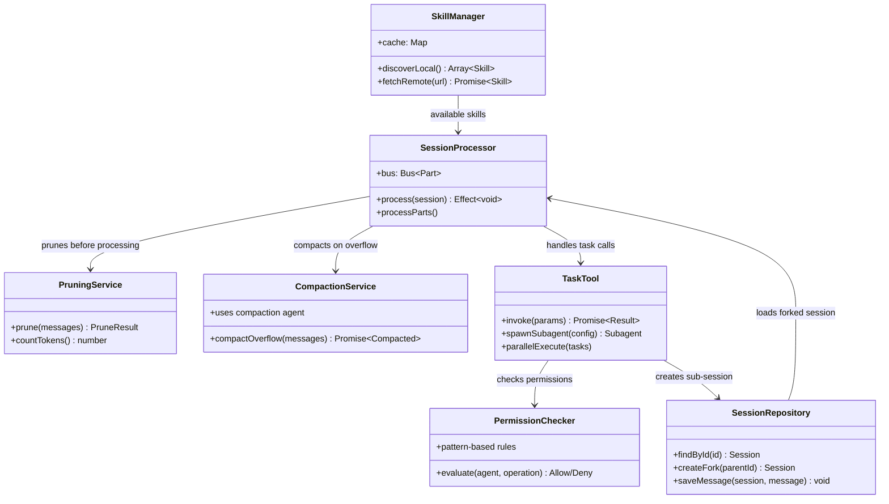

# OpenCode Codemap: Effect-TS based AI Programming Agent

This research analyzes **OpenCode** - an open-source AI programming agent similar to Claude Code, supporting 75+ AI providers, multi-platform (terminal, desktop, IDE extensions), with a local-first privacy design. Built with Effect-TS architecture in TypeScript.

## Research Scope

For each core module, we examined:
1.  **Architecture Overview** - How the module fits into the overall system
2.  **Data Structures and Type System** - Key types and interfaces
3.  **Complete Operation Flow** - Step-by-step process for key operations
4.  **Code Maps** - Key source files with line numbers and core algorithm snippets
5.  **Design Choices & Tradeoffs** - Why it was built this way

## Core Modules Researched

| Module | Architecture | Main Approach | Report |
|--------|--------------|---------------|--------|
| [Agent React System](codemap/agent-react-codemap.md) | ACP Protocol + Bus event system | Effect-TS based session processing with reactive part-based messages | [codemap/agent-react-codemap.md](codemap/agent-react-codemap.md) |
| [Context Management](codemap/context-compression-codemap.md) | Two-level pruning + compaction | Lightweight pruning first, LLM compaction only on overflow, structured summary template | [codemap/context-compression-codemap.md](codemap/context-compression-codemap.md) |
| [Sub-agent System](codemap/subagent-codemap.md) | Configuration-driven with task tool | Parallel execution via task tool, permission-based isolation, dynamic generation | [codemap/subagent-codemap.md](codemap/subagent-codemap.md) |
| [Skill Mechanism](codemap/skills-codemap.md) | Standard format + remote repos | Standard SKILL.md with remote repository pull support | [codemap/skills-codemap.md](codemap/skills-codemap.md) |
| [Session Isolation](codemap/session-isolation-codemap.md) | Relational Database + parent_id | SQL persistent storage with session forking via parent references | [codemap/session-isolation-codemap.md](codemap/session-isolation-codemap.md) |

## Summary Table - Key Characteristics

| Module | Storage Approach | Isolation | Key Feature |
|--------|------------------|-----------|-------------|
| **Agent React** | Effect-TS ACP Protocol | N/A | Reactive bus-based event processing |
| **Context Management** | Pruning + LLM compaction | N/A | Two-level approach - lightweight first |
| **Sub-agent** | Config-based with permissions | Per-subagent permission rulesett | Parallel execution, dynamic agent generation |
| **Skills** | SKILL.md + git cache | N/A | Remote repository support, versioning |
| **Session Isolation** | Relational DB (SQLite) | Per-session rows with parent_id | Full fork support, enterprise sharing |

## Overview: Architecture Summary

OpenCode is a **full-featured open-source AI programming agent** that:

1.  **ACP Protocol**: Uses Agent Client Protocol (ACP) for session processing with a reactive event bus
2.  **Two-level Context Management**: Lightweight pruning for regular token management, LLM compaction only when context overflows
3.  **Flexible Sub-agents**: Configuration-driven with independent permissions, supports parallel execution via the `task` tool
4.  **Remote Skills**: Supports pulling skills from remote git repositories with version management
5.  **Persistent Sessions**: Database storage with forking support for enterprise collaboration

### High-level Architecture Diagram



## Directory Structure

```
~/my-research/agents/opencode/
├── README.md                 # This file - overview and comparison
└── codemap/                  # Detailed codemap for each core module
    ├── agent-react-codemap.md     # ACP Protocol and reactive processing
    ├── context-compression-codemap.md  # Two-level pruning + compaction
    ├── subagent-codemap.md        # Task tool and parallel subagents
    ├── skills-codemap.md          # Skill discovery with remote support
    └── session-isolation-codemap.md  # Database sessions and forking
```

## Reading the Reports

Each codemap file follows the same structure:
1.  Module overview and official links
2.  Architecture diagrams (class and data flow)
3.  Complete storage/layout description
4.  Step-by-step operation flow for key operations
5.  Key source files with line numbers
6.  Core code snippets showing key algorithms
7.  Summary of design choices and tradeoffs

## References

[^1]: GitHub Repository - https://github.com/anomalyco/opencode
[^2]: DeepWiki Documentation - https://deepwiki.com/anomalyco/opencode
[^3]: CSDN - OpenCode:开源 AI Coding Agent 技术与行业分析 - https://blog.csdn.net/fyfugoyfa/article/details/157844145
[^4]: CSDN - OpenCode 深度解析:2025 年最强开源 AI 编程助手完全指南 - https://blog.csdn.net/Yunyi_Chi/article/details/157775001
[^5]: CSDN - AI 编程助手三强争霸:OpenCode vs Claude Code vs Kimi Code CLI 深度对比 - https://blog.csdn.net/qq_41797451/article/details/158039912
