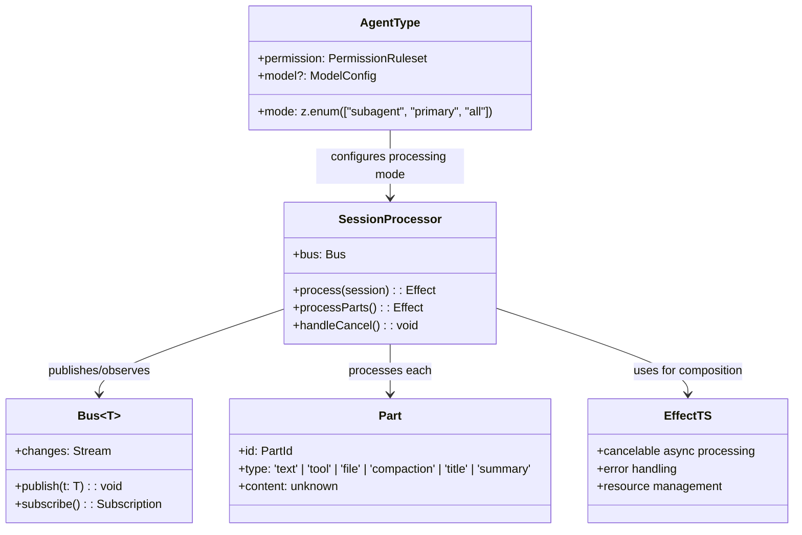
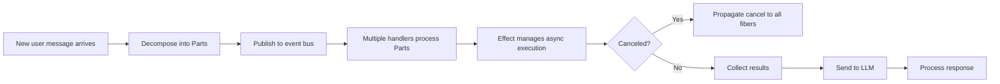

# OpenCode Agent React Codemap: ACP Protocol with Effect-TS Reactive Processing

## Overview

OpenCode uses the **ACP (Agent Client Protocol)** with a reactive bus-based event processing architecture built on Effect-TS. Messages are decomposed into multiple Part types (text, tool, file, compaction, etc.) and processed asynchronously with cancelability support.

**Official Resources:**
- GitHub Repository: [anomalyco/opencode](https://github.com/anomalyco/opencode)
- DeepWiki: https://deepwiki.com/anomalyco/opencode/packages/opencode/src/session
- Language: TypeScript with Effect-TS

---

## Codemap: System Context

```
packages/opencode/src/
├── agent/
│   ├── types.ts               # Agent type definitions (mode: primary/subagent/all)
│   └── config.ts              # Agent configuration parsing
├── session/
│   ├── processor.ts           # Main session processor
│   ├── bus.ts                 # Event bus for part processing
│   ├── types.ts               # Session and Part type definitions
│   ├── compaction.ts          # Compaction orchestration
│   └── summary.ts             # Summary generation
└── tools/
    └── task.ts                # Subtask/parallel agent execution
```

---

## Component Diagram



---

## Data Flow Diagram (ACP Processing)



---

## 1. Agent Type System

OpenCode has a **built-in agent type system** with mode classification:

```typescript
// From: packages/opencode/src/agent/types.ts
mode: z.enum(["subagent", "primary", "all"])
```

### Predefined Agents

| Agent | Mode | Purpose |
|-------|------|---------|
| `build` | primary | Default agent, full permissions for development tasks |
| `plan` | primary | Planning mode - all editing tools disabled, planning only |
| `general` | subagent | General-purpose subagent for complex research and multi-step tasks |
| `explore` | subagent | Specialized for codebase exploration |
| `compaction` | primary (hidden) | Dedicated context compression agent |
| `title` | primary (hidden) | Generates session title |
| `summary` | primary (hidden) | Generates session summary |

### Key Characteristics

- **Configuration-driven**: All agents defined in config, no hardcoding
- **Mode filtering**: Allows agents that can be primary, subagent, or both
- **Permission rules**: Each agent has independent permission configuration
- **Model override**: Each agent can specify its own provider/model

---

## 2. Reactive Bus Processing

The core idea is that **everything is a Part** on the event bus:

| Part Type | Purpose |
|-----------|---------|
| `text` | Plain text content from user/assistant |
| `tool` | Tool call |
| `file` | File content |
| `compaction` | Compaction event |
| `title` | Session title generation |
| `summary` | Session summary generation |

Benefits of this approach:

- **Extensible**: New part types can be added without changing core processing
- **Reactive**: Handlers automatically react when a part appears
- **Parallel processing**: Multiple handlers can process the same part
- **Cancelable**: Entire processing tree can be canceled via Effect-TS
- **Effect-TS gives structured concurrency**: All fibers clean up correctly on cancel

---

## 3. Key Source Files & Implementation Points

| File | Purpose |
|------|---------|
| **`packages/opencode/src/session/processor.ts`** | Main ACP session processor |
| **`packages/opencode/src/session/bus.ts`** | Reactive event bus implementation |
| **`packages/opencode/src/agent/types.ts`** | Agent mode and configuration types |
| **`packages/opencode/src/session/types.ts`** | Part and session types |

---

## Summary of Key Design Choices

### Effect-TS Based

- **Structured concurrency**: Proper cancelation and resource cleanup
- **Functional error handling**: Errors are typed and handled explicitly
- **Composable**: Effects can be composed cleanly
- **Learning curve**: Effect-TS is a big dependency - but the team likes it

### ACP Protocol

- **Decomposed messages into Parts**: More flexible than monolithic messages
- **Reactive bus**: Loose coupling between components
- **IDE extension support**: SDks for editors (Zed) use the same protocol

### Agent Mode System

- **Clear separation of concerns**: Different agents for different tasks
- **Subagent first design**: Subagents are first-class citizens from the beginning
- **Hidden system agents**: Compaction/title/summary are agents too, consistent processing

### Tradeoffs

- **Complexity**: Reactive bus + Effect-TS is more complex than a simple loop
- **Learning curve**: Team familiarity with functional programming required
- **Benefits**: Cancelability, error handling, extensibility are all better

OpenCode's architecture is **modern and expressive**, leveraging Effect-TS to handle the complexities of asynchronous agent processing with proper cancelation and resource management. The ACP protocol enables integration with multiple frontends (CLI, desktop, VSCode, Zed) through the same core processing engine.
