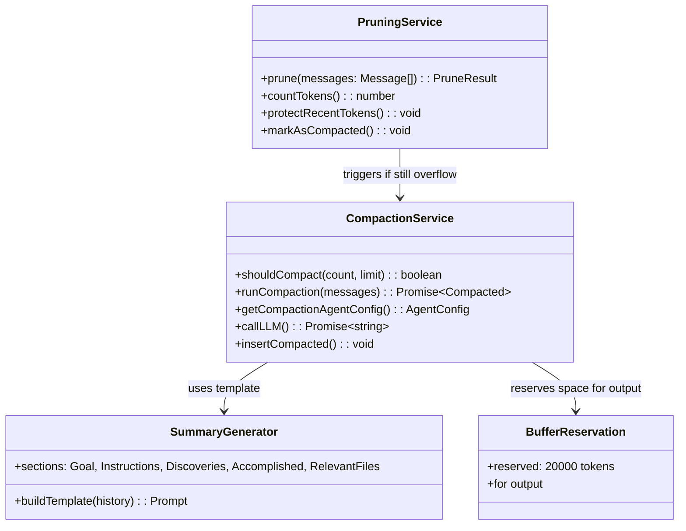

# OpenCode Context Compression Codemap: Two-level Pruning + LLM Compaction

## Overview

OpenCode uses a **two-level approach to context management**:
1.  **Pruning (lightweight)**: Regularly trims old tool outputs without LLM, just marks them as compacted to recover tokens quickly
2.  **LLM Compaction (full)**: Only when pruning isn't enough and context overflows, calls the compaction agent to generate a full structured summary

This is more incremental and lightweight than pi-mono's approach where all compression is LLM-based.

**Official Resources:**
- GitHub Repository: [anomalyco/opencode](https://github.com/anomalyco/opencode)
- Source Location: `packages/opencode/src/session/`

---

## Codemap: System Context

```
packages/opencode/src/session/
├── processor.ts           # Orchestration of pruning + compaction
├── compaction.ts          # Compaction triggering and execution
├── summary.ts             # Summary generation with template
└── types.ts               # Type definitions
```

---

## Component Diagram



---

## Data Flow Diagram (Two-level Compression)

```mermaid
flowchart LR
    A[New message added] --> B[Count current tokens]
    B --> C[PruningService runs]
    C --> D[Backward traversal, accumulate tokens]
    D --> E[Reach PRUNE_PROTECT = 40,000 tokens]
    E --> F[Mark older tool calls as compacted]
    F --> G[Count tokens after pruning]
    G --> H{Still > usable?}
    H -->|No| I[Done]
    H -->|Yes| J[Trigger LLM compaction]
    J --> K[Find last uncompressed user message]
    K --> L[Call compaction agent with template]
    L --> M[Insert compacted summary]
    M --> N[Done]
```



---

## 1. Level 1: Pruning

Pruning is **fast, no LLM required**, it just marks old tool outputs as compacted so they aren't sent to the LLM. The structure of the conversation is preserved, just the large tool outputs are dropped.

### Pruning Parameters

```typescript
const PRUNE_MINIMUM = 20000;  // Only prune if we recover at least this many tokens
const PRUNE_PROTECT = 40000;   // Keep last this many tokens uncompressed
const COMPACTION_BUFFER = 20000;  // Reserve this many tokens for output
```

### Pruning Algorithm

1.  **Start from newest message** and go backward
2.  **Accumulate tokens** until reaching `PRUNE_PROTECT`
3.  **Any tool call before that point** gets its output marked as compacted (not sent to LLM)
4.  **Only apply pruning if** the total tokens recovered >= `PRUNE_MINIMUM`
5.  **Protected tools**: Certain tools like `skill` are never pruned

### Benefits

- **Very fast**: No LLM call needed
- **Incremental**: Happens after every message, keeps token count under control before it gets bad
- **Preserves structure**: Conversation structure remains, tool calls still exist in the database
- **Low overhead**: Just a backward traversal, very quick

---

## 2. Level 2: LLM Compaction

When pruning isn't enough to get token count under the limit, **full LLM compaction** triggers. OpenCode has a dedicated `compaction` agent that generates a structured summary.

### Trigger Condition

```typescript
const context = model.limit.context;
const reserved = config.compaction?.reserved ?? buffer;
const usable = context - maxOutputTokens;
return count >= usable;  // Trigger compaction
```

### Compaction Process

1.  Find the parent user message
2.  If already compacted before, find the last uncompressed user message as the restart point
3.  Get the compaction agent configuration (can use a different model)
4.  Create a new compaction request with the structured template
5.  Call LLM to generate the summary
6.  If auto-compaction succeeds, insert the summary and add a continue prompt
7.  Agent continues with the compacted context

### Structured Summary Template

OpenCode uses this structured template:

```markdown
Provide a detailed summary for continuing the conversation above.
Focus on information that would be helpful for continuing:
- What we did
- What we're doing
- Which files we're working on
- What we're going to do next
- Key decisions and why they were made

Stick to this template:
---
## Goal
[goal(s)]

## Instructions
[important user instructions]

## Discoveries
[things learned that are useful]

## Accomplished
[what's done, what's in progress, what's left]

## Relevant files / directories
[list of files that are relevant]
---
```

### Plugin Extension Points

OpenCode provides plugin hooks for customizing compaction:
- `experimental.session.compacting`: Before compaction, modify the prompt
- `experimental.chat.messages.transform`: Transform the message list

---

## 3. Comparison of Pruning vs Compaction

| Method | When used | Needs LLM | What it does |
|--------|-----------|-----------|--------------|
| Pruning | After every message | No | Marks old tool outputs as compacted, doesn't send them |
| Compaction | When still overflow after pruning | Yes | Generates full structured summary of conversation history |

---

## 4. Key Source Files & Implementation Points

| File | Purpose |
|------|---------|
| **`packages/opencode/src/session/compaction.ts`** | Compaction triggering and orchestration |
| **`packages/opencode/src/session/pruning.ts`** | Pruning algorithm implementation |
| **`packages/opencode/src/session/summary.ts`** | Summary template and generation |

---

## Summary of Key Design Choices

### Two-level Approach

- **Pruning first handles most cases**: Most of the time, pruning keeps token count under control without needing expensive LLM compaction
- **Only compaction when necessary**: Saves LLM inference cost and latency
- **Incremental**: Keeps token count under control gradually instead of waiting for overflow

### Protected Recent Tokens

- **Always keep most recent N tokens uncompressed**: Recent conversation is more relevant, keeps full detail
- **Older stuff gets pruned/compacted**: Out of sight but not forgotten - still in database

### Structured Template

- **Consistent output**: LLM always produces the same sections
- **Easy for agent to find information**: Relevant files section is especially useful for coding
- **Similar to pi-mono but adds Relevant files**: OpenCode explicitly captures which files are relevant

### Extension Points

- **Plugin hooks allow customization**: Users can customize compaction behavior without changing core code
- **Experimental flags allow trying new approaches**

### Tradeoffs vs pi-mono

| Aspect | OpenCode | pi-mono |
|--------|----------|---------|
| **Approach** | Two-level (pruning + compaction) | Single-level (LLM compaction when needed) |
| **LLM calls** | Less frequent | More frequent |
| **Latency** | Lower average | Higher average |
| **Context preservation** | Pruning preserves structure, compacts only when needed | Always compacts when hitting threshold, preserves file ops explicitly |

OpenCode's two-level approach is **optimized for the common case** where token creep happens gradually from tool outputs. Pruning handles this quickly without LLM calls, only going to full compaction when really needed. This gives a good balance between context preservation and performance/cost.
