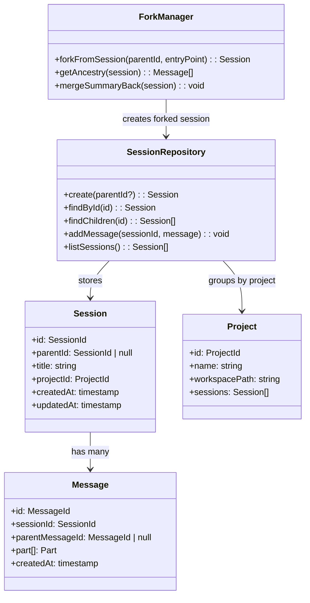
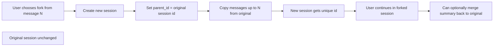

# OpenCode Session Isolation Codemap: Relational Database with Forking

## Overview

OpenCode uses **relational database (SQLite by default) persistent storage** for sessions, with session forking supporting via `parent_id` references. This enables:
- Full persistent session history
- Forking from any point in history
- Multiple concurrent sessions
- Enterprise session sharing via shared database
- Session links that can be shared

**Official Resources:**
- GitHub Repository: [anomalyco/opencode](https://github.com/anomalyco/opencode)
- Source Location: `packages/opencode/src/session/`, `packages/enterprise/`

---

## Codemap: System Context

```
packages/opencode/src/session/
├── repository.ts          # Session database operations
├── types.ts               # Session and message types
└── fork.ts                # Forking logic
packages/enterprise/
├── sessions/              # Enterprise multi-user session sharing
└── sharing/               # Shareable link generation
```

---

## Component Diagram



---

## Data Flow Diagram (Forking)



---

## 1. Data Model Hierarchy

OpenCode uses this hierarchical structure:

```
Project → Workspace → Session → Message → Part
```

| Level | Purpose |
|-------|---------|
| **Project** | Groups sessions by project/workspace |
| **Session** | One conversation thread |
| **Message** | One turn in the conversation |
| **Part** | Multiple content parts in a message (text, tool, file, etc.) |

### Session Table Schema

```
id: PRIMARY KEY
parent_id: FOREIGN KEY → sessions.id (nullable for root sessions)
project_id: FOREIGN KEY → projects.id
title: string
created_at: timestamp
updated_at: timestamp
```

### Message Table Schema

```
id: PRIMARY KEY
session_id: FOREIGN KEY → sessions.id
parent_message_id: FOREIGN KEY → messages.id
role: user/assistant/system
content: jsonb (parts)
created_at: timestamp
```

---

## 2. Forking (Branching)

When you fork a session:

1.  **New session created** in database with its own unique id
2.  `parent_id` references the original session
3.  **Messages up to the fork point** are implicitly included via ancestry
4.  Original session remains **completely unchanged**
5.  Forked session is **fully independent** - changes don't affect original

### Isolation Characteristics

| Isolation Dimension | Isolation Level |
|----------------------|-----------------|
| **Message History** | Fully isolated - independent messages |
| **Permissions** | Can inherit or be reconfigured |
| **Working Directory** | Can inherit or be different |
| **Processing** | Independent - one failure doesn't affect other |

---

## 3. Enterprise Session Sharing

In the enterprise package, OpenCode supports:
- **Multiple concurrent users** on the same database
- **Shareable session links** - can give read access to others
- **Comments** on sessions - collaboration
- **Organizations/teams** - access control

The `parent_id` model works the same for shared sessions - forking creates a new session that can be worked on independently.

---

## 4. Key Source Files & Implementation Points

| File | Purpose |
|------|---------|
| **`packages/opencode/src/session/repository.ts`** | Session CRUD operations |
| **`packages/opencode/src/session/types.ts`** | Type definitions |
| **`packages/enterprise/sessions/`** | Multi-user session management |

---

## Summary of Key Design Choices

### Relational Database vs File-based

- **ACID guarantees**: Database guarantees consistency
- **Concurrent access**: Multiple processes can access safely
- **Query capability**: Can query sessions by title, date, etc.
- **Enterprise sharing**: Easier to share in a multi-user environment
- **Tradeoff**: More complex than file-based, requires migration management

OpenCode handles this with **incremental migrations** on startup - database schema automatically upgrades.

### Parent Reference Model

- **No duplication**: Fork doesn't duplicate messages that already exist in parent
- **Ancestry walking**: To build context, walk from leaf to root
- **Space efficient**: Only new messages stored in the fork
- **Tradeoff**: Need to join across parent sessions to build full context - but this is only done once when loading the session, so acceptable

### Hierarchical Organization

- **Project → Session → Message → Part**: Matches how users actually work
- **Easy navigation**: Can list all sessions in a project
- **Clean queries**: SQL foreign keys enforce referential integrity

### Comparison to pi-mono

| Aspect | OpenCode | pi-mono |
|--------|----------|---------|
| **Storage** | Relational database (SQLite) | Line-delimited JSON files |
| **Forking** | `parent_id` reference, no duplication | Full file per fork, tree structure in file |
| **Sharing** | Native enterprise sharing | File-based, manual sharing |
| **Querying** | Full SQL query capability | Limited to scanning files |
| **Complexity** | Higher | Lower |

OpenCode's session isolation design is **optimized for persistent multi-user enterprise use** where sessions need to be stored long-term and shared, whereas pi-mono's file-based design is optimized for local-first simplicity and human inspectability. Both approaches make sense for their target use cases.
