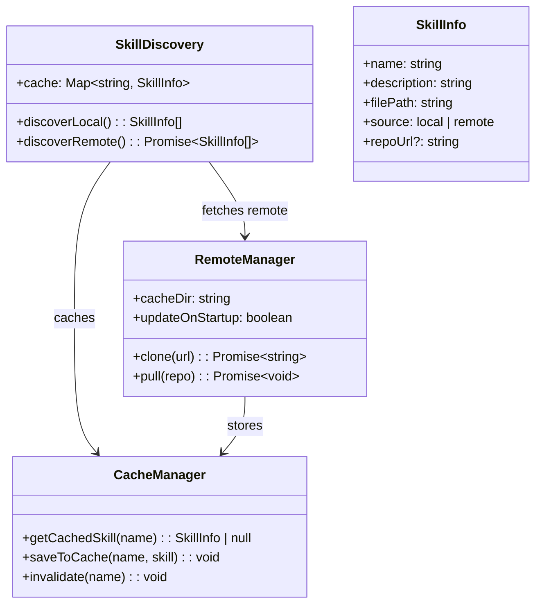
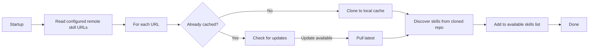

# OpenCode Skill Mechanism Codemap: Standard Format with Remote Repository Support

## Overview

OpenCode implements the **standard Agent Skills format** (same as pi-mono/agentskills.io) but adds **remote skill repository support** allowing users to configure URLs to git repositories that are automatically cloned/pulled to a local cache.

**Official Resources:**
- GitHub Repository: [anomalyco/opencode](https://github.com/anomalyco/opencode)
- Agent Skills Standard: https://agentskills.io/
- Source Location: `packages/opencode/src/skills/`

---

## Codemap: System Context

```
packages/opencode/src/skills/
├── discovery.ts           # Skill discovery from multiple locations
├── remote.ts              # Remote repository git cloning/pulling
├── cache.ts               # Local cache management
└── types.ts               # Type definitions
```

---

## Component Diagram



---

## Data Flow Diagram (Remote Skill Discovery)



---

## 1. Skill Discovery Locations

OpenCode discovers skills from **four locations**:

1.  **Global external**: `~/.claude/skills/`, `~/.agents/skills/`
2.  **Project external**: Walk upwards from current directory looking for `.claude/skills/`, `.agents/skills/`
3.  **Custom paths**: Additional paths specified in configuration `skills.paths[]`
4.  **Remote URLs**: Git repositories specified in configuration `skills.urls[]` → automatically cloned/pulled to cache

### Discovery Pattern

- Search for `**/SKILL.md` → any directory containing `SKILL.md` is recognized as a skill
- Respects `.gitignore` filtering → doesn't discover build outputs
- Same naming validation as pi-mono → consistent naming conventions

---

## 2. Skill Definition Format

OpenCode uses **the standard Agent Skills format** compatible with pi-mono/agentskills.io:

```markdown
---
name: skill-name
description: When to use this skill
---

# Detailed Instructions
...
```

Same **naming validation rules**:
- Name must match directory name
- Lowercase a-z, numbers, hyphens only
- No consecutive hyphens, can't start/end with hyphen
- Max 64 characters

### Formatting Output for System Prompt

OpenCode supports **two output formats**:

```
Verbose format (XML):
<available_skills>
  <skill>
    <name>skill-name</name>

```

Actually full format:

```xml
<!-- Verbose verbose format -->
<available_skills>
  <skill>
    <name>skill-name</name>
    <description>When to use this skill</description>
    <location>/path/to/SKILL.md</location>
    <source>remote|local</source>
  </skill>
</available_skills>
```

```
Concise format:
- skill-name: description
```

User can configure which format to use depending on their preferences and token budget.

---

## 3. Remote Skill Repository Feature

OpenCode's unique feature beyond pi-mono is **remote skill repositories**:

### Configuration

```json
{
  "skills": {
    "urls": [
      "https://github.com/user/my-skills.git",
      "https://github.com/opencode-community/common-skills.git"
    ],
    "autoUpdate": true
  }
}
```

### Caching

- Remote repos are cloned to `~/.cache/opencode/skills/`
- Each remote repo gets its own directory
- Can be configured to auto-update on startup
- Caching avoids repeated clones, saves network

### Permission Checking

When a skill is used, **permission check still runs** against the skill name → skill can only be used if allowed by current agent's permissions.

---

## 4. Key Source Files & Implementation Points

| File | Purpose |
|------|---------|
| **`packages/opencode/src/skills/discovery.ts`** | Local skill discovery |
| **`packages/opencode/src/skills/remote.ts`** | Remote git repository handling |
| **`packages/opencode/src/skills/cache.ts`** | Local cache management |

---

## Summary of Key Design Choices

### Compatible with Standard

- **Ecosystem compatibility**: Same format as pi-mono/agentskills.io → skills work everywhere
- **No reinvention**: Benefits from existing community skill sharing
- **Consistent naming**: Same validation rules → avoids fragmentation

### Remote Repository Support

- **Community sharing**: Users can share collections of skills via GitHub
- **Version control**: Skills get the same versioning as code
- **Easy updates**: Auto-pull gets the latest improvements
- **Caching**: Doesn't waste network bandwidth on repeated clones

### Multiple Discovery Locations

- **Global user skills**: Personal skills available everywhere
- **Project skills**: Project-specific skills in the repo
- **Custom paths**: Flexibility for custom setups
- **Remote repos**: Shared community collections

### Permission Model

- **Same permission check applies**: Even for remote skills, they can only be used if permitted
- **Security first**: Remote skills don't bypass permission system
- **Defense in depth**: User controls which skills are allowed

### Tradeoffs vs pi-mono

| Feature | OpenCode | pi-mono |
|---------|----------|---------|
| Local discovery | Same as pi-mono | Same as OpenCode |
| Remote repositories | Yes built-in | No built-in |
| Auto-update | Yes | Manual |
| Formats | verbose/concise | XML only |
| Caching | Persistent cache for remote | N/A |

OpenCode's skill system is **a superset of the standard** adding remote repository support that enables community sharing of skills. This makes it easier to distribute and maintain collections of specialized skills across many projects and users.
