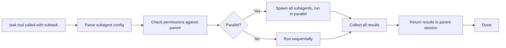

# OpenCode Sub-agent Codemap: Task Tool Parallel Execution with Permissions

## Overview

OpenCode handles parallel agent execution and subtask management through the `task` tool, which enables running multiple subagents in parallel for complex operations. Subagents are configuration-driven with independent permission rulesets. OpenCode also supports **dynamic AI-generated subagent creation** from natural language descriptions.

**Official Resources:**
- GitHub Repository: [anomalyco/opencode](https://github.com/anomalyco/opencode)
- Source Location: `packages/opencode/src/tool/task.ts`

---

## Codemap: System Context

```
packages/opencode/src/
├── agent/
│   ├── types.ts               # Subagent configuration types
│   └── config.ts              # Agent config parsing
├── tool/
│   └── task.ts                # Task tool execution for parallel subagents
└── session/
    └── processor.ts           # Session processing for sub-sessions
```

---

## Component Diagram

```mermaid
classDiagram
    class TaskTool {
        +invoke(params): Promise~Result~
        +createSubagent(config): Subagent
        +executeParallel(tasks): Promise~Result[]~
        +executeSequential(tasks): Promise~Result[]~
    }
    class SubAgentConfig {
        +name: string
        +description: string
        +mode: "subagent"
        +permission: PermissionRuleset
        +model?: {providerID, modelID}
        +prompt?: string
        +temperature?: number
        +hidden?: boolean
    }
    class PermissionChecker {
        +evaluate(agent, operation): Allow/Deny
        +pattern-based: allow/ask/deny
    }
    class DynamicGenerator {
        +generateFromDescription(text): Promise~SubAgentConfig~
        +uses LLM to generate JSON
    }
    class SubSession {
        +parent: Session
        +independent history
        +isolated permissions
        +forks from parent
    }

    TaskTool --> SubAgentConfig : uses
    TaskTool --> PermissionChecker : checks
    TaskTool --> DynamicGenerator : supports dynamic
    TaskTool --> SubSession : creates
```

---

## Data Flow Diagram (Subagent Invocation)



---

## 1. Declarative Subagent Configuration

Subagents are **declared in configuration** with full type safety:

```typescript
// From: packages/opencode/src/agent/types.ts
{
  name: string;              // Unique identifier
  description: string;       // When to use this subagent
  mode: "subagent";          // Mark as subagent
  permission: PermissionRuleset;  // Independent permission rules
  model?: {                   // Optional: override model
    providerID;
    modelID;
  };
  prompt?: string;           // Optional: custom system prompt
  temperature?: number;      // Optional: temperature
  topP?: number;
  color?: string;             // UI display color
  hidden?: boolean;           // Hide from lists
}
```

### Built-in Subagent Examples

**general subagent:**
- Purpose: "General-purpose agent for researching complex questions and executing multi-step tasks. Use this agent to execute multiple units of work in parallel."
- Permissions: Restricted to todo read/write, can execute independent tasks

**explore subagent:**
- Purpose: "Fast agent specialized for exploring codebases. Use this when you need to quickly find files by patterns (eg. \"find all API endpoints\"), search for keywords, and understand code structure."
- Permissions: Allows search tools (grep, glob, ls, read, webfetch, etc.), no editing
- Specialized for fast code exploration

---

## 2. Permission Isolation

Each subagent has **independent permission rules**:
- Permissions based on pattern matching: allow/ask/deny for paths, tools, file types
- Default permissions can be inherited from parent then overridden
- This ensures that a specialized subagent can only do what it's designed to do
- Example: explore subagent can't edit files, only read/search → improves safety

---

## 3. Parallel vs Sequential Execution

The `task` tool supports **both parallel and sequential execution**:
- **Parallel**: Multiple independent subtasks run at the same time → faster for independent work
- **Sequential**: One after another → when tasks depend on each other

Invocation by `@agent-name`:
- Users can invoke subagents with `@agent-name` in messages
- TUI has dedicated subagent dialog
- Subagent runs in independent session, doesn't disturb parent context

---

## 4. Dynamic Agent Generation

OpenCode supports **AI-driven dynamic subagent creation**:

```typescript
// API: Agent.generate({ description, model? })
// LLM generates JSON configuration:
{
  identifier,
  whenToUse,
  systemPrompt
}
```

This allows **natural language creation**: "Help me create a specialized agent for reviewing accessibility in HTML/CSS code" → the LLM generates the full configuration automatically.

---

## 5. Key Source Files & Implementation Points

| File | Purpose |
|------|---------|
| **`packages/opencode/src/tool/task.ts`** | Main task tool implementation for subagent execution |
| **`packages/opencode/src/agent/types.ts`** | Subagent configuration types |
| **`packages/opencode/src/agent/config.ts`** | Agent config parsing |

---

## Summary of Key Design Choices

### Configuration-driven

- **All agents defined in config**: No code changes needed to add/modify subagents
- **Users can add their own**: Custom subagents in user config
- **Consistent**: Same format for built-in and custom subagents

### Permission Isolation

- **Each subagent has its own rules**: The main agent can have full permissions while subagents have restricted permissions
- **Defense in depth**: Even if something goes wrong, damage is contained
- **Pattern-based**: Same permission system as main agent, consistent mental model

### Parallel Execution

- **Independent subtasks run in parallel**: Big speedup for things like exploring multiple directories or reviewing multiple files
- **Optional sequential**: When dependencies exist, still supports sequential
- **User decides**: The agent can choose which approach fits the problem

### Dynamic Generation

- **Natural language creates agents**: Users don't need to know the config format
- **LLM handles the details**: Just describe what you want
- **Still editable**: After generation, user can edit the file

### Comparison to pi-mono

| Aspect | OpenCode | pi-mono |
|--------|----------|---------|
| **Definition** | Config in code/user config | Markdown files with frontmatter |
| **Parallel execution** | Built-in via task tool | No built-in, depends on host |
| **Dynamic generation** | Native support | No native support |
| **Permissions** | Full ruleset per subagent | Depends on host, not built-in |
| **Discovery** | Config-based | Directory scanning |

OpenCode's subagent system is **more feature-rich for parallel execution** and dynamic creation, making it well-suited for complex multi-tasking workflows where multiple independent subtasks can be worked on simultaneously. The permission isolation improves security when running specialized subagents.
