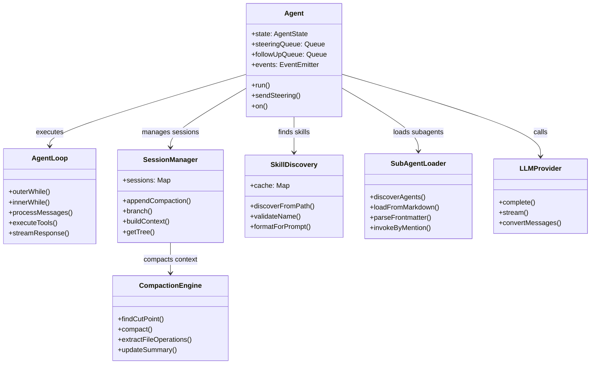

# pi-mono - Modular AI Agent Toolset Architecture Analysis

This research analyzes **pi-mono** - a mature TypeScript monorepo containing AI Agent components including a coding agent CLI, unified LLM API, TUI & Web UI libraries, Slack bot, and more. pi-mono is known for its clean modular architecture and innovative approaches to agent React loops, context compression, and subagent composition.

## Research Scope

For each core module, we examined:
1.  **Architecture Overview** - How the module fits into the overall system
2.  **Data Structures and Type System** - Key types and interfaces
3.  **Complete Operation Flow** - Step-by-step process for key operations
4.  **Code Maps** - Key source files with line numbers and core algorithm snippets
5.  **Design Choices & Tradeoffs** - Why it was built this way

## Core Modules Researched

| Module | Architecture | Main Approach | Report |
|--------|--------------|---------------|--------|
| [Agent React Loop](codemap/agent-react-codemap.md) | Event-driven double loop | Outer loop for follow-ups, inner loop for tool calling, with event subscription system | [codemap/agent-react-codemap.md](codemap/agent-react-codemap.md) |
| [Context Compression](codemap/context-compression-codemap.md) | Structured LLM summarization | Token-based triggering with cut-point finding, incremental compression, file operation tracking | [codemap/context-compression-codemap.md](codemap/context-compression-codemap.md) |
| [Sub-agent System](codemap/subagent-codemap.md) | Markdown-based discovery | Configuration via markdown frontmatter, project-level and user-level discovery | [codemap/subagent-codemap.md](codemap/subagent-codemap.md) |
| [Skill Mechanism](codemap/skills-codemap.md) | Standardized SKILL.md format | Three-level discovery with name validation, lazy loading, standardized format | [codemap/skills-codemap.md](codemap/skills-codemap.md) |
| [Session Isolation](codemap/session-isolation-codemap.md) | Tree-based file format | Line-delimited JSON with parent references, supports forking and branching | [codemap/session-isolation-codemap.md](codemap/session-isolation-codemap.md) |

## Summary Table - Key Characteristics

| Module | Storage Approach | Isolation | Key Feature |
|--------|------------------|-----------|-------------|
| **Agent React** | In-memory event system | N/A | Double loop with queues, pluggable context transformation |
| **Context Compression** - LLM Structured Summary | In-session file | Token-based triggering | Incremental with file operation tracking |
| **Sub-agent** | Markdown files | Per-agent configuration | Markdown frontmatter, @mention invocation |
| **Skills** | SKILL.md files | N/A | Standard format, three-level discovery, lazy loading |
| **Session Isolation** | Line-delimited JSON file | Full-file isolation | Tree structure with parent references, forking support |

## Overview: Architecture Summary

pi-mono is a **modular monorepo AI agent toolkit** that:

1.  **Event-driven Agent Loop**: Uses a double-loop reaction pattern with event hooks for external observation and intervention
2.  **Sophisticated Compression**: Implements incremental context compression with structured summarization that preserves file operation context
3.  **Markdown-based Sub-agents**: Simple but effective sub-agent discovery via markdown files with YAML frontmatter
4.  **Standardized Skills**: Implements the Agent Skills standard for shareable, composable specialist instructions
5.  **Tree-based Sessions**: Line-delimited JSON with parent references enabling session forking and experimentation

### High-level Architecture Diagram



## Directory Structure

```
~/my-research/agents/pi-mono/
├── README.md                 # This file - overview and comparison
└── codemap/                  # Detailed codemap for each core module
    ├── agent-react-codemap.md     # Agent React loop architecture
    ├── context-compression-codemap.md  # Context compression algorithm
    ├── subagent-codemap.md        # Sub-agent system design
    ├── skills-codemap.md          # Skill discovery and format
    └── session-isolation-codemap.md  # Session tree and isolation
```

## Reading the Reports

Each codemap file follows the same structure:
1.  Module overview and official links
2.  Architecture diagrams (class and data flow)
3.  Complete storage/layout description
4.  Step-by-step operation flow for key operations
5.  Key source files with line numbers
6.  Core code snippets showing key algorithms
7.  Summary of design choices and tradeoffs

## References

[^1]: GitHub Repository - https://github.com/badlogic/pi-mono
[^2]: DeepWiki Documentation - https://deepwiki.com/badlogic/pi-mono
[^3]: Agent Skills Standard - https://agentskills.io/
[^4]: CSDN - 解密openclaw底层pi-mono架构系列一 - https://blog.csdn.net/cwt0408/article/details/159020491
[^5]: CSDN - OpenClaw Agent 架构概述 - https://blog.csdn.net/leah126/article/details/158931985
