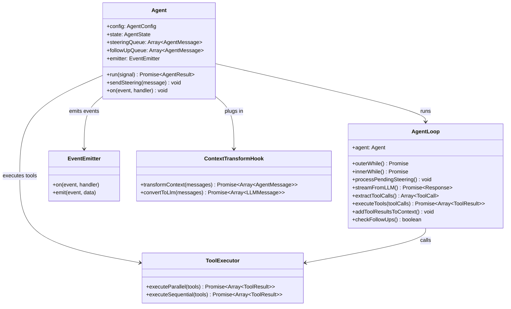

# pi-mono Agent React Codemap: Event-driven Double Loop Architecture

## Project Overview

pi-mono's Agent React loop implements an **event-driven double-loop reaction pattern** that supports:
- External observation via event subscriptions
- Runtime message injection via steering queue
- Configurable message delivery modes
- Parallel tool execution
- Pluggable context transformation hooks

**Official Resources:**
- GitHub Repository: [badlogic/pi-mono](https://github.com/badlogic/pi-mono)
- DeepWiki: https://deepwiki.com/badlogic/pi-mono/packages/agent/src

---

## Codemap: System Context

```
packages/agent/src/
├── agent.ts                 # Main Agent class with state management
├── agent-loop.ts            # Core double-loop reaction implementation
├── types.ts                 # Type definitions for messages, configuration
├── tool.ts                  # Tool definitions and execution
└── events.ts                # Event type definitions
```

---

## Component Diagram



---

## Data Flow Diagram (Agent Execution)

```mermaid
flowchart LR
    A[Agent.run()] --> B[Outer Loop Start]
    B --> C{Has pending messages?}
    C -->|Yes| D[Inner Loop Start]
    D --> E[Process steering queue]
    E --> F[Stream LLM response]
    F --> G[Extract tool calls]
    G --> H{Tool calls exist?}
    H -->|Yes| I[Execute tools (parallel/sequential)]
    I --> J[Add results to context]
    J --> D
    H -->|No| K[Inner Loop Exit]
    K --> L{Check follow-up queue}
    L -->|Has follow-ups| B
    L -->|No| M[Emit agent_end event]
    M --> N[Return result]
```

---

## 1. Double Loop Architecture

The core insight of pi-mono's agent loop is the **double loop design** with two message queues:

- **Outer Loop**: Handles follow-up messages added after the inner loop completes
- **Inner Loop**: Processes tool calls until no more tools need to be called
- **Steering Queue**: Allows injecting messages during execution from external events

### Key Configuration Options

| Option | Purpose | Default |
|--------|---------|---------|
| `steeringMode` | How steering messages are delivered | `"all"` (all at once) |
| `followUpMode` | How follow-up messages are delivered | `"all"` (all at once) |
| `executeToolsParallel` | Run multiple tool calls in parallel | `true` |

### Core Loop Algorithm

```typescript
// From: packages/agent/src/agent-loop.ts
// Outer while loop for follow-up messages
outer while (true) {
  let hasMoreToolCalls = false;
  // Inner while loop processes current messages until quiescence
  inner while (hasMoreToolCalls || pendingMessages.length > 0) {
    process pending steering messages
    stream assistant response from LLM
    extract tool calls
    execute tool calls (parallel or sequential)
    add tool results to context
    hasMoreToolCalls = tool calls.length > 0
  }
  check for follow-up messages added after turn completion
  if none, break outer loop
}
```

### Event Subscription System

The agent emits events at every stage allowing UIs or frameworks to react:

```typescript
// Events emitted:
// - message_start
// - message_update
// - tool_execution_start
// - tool_execution_end
// - turn_end
// - agent_end

agent.on('tool_execution_end', (event) => {
  console.log(`Tool ${event.name} completed`);
  updateUI(event.result);
});
```

This makes it easy for TUI or Web UI to track progress incrementally without polling.

---

## 2. Context Transformation Hooks

pi-mono uses **pluggable context transformation** to keep the core loop clean. Compression, trimming, prompt engineering all happen via hooks:

```typescript
// From: packages/agent/src/types.ts
// 1. transformContext: transforms the full message array (compaction, trimming)
transformContext?: (
  messages: AgentMessage[],
  signal?: AbortSignal
) => Promise<AgentMessage[]>;

// 2. convertToLlm: converts internal format to LLM provider specific format
convertToLlm?: (
  messages: AgentMessage[]
) => Message[] | Promise<Message[]>;
```

### Benefits of this design:

1.  **Core loop doesn't depend on compression algorithm**: Compression can evolve independently
2.  **Multiple strategies supported**: Different compression strategies can be swapped at runtime
3.  **Easy to test**: Transform hooks are pure functions that can be unit tested
4.  **Allows experimentation**: Third-party code can add custom transformations

---

## 3. Key Source Files & Implementation Points

| File | Line Range | Purpose |
|------|------------|---------|
| **`packages/agent/src/agent.ts`** | entire | Main Agent class, state management, queue handling |
| **`packages/agent/src/agent-loop.ts`** | entire | Double-loop reaction implementation |
| **`packages/agent/src/types.ts`** | entire | Type definitions for config, messages, hooks |
| **`packages/agent/src/tool.ts`** | entire | Tool execution and result handling |

---

## Summary of Key Design Choices

### Double Loop Pattern

- **Why double loop?**: Separates the processing of tool calls within a turn from follow-up messages added after the turn completes. Follow-ups can be added by tools or external systems to chain multiple turns together.
- **Queues for steering**: Allows external systems to inject messages while the agent is running, enabling features like user interruption or additional context arriving asynchronously.

### Event-driven Design

- **Subscription for all key stages**: UIs and frameworks can react to progress without polling
- **Separation of concerns**: Core agent logic doesn't depend on UI technology
- **Multiple consumers can listen**: Different subsystems can handle the same event

### Pluggable Context Transformation

- **Open/closed principle**: Open for extension, closed for modification. New compression schemes don't require changing the core loop.
- **Testing friendliness**: Pure function hooks are easy to test in isolation

### Tradeoffs

- **More complex than single loop**: Double loop adds complexity but enables more flexible execution patterns
- **In-memory queues**: All state in memory - for persistence you need session management outside the core
- **Event listeners can cause side effects**: This is intentional but requires consumers to be careful about memory leaks

The pi-mono agent loop is a **clean, modular design** that prioritizes flexibility and observability, making it suitable for embedding in different host applications (CLI, TUI, web, Slack bot).
