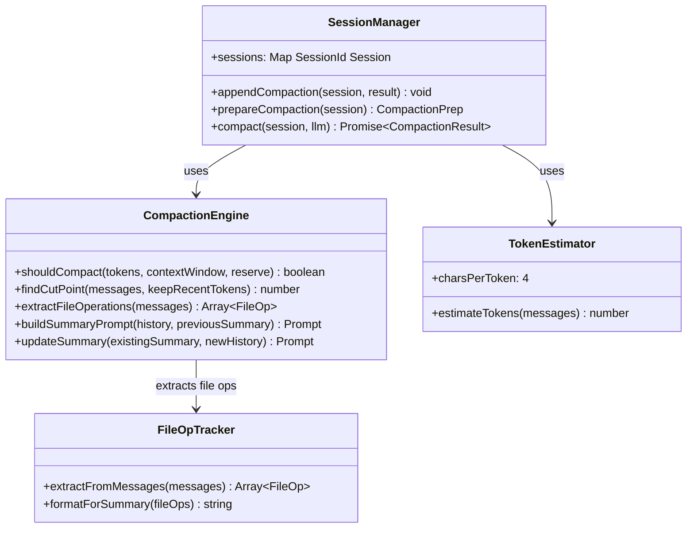
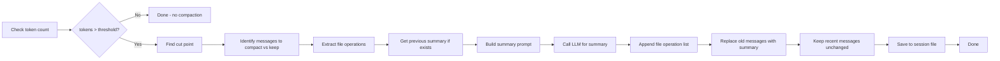

# pi-mono Context Compression Codemap: Structured LLM Summarization with File Tracking

## Overview

pi-mono implements a **sophisticated context compression algorithm** that:
- Triggers compression when token count approaches context window limit
- Finds valid cut points preserving tool call-result pairs
- Uses LLM to generate structured summarized context
- Explicitly tracks file operations to preserve which files were modified
- Supports incremental updates to previous summaries
- Keeps most recent messages uncompressed to preserve recent context

**Official Resources:**
- GitHub Repository: [badlogic/pi-mono](https://github.com/badlogic/pi-mono)
- Source Location: `packages/coding-agent/src/core/sessions/`

---

## Codemap: System Context

```
packages/coding-agent/src/core/sessions/
├── session-manager.ts        # Session management orchestration
├── types.ts                  # Type definitions for sessions and entries
└── compaction.ts             # Compaction algorithm implementation
```

---

## Component Diagram



---

## Data Flow Diagram (Compaction)



---

## 1. Compaction Triggering

Compaction is **token-based** - it triggers when the estimated token count exceeds the available context window minus a reserve:

```typescript
// Default configuration
const reserveTokens = 16384;      // Reserve space for output
const keepRecentTokens = 20000;   // Keep this many recent uncompressed

// Trigger condition
const contextTokens = estimateTotalTokens(messages);
if (contextTokens > contextWindow - reserveTokens) {
  triggerCompaction();
}
```

### Token Estimation Heuristic

pi-mono uses a simple **character-based heuristic** that avoids dependency on full tokenizers:

```typescript
// Estimation rules:
- user/assistant text: characters / 4 tokens
- images: fixed 1200 tokens
- tool results: characters / 4 tokens
```

This is accurate enough for triggering compression in practice and keeps dependencies small.

---

## 2. Cut Point Finding Algorithm

Finding the right cut point is **critical** - you can't split a tool call from its result.

Algorithm steps:

1.  **Identify valid cut points**: Only cut after `user`, `assistant`, `custom`, `bashExecution` messages. Never cut between a `toolCall` and `toolResult` - they must stay together.

2.  **Backward accumulation**: Start from the newest message and accumulate tokens backward until reaching `keepRecentTokens`. The cut happens before the accumulated region.

3.  **Align to user turn**: Ensure cut point is at a user turn to keep conversations coherent.

### Key Code

```typescript
// From: packages/coding-agent/src/core/sessions/compaction.ts
// Find cut point such that the last ~keepRecentTokens are kept uncompressed.
// Can only cut at the start of a turn, i.e., after a system message or before
// a user message, and can't split toolCall/toolResult pairs.
function findCutPoint(
  messages: AgentMessage[],
  keepRecentTokens: number
): number {
  let tokenCount = 0;
  for (let i = messages.length - 1; i >= 0; i--) {
    const msg = messages[i];
    if (isValidCutPoint(msg)) {
      if (tokenCount > keepRecentTokens) {
        return i;
      }
    }
    tokenCount += estimateMessageTokens(msg);
  }
  return 0;
}
```

---

## 3. Structured Summary Format

pi-mono uses a **fixed structured template** for summaries that the LLM follows consistently:

```markdown
## Goal
[What goal the user is trying to accomplish]

## Constraints & Preferences
[User constraints and preferences mentioned]

## Progress
### Done
- [x] Completed tasks with checkmarks

### In Progress
- [ ] Current work in progress

### Blocked
- [Any blocked issues]

## Key Decisions
- **[Decision name]**: [Brief reasoning]

## Next Steps
1. [Ordered list of next steps]

## Critical Context
[Any other critical context that must be preserved]

## File Operations
[Automatically appended list of file reads/modifications]
- modified: `path/to/file.ts`
- created: `path/to/new-file.ts`
```

### Incremental Summary Update

When compression happens again after a previous compression, pi-mono **incrementally updates** the existing summary instead of re-summarizing everything from scratch. This keeps the summary current while keeping the prompt size bounded.

---

## 4. File Operation Tracking

A unique feature of pi-mono compression is that it **explicitly tracks file operations**. After the LLM generates the summary, pi-mono extracts all file operations from the compacted messages and appends them to the summary. This ensures:

- The agent always knows which files were modified even after compression
- File state doesn't get lost in vague summaries
- The agent can quickly see what files are relevant to the current task

```typescript
// Extraction logic from compaction.ts
function extractFileOperations(messages: AgentMessage[]): FileOp[] {
  const ops: FileOp[] = [];
  for (const msg of messages) {
    if (msg.type === 'toolResult') {
      // Parse tool result to find which files were read/written
      // add to ops array
    }
    if (msg.type === 'toolCall') {
      // Extract file paths from tool parameters
    }
  }
  return ops;
}
```

---

## 5. Key Source Files & Implementation Points

| File | Line Range | Purpose |
|------|------------|---------|
| **`packages/coding-agent/src/core/sessions/session-manager.ts`** | entire | Session orchestration and compaction triggering |
| **`packages/coding-agent/src/core/sessions/compaction.ts`** | entire | Cut point finding, summary building, compression algorithm |
| **`packages/coding-agent/src/core/sessions/types.ts`** | entire | Type definitions for session entries |

---

## Summary of Key Design Choices

### Cut Point Safety

- **Never split tool call/result**: This preserves the invariant that every tool call has a corresponding result in the context. Splitting would cause confusion.
- **Only cut at user turns**: Keeps conversation structure coherent - you don't want to cut in the middle of a turn.

### Structured Summary

- **Fixed template gives consistent output**: LLM always produces the same sections which makes the summary predictable.
- **Separate sections for different information types** makes it easy for the agent to find what it needs.

### Incremental Compression

- **Only compacts what's new since last compaction**: Keeps the summary prompt bounded, doesn't reprocess entire history every time.
- **Updates previous summary**: Maintains a single current summary instead of multiple fragmented summaries.

### File Operation Tracking

- **Explicit is better than implicit**: Even if the LLM summary forgets a file modification, the explicit list is still there.
- **Minimal overhead**: Just appends a list of paths, doesn't take much token space.

### Token Estimation

- **Heuristic avoids tokenizer dependency**: Good enough for triggering, keeps dependencies small.
- **Overhead per message accounts for framing**: Adds a little extra for role tags and formatting.

### Tradeoffs

- **LLM-based compression vs deterministic trimming**: Uses more tokens and LLM inference time but preserves much more context quality
- **Incremental updates can drift**: Over multiple compressions, the summary can lose detail, but this is acceptable because only the most important information is needed
- **File tracking adds complexity**: But it's worth it because it prevents "lost file modification" hallucinations

pi-mono's context compression is one of the **most complete open source implementations** available, with many thoughtful design decisions that show experience with real-world coding agent usage.
