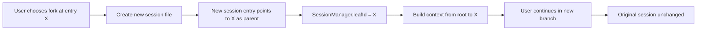

# pi-mono Session Isolation Codemap: Tree-based File Format with Forking

## Overview

pi-mono uses a **tree-based line-delimited JSON file format** for session storage that supports:
- Session forking from any point in history
- Full isolation between forked sessions
- Branch summary when merging back to main
- Tree navigation for UI exploration

**Official Resources:**
- GitHub Repository: [badlogic/pi-mono](https://github.com/badlogic/pi-mono)
- Source Location: `packages/coding-agent/src/core/sessions/`

---

## Codemap: System Context

```
packages/coding-agent/src/core/sessions/
├── session-manager.ts        # Session management and tree operations
├── types.ts                  # Type definitions for entries and tree
├── compaction.ts             # Compaction (covered separately)
└── io.ts                     # File read/write operations
```

---

## Component Diagram

```mermaid
classDiagram
    class SessionManager {
        +sessions: Map~SessionId, Session~
        +createSession() Session
        +branch(sessionId, entryId) SessionId
        +buildSessionContext(sessionId) Array~Entry~
        +getTree(sessionId) SessionTreeNode
        +appendEntry(sessionId, entry) void
    }
    class Session {
        +id: SessionId
        +leafId: EntryId
        +filePath: string
    }
    class SessionEntry {
        +id: UUID
        +parentId: EntryId | null
        +type: EntryType
        +timestamp: number
        +data: EntryData
    }
    class SessionTreeNode {
        +entry: SessionEntry
        +children: Array~SessionTreeNode~
        +label?: string
    }
    class IO {
        +readSession(filePath) Session
        +appendEntryToFile(filePath, entry) void
    }

    SessionManager --> Session : manages
    SessionManager --> IO : reads/writes
    Session --> *SessionEntry : contains
    SessionManager --> SessionTreeNode : builds tree
```

---

## Data Flow Diagram (Forking)



---

## 1. File Format

pi-mono stores sessions as **line-delimited JSON (LDJSON)**:

```
<version line>
<entry 1 JSON>
<entry 2 JSON>
<entry 3 JSON>
...
```

Each entry is a single line with this structure:

```typescript
// From: packages/coding-agent/src/core/sessions/types.ts
interface SessionEntry {
  id: UUID;                     // Unique identifier
  parentId: UUID | null;        // Parent entry (tree structure)
  type: 'message' | 'compaction' | 'branch_summary' | 'custom';
  timestamp: number;            // Unix timestamp
  data: unknown;                // Entry-type specific data
}
```

### Benefits of this format:

- **Incremental append-only**: Just append new entries, no rewriting the whole file
- **Simple to implement**: No complex database needed
- **Human-readable/editable**: Can open in any text editor
- **Efficient**: Reading builds the tree in memory once

---

## 2. Tree Structure and Forking

The `parentId` reference creates a **tree structure** where:

- Each entry has zero or one parent
- Any entry can be forked
- Multiple children can branch from the same parent

```
Root (start)
├── Message 1
├── Message 2
├── Message 3  ← Fork point
│   ├── Branch A (experiment)
│   └── Branch B (main继续)
│       ├── Message 4
│       └── ...
└── ...
```

### Forking Algorithm

```typescript
// From: packages/coding-agent/src/core/sessions/session-manager.ts
branch(entryId: UUID): SessionId {
  // Create new session
  const newSession = createNewSession();
  // The leaf of the new session starts at the forked entry
  newSession.leafId = entryId;
  // Context will be built by walking from leaf to root on next run
  return newSession.id;
}

// When building context for the forked session:
function buildSessionContext(session: Session): SessionEntry[] {
  const context: SessionEntry[] = [];
  let currentId = session.leafId;
  // Walk backwards from leaf to root collecting entries
  while (currentId != null) {
    const entry = findEntry(currentId);
    context.unshift(entry);
    currentId = entry.parentId;
  }
  return context;
}
```

### Session Isolation Properties

- **Forked session is completely independent**: Changes don't affect the original
- **Original session remains unchanged**: Can still be used
- **Multiple forks from the same point**: Can experiment with multiple approaches
- **Isolation level**: Full file-level isolation - each session has its own file

---

## 3. Branch Summary

When you want to **merge** a forked branch back into the main session, pi-mono creates a `branch_summary` entry:

1.  The system uses LLM to summarize what was done in the branch
2.  A single `branch_summary` entry is appended to the main session
3.  The full branch structure is preserved but not carried in the context every time
4.  The summary preserves the key outcomes without carrying all the detail

This keeps the main session context clean while preserving the history.

---

## 4. Tree Navigation

The `SessionManager` provides a `getTree()` method that builds a tree structure for UI display:

```typescript
// From: packages/coding-agent/src/core/sessions/types.ts
export interface SessionTreeNode {
  entry: SessionEntry;
  children: SessionTreeNode[];
  label?: string;
}
```

This allows:
- UI to display the session tree visually
- Users see the branching structure
- Users can navigate to different branches
- Users can rename/label branches

---

## 5. Key Source Files & Implementation Points

| File | Purpose |
|------|---------|
| **`packages/coding-agent/src/core/sessions/session-manager.ts`** | Session management, forking, context building |
| **`packages/coding-agent/src/core/sessions/types.ts`** | Type definitions for entries and tree |
| **`packages/coding-agent/src/core/sessions/io.ts`** | File read/write operations |

---

## Summary of Key Design Choices

### Append-only Line-delimited JSON

- **Simplicity**: No database dependency, just plain files
- **Atomic appends**: Appending one line doesn't corrupt the file
- **Crash resistant**: If the process crashes mid-write, you only lose the last entry
- **Human inspectable**: Can just cat the file to see what happened
- **Tradeoff**: Not efficient for random updates - but sessions are mostly append-only anyway, so this is fine.

### Tree Structure with Parent References

- **Any point can be forked**: Maximum flexibility for experimentation
- **Minimal duplication**: Only the new entries are in the new file, no need to copy everything
- **Context building requires walking from leaf to root**: This happens once per session run, acceptable overhead

### Full File Isolation

- **Strong isolation**: One session = one file, forks don't interact unless you merge
- **Easy to debug/cleanup**: Just delete the session file you don't want
- **Tradeoff**: Some duplication of entries across fork files - but session files are typically small, this is acceptable.

### Branch Summary for Merging

- **Preserves context without bloat**: Summary keeps key outcomes, doesn't carry all the detail
- **Full history preserved**: The original branch file still exists if you need it
- **Optional**: You don't have to merge, you can just continue in the fork

### Comparison to Other Approaches

| Approach | pi-mono Tree | Database with parent_id | Single file flat |
|----------|--------------|-------------------------|------------------|
| Forking support | Native | Yes with query | Manual |
| Isolation | Full file | Row-level | Manual |
| Simplicity | High (just files) | Lower (needs DB) | Highest |
| Human editable | Yes | No | Yes |
| Multiple branches | Native | Yes | No |

pi-mono's approach is **well-suited for a local-first CLI application** where simplicity and human inspectability are important. The tree design naturally supports experimentation with different approaches from the same starting point, which is very common in AI-assisted coding.
