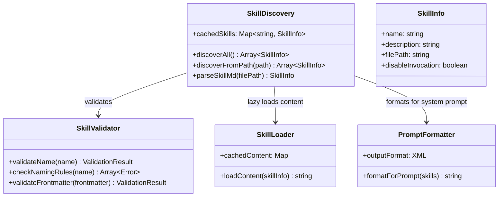
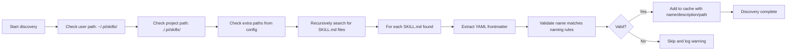

# pi-mono Skills Codemap: Standardized SKILL.md Format System

## Overview

pi-mono implements the **Agent Skills standard** (https://agentskills.io/) - a standardized format for shareable, composable specialist instructions that can be discovered automatically. Skills are loaded lazily - only the name and description go into the system prompt, the full content is loaded when the skill is used.

**Official Resources:**
- GitHub Repository: [badlogic/pi-mono](https://github.com/badlogic/pi-mono)
- Agent Skills Standard: https://agentskills.io/
- Source Location: `packages/coding-agent/src/skills/`

---

## Codemap: System Context

```
packages/coding-agent/src/skills/
├── discovery.ts           # Skill discovery from multiple paths
├── validation.ts          # Skill name and format validation
├── types.ts               # Type definitions
└── formatter.ts           # Formatting for system prompt
```

---

## Component Diagram



---

## Data Flow Diagram (Skill Discovery)



---

## 1. Skill Definition Format

Skills use a **standardized markdown format** with YAML frontmatter:

```markdown
---
name: my-skill-name
description: When to use this skill - what problem does it solve?
disable-model-invocation: false  # optional
---

# Skill Content

Here are the detailed instructions for this skill...
- Step by step guidance
- Code examples
- Best practices
```

### Naming Rules

pi-mono **strictly validates** skill names:

| Rule | Reason |
|------|--------|
| Must equal parent directory name | Consistent discovery - directory name = skill name |
| Lowercase `a-z` only | Consistent convention |
| Allowed: `0-9` and `-` (hyphen) | Allows multi-word names |
| Cannot start/end with hyphen | Avoids parsing issues |
| No consecutive hyphens | Clean convention |
| Max 64 characters | Reasonable length limit |

These rules **prevent common issues** with discovery and ensure the ecosystem has consistent formatting.

---

## 2. Discovery Levels

Skills are discovered from **three levels**:

1.  **User-level**: `~/.pi/skills/` - personal skills available to all projects
2.  **Project-level**: `./.pi/skills/` - project-specific skills checked into the repo
3.  **Extra paths**: Configured explicitly in config file

### Discovery Algorithm

- If a directory contains `SKILL.md`, it's treated as one skill - no recursion into subdirectories
- If no `SKILL.md`, it recursively searches subdirectories
- Respects `.gitignore` patterns - ignores build outputs and node_modules
- Follows symlinks with deduplication - won't discover the same skill twice

---

## 3. Lazy Loading Design

Skills use **lazy loading** to minimize prompt bloat:

1.  **Discovery time**: Only name, description, and file path are cached
2.  **System prompt insertion**: Only name, description, and path are included in XML format
3.  **On-demand loading**: When the agent decides to use the skill, it reads the full content from the file

### Format in System Prompt

Skills are formatted as XML:

```xml
<available_skills>
  <skill>
    <name>code-reviewer</name>
    <description>Specialized for thorough code review focusing on security, performance, and best practices</description>
    <location>/path/to/SKILL.md</location>
  </skill>
</available_skills>
```

The agent is instructed: **"When the task matches a skill description, use the read tool to load the skill file for detailed instructions."**

This design **dramatically reduces prompt bloat** - only a few lines per skill instead of the full content.

---

## 4. Key Source Files & Implementation Points

| File | Purpose |
|------|---------|
| **`packages/coding-agent/src/skills/discovery.ts`** | Recursive discovery from multiple paths |
| **`packages/coding-agent/src/skills/validation.ts`** | Naming validation and frontmatter validation |
| **`packages/coding-agent/src/skills/formatter.ts`** | XML formatting for system prompt |

---

## Summary of Key Design Choices

### Standardized Format

- **Ecosystem compatibility**: Same format works across agentskills.io compatible agents
- **Shareable**: Skills can be shared on GitHub, discovered by anyone
- **Composable**: Multiple skills can be used together
- **Version controllable**: Skills are just markdown files in git

### Lazy Loading

- **Prompt bloat prevention**: Only names/descriptions in prompt, full content loaded on use
- **Faster startup**: Doesn't read dozens of skill files on every startup
- **Tradeoff**: Requires an extra file read when used - but that's only when actually needed, so average case is better

### Strict Naming Validation

- **Consistency**: All skills in the ecosystem follow the same rules
- **Prevents bugs**: Catches common issues early (capitalization, invalid characters)
- **Fail-fast**: If something is wrong, you get a warning immediately during discovery

### Multi-level Discovery

- **Flexible**: Works for personal skills and project-specific skills
- **Conventional locations**: Users know where to find/add skills without config
- **Overridable**: Extra config paths allow for custom setups

### Tradeoffs

- **Convention over configuration**: Fixed SKILL.md filename means you don't have to guess - but it's less flexible. This is intentional for ecosystem consistency.
- **Strict naming rules**: Prevents inconsistent naming at the cost of some user convenience. Again, intentional for ecosystem health.
- **XML format in prompt**: XML is easy for both humans and LLMs to parse, works well.

The pi-mono skill system is **clean and standardized**, making it easy to share and reuse specialist instructions across projects and users. This is one of the reasons the OpenClaw ecosystem uses it as the foundation.
