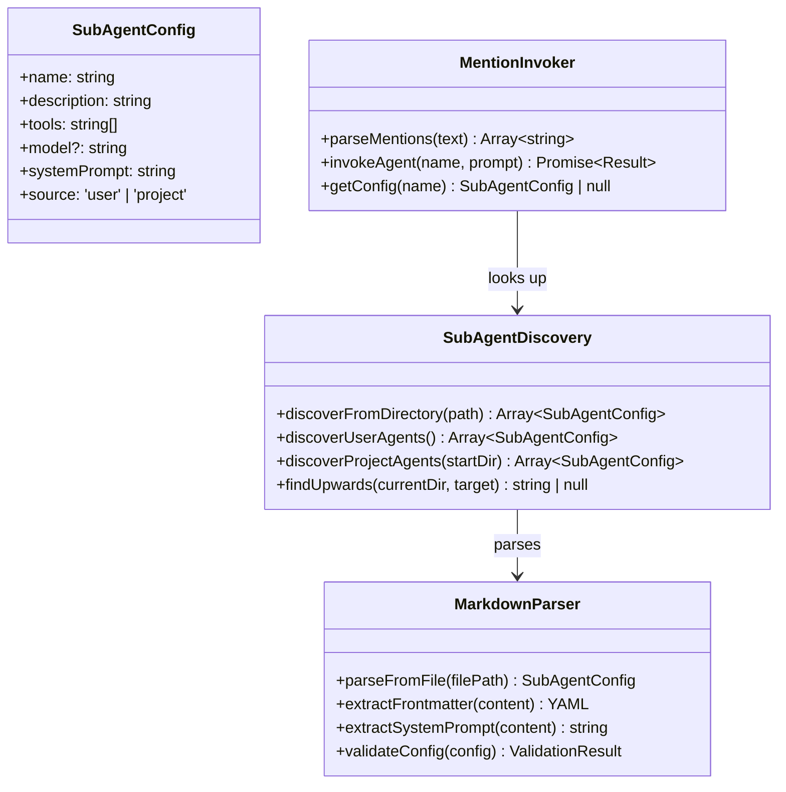
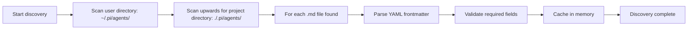

# pi-mono Sub-agent Codemap: Markdown-based Sub-agent Discovery

## Overview

pi-mono implements a **simple but effective sub-agent system** where sub-agents are defined as markdown files with YAML frontmatter. They are discovered automatically from two directories (user-level and project-level) and can be invoked via `@agent-name` mentions in chat.

**Official Resources:**
- GitHub Repository: [badlogic/pi-mono](https://github.com/badlogic/pi-mono)
- Example: `packages/coding-agent/examples/extensions/subagent/`

---

## Codemap: System Context

```
packages/coding-agent/src/
├── subagents/
│   ├── discovery.ts           # Agent discovery from directories
│   └── types.ts               # Sub-agent config types
└── core/sessions/
    └── ...                    # Session handles invocation
```

---

## Component Diagram



---

## Data Flow Diagram (Sub-agent Discovery)



---

## 1. Sub-agent Definition Format

Sub-agents are **single markdown files** with YAML frontmatter. This keeps them simple and human-editable:

```markdown
---
name: my-coding-agent
description: Specialized for writing clean TypeScript code with proper typing
tools: read,edit,write,bash,grep,glob
model: openai/gpt-4o
---

# System Prompt

You are a specialized coding agent focused on writing clean, maintainable TypeScript...
Write detailed explanations of your changes...
[...rest of system prompt...]
```

### Required Fields

| Field | Purpose |
|-------|---------|
| `name` | Identifier used for `@name` invocation |
| `description` | Tells main agent when to use this sub-agent |
| `tools` | Comma-separated list of allowed tools |

### Optional Fields

| Field | Purpose |
|-------|---------|
| `model` | Override the model provider/model-id |
| `systemPrompt` | Custom system prompt (can also be in markdown body) |

## 2. Discovery Locations

Agents are discovered from **two locations** automatically:

1.  **User-level**: `~/.pi/agents/` - agents available to all projects for this user
2.  **Project-level**: `./.pi/agents/` - project-specific agents, searched by walking upwards from current directory

This allows:
- Users to have their own favorite personal agents
- Projects to define project-specific agents
- Custom agents can be checked into source control with the project

---

## 3. Invocation via @mention

To invoke a sub-agent, the user (or agent) just includes `@agent-name` in the message. The system:

1.  Parses mentions from the message
2.  Looks up the sub-agent config
3.  Creates a new session with the sub-agent's configuration
4.  Inherits appropriate context from the parent
5.  Runs the sub-agent and returns the result

### Key Characteristics

- **Independent session**: Sub-agent runs in its own session, doesn't affect parent context
- **Independent tool allowlist**: Only the tools specified in the config are available
- **Independent model**: Can use a different model/provider than the parent
- **Result is incorporated** into parent conversation

---

## 4. Key Source Files & Implementation Points

| File | Purpose |
|------|---------|
| **`packages/coding-agent/src/subagents/discovery.ts`** | Discovery from user/project directories |
| **`packages/coding-agent/src/subagents/types.ts`** | Type definitions for sub-agent config |
| **`packages/coding-agent/examples/extensions/subagent/`** | Example sub-agent definitions reference |

---

## Summary of Key Design Choices

### Markdown + Frontmatter Format

- **Simplicity**: Any text editor can edit sub-agents, no special tooling needed
- **Human-readable**: The system prompt is plain markdown, easily version controlled
- **YAML frontmatter** gives structured metadata while keeping everything in one file
- **Tradeoff**: Less machine-parsable than JSON/YAML files - but that's okay because humans need to edit them frequently

### Two-level Discovery

- **User + project separation** works well for both personal and team use
- **Upwards search** finds the nearest project agents - works when invoked from a subdirectory
- **Caching** prevents repeated directory scanning on every invocation

### @mention Invocation

- **Natural syntax**: Users and agents can invoke sub-agents naturally in conversation
- **Multiple sub-agents** can be invoked in the same message
- **No special command syntax** needed - just works with conversational flow

### Minimal Design

pi-mono's sub-agent design is ** intentionally minimal**:

- No complex dynamic generation - just static files
- No fancy dependency graph - agents are independent
- Invocation is explicit via @mention - agent decides when to delegate
- This keeps the system predictable and easy to debug

### Tradeoffs

- **Static vs dynamic**: Static files can't be created on the fly by the agent. However, creating a file is straightforward and the agent can do that itself if needed.
- **Single file per agent**: Simplicity vs organizing multiple related agents. Works well for most use cases.

pi-mono's sub-agent system demonstrates that **you don't need complex infrastructure** for effective sub-agent usage - simple conventions work well and are easy for users to understand.
