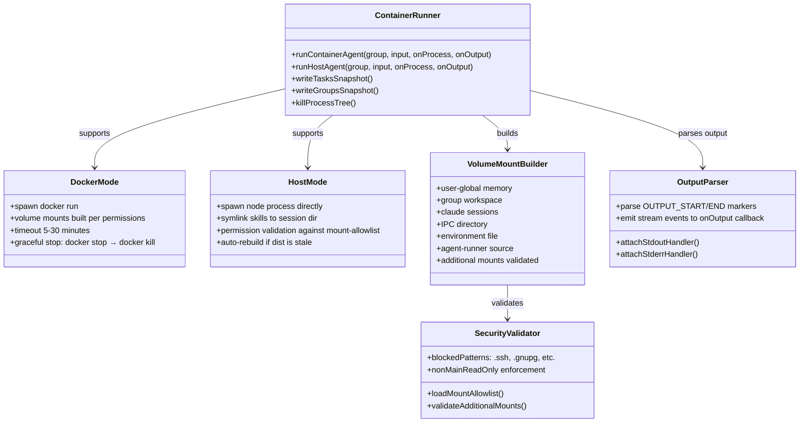

# HappyClaw Container Runner Codemap: Isolation & Execution Architecture

## Overview

Container Runner handles **spawning Claude Agent execution** in either Docker containers or directly on the host machine, with multi-layered isolation between users and workspaces. It builds volume mounts respecting security allowlists, sets up isolated IPC communication channels, and handles timeouts and logging.

**Source Location:** `src/container-runner.ts` - main entry point for both Docker and host execution modes

---

## Codemap: System Context

```
src/
├── container-runner.ts      # Main: runContainerAgent() + runHostAgent()
├── mount-security.ts        # Security validation: allowlist/blocklist for mounts
├── container-output-parser.ts  # stdout parsing: streaming output via OUTPUT_MARKER
├── types.ts                 # Type definitions: RegisteredGroup, ContainerInput, etc.
├── config.ts                # Constants: DATA_DIR, GROUPS_DIR, CONTAINER_IMAGE
└── logger.ts               # Structured logging
```

---

## Component Diagram



---

## 1. Execution Modes

HappyClaw supports **two execution modes** with different isolation guarantees:

| Mode | Isolation | Default For | Use Case |
|------|-----------|-------------|-----------|
| `container` | Full Docker container isolation | Non-admin member users | Unprivileged execution, safe multi-user |
| `host` | Direct on-host process | Admin users | Development, full filesystem access |

### Automatic Assignment Per User:

```typescript
// When creating user home group:
// - admin → folder='main', executionMode='host'
// - member → folder='home-{userId}', executionMode='container'
```

---

## 2. Multi-layered Isolation Architecture

### Layer 1: Filesystem Isolation Per Group

Each registered group/workspace gets its own directories:

| Purpose | Host Path | Container Path | Notes |
|---------|-----------|----------------|-------|
| Group workspace | `data/groups/{folder}/` | `/workspace/group` | Read-write, group-owned |
| User-global memory | `data/groups/user-global/{userId}/` | `/workspace/global` | Cross-workspace user memory |
| Claude sessions | `data/sessions/{folder}/.claude/` | `/home/node/.claude` | Isolated session state |
| IPC communication | `data/ipc/{folder}/` | `/workspace/ipc` | Isolated message passing |
| Memory storage | `data/memory/{folder}/` | `/workspace/memory` | Persistent memory files |
| Environment | `data/env/{folder}/env` | `/workspace/env-dir/env` | Group-specific env vars |

### Layer 2: Docker Container Isolation (container mode)

- Agent runs in an isolated Docker container based on `node:22-slim`
- Only explicitly allowed directories are mounted
- Runs as non-root `node` user inside container
- Entrypoint drops privileges before execution

### Layer 3: Permission Hierarchy

| Privilege | Admin Home (folder=main) | Member Home | Non-home Group |
|-----------|---------------------------|-------------|---------------|
| Mount project root | ✏️ Read-write | ❌ Not mounted | ❌ Not mounted |
| Group folder | ✏️ Read-write | ✏️ Read-write | ✏️ Read-write |
| User-global memory | ✏️ Read-write | ✏️ Read-write | 📖 Read-only |
| IPC directory | ✏️ Read-write | ✏️ Read-write | ✏️ Read-write |
| Additional mounts | ✒️ As configured | ✒️ As configured | 📖 Read-only (forced if nonMainReadOnly) |

### Layer 4: Mount Security Validation

**File:** `src/mount-security.ts`

Security checks before any additional mount is allowed:

1. **Blocked patterns**: Paths containing `.ssh`, `.gnupg`, `.config/chrome`, etc. are always blocked
2. **Whitelist check**: Path must be under an allowed root from `config/mount-allowlist.json`
3. **Non-main read-only enforcement**: Non-admin non-main groups always get read-only mounts regardless of config

```typescript
// From: src/mount-security.ts
export function validateAdditionalMounts(
  additionalMounts: AdditionalMount[],
  groupName: string,
  isAdminHome: boolean,
): ValidatedMount[] {
  // ... checks against blocked patterns and allowlist ...
  // Forced read-only for non-admin non-main:
  if (!isAdminHome && allowlist.nonMainReadOnly) {
    validated.readonly = true;
  }
}
```

---

## 3. Volume Mount Construction (Docker Mode)

Code: `buildVolumeMounts()` in `src/container-runner.ts:L197-L414`

```typescript
// Pseudocode of mount order:
1. Mount user-global memory: /workspace/global
2. If admin home: mount project root: /workspace/project (rw)
3. Mount group folder: /workspace/group (rw)
4. Mount memory storage: /workspace/memory
5. Mount Claude sessions directory: /home/node/.claude (rw)
   - writes settings.json with required env flags for Claude Agent SDK
   - merges user MCP servers into config
6. Mount project skills: /workspace/project-skills (ro)
7. Mount user skills: /workspace/user-skills (ro)
8. Mount IPC directory: /workspace/ipc (rw) - 0o777 for cross-uid access
9. Mount environment file: /workspace/env-dir/env (ro) - 0o600 permissions
10. Mount agent-runner source from host: /app/src (ro) - bypasses Docker cache
11. Validate and add any additional mounts from group config
```

**Key point: `agent-runner` source is always mounted from host** - this ensures you get the latest code changes without rebuilding the Docker image. The container recompiles on startup.

---

## 4. Execution Flow (Docker Mode)

```typescript
// From: src/container-runner.ts:L437-L641
export async function runContainerAgent(
  group: RegisteredGroup,
  input: ContainerInput,
  onProcess: (proc: ChildProcess, containerName: string) => void,
  onOutput?: (output: ContainerOutput) => Promise<void>,
  ownerHomeFolder?: string,
): Promise<ContainerOutput> {
  // Step 1: Provider pool selection (if multiple Claude API providers configured)
  const poolResult = trySelectPoolProvider(group.folder);
  const selectedProfileId = poolResult?.profileId ?? null;

  // Step 2: Determine permissions (isAdminHome = is_home && folder === 'main')
  const isAdminHome = !!group.is_home && group.folder === 'main';

  // Step 3: Build all volume mounts with security validation
  const mounts = buildVolumeMounts(...);

  // Step 4: Build docker run args
  const containerName = `happyclaw-${safeName}-${Date.now()}`;
  const containerArgs = buildContainerArgs(mounts, containerName);

  // Step 5: Spawn docker process
  const container = spawn('docker', containerArgs, { stdio: ['pipe', 'pipe', 'pipe'] });

  // Step 6: Call onProcess callback for lifecycle management
  onProcess(container, containerName);

  // Step 7: Write input JSON to stdin, close stdin
  container.stdin.write(JSON.stringify(input));
  container.stdin.end();

  // Step 8: Set up timeout (default 5 minutes, configurable per group)
  const timeoutMs = group.containerConfig?.timeout || systemSettings.containerTimeout;
  if timeout, killOnTimeout after timeoutMs: docker stop → 15s wait → docker kill SIGKILL

  // Step 9: Attach output parsers
  attachStdoutHandler(container.stdout, stdoutState, { onOutput, resetTimeout });
  attachStderrHandler(container.stderr, stderrState, group.name);

  // Step 10: Wait for container to exit, handle result
  container.on('close', (code, signal) => {
    // - check timeout
    // - write run log to file
    // - handle non-zero exit
    // - resolve promise with result
  });

  // Step 11: Report success/failure to provider pool for load balancing
  if (selectedProfileId) {
    if (success || closed) providerPool.reportSuccess(selectedProfileId);
    else if (API error) providerPool.reportFailure(selectedProfileId);
  }

  return result;
}
```

---

## 5. Execution Flow (Host Mode)

Host mode runs the agent directly as a Node.js process on the host **without Docker**. Used by admins for full filesystem access.

Key differences from Docker mode:

```typescript
// From: src/container-runner.ts:L746-L1233
export async function runHostAgent(...): Promise<ContainerOutput> {
  // 1. Ensure working directory exists and is accessible
  // 2. Validate customCwd against mount allowlist (defense in depth)
  // 3. Create directory structure with proper permissions (0o700 for IPC)
  // 4. Create settings.json in session directory (same as Docker mode)
  // 5. Symlink skills from project and user into session directory
  // 6. Build environment variables
  hostEnv['HAPPYCLAW_WORKSPACE_GROUP'] = groupDir;
  hostEnv['HAPPYCLAW_WORKSPACE_GLOBAL'] = globalDir;
  hostEnv['HAPPYCLAW_WORKSPACE_MEMORY'] = memoryDir;
  hostEnv['HAPPYCLAW_WORKSPACE_IPC'] = ipcDir;
  hostEnv['CLAUDE_CONFIG_DIR'] = sessionDir;

  // 7. Check dependencies - ensure agent-runner is built
  //    Auto-rebuild if src is newer than dist
  // 8. Spawn node process with correct cwd
  // 9. Same timeout/output parsing/handling as Docker mode

  // 10. Report to provider pool like Docker mode
  return result;
}
```

**Host Mode Security Notes:**
- Custom CWD must be under an allowed root from the mount allowlist
- `git init` is run in the group directory to contain Claude Code's project detection
- IPC directories have 0o700 permissions - only owner can read/write
- Skills are symlinked (not copied) from the user/skill directories

---

## 6. IPC Namespacing

Every group/agent/task gets its **own isolated IPC directory**:

```typescript
// From: src/container-runner.ts:L321-L338
// Sub-agents get their own IPC subdirectory
const groupIpcDir = agentId
  ? path.join(DATA_DIR, 'ipc', group.folder, 'agents', agentId)
  : taskRunId
    ? path.join(DATA_DIR, 'ipc', group.folder, 'tasks-run', taskRunId)
    : path.join(DATA_DIR, 'ipc', group.folder);

// Create subdirectories for different IPC channels:
for (const sub of ['messages', 'tasks', 'input', 'agents'] as const) {
  const subDir = path.join(groupIpcDir, sub);
  fs.mkdirSync(subDir, { recursive: true });
  // chmod 777 so container (node/1000) and host can both write
  try { fs.chmodSync(subDir, 0o777); } catch {}
}
```

This ensures:
- No IPC message crossing between different groups or agents
- Atomic file-based IPC with `.tmp` rename → no partial reads
- `fs.watch` for event-driven processing with 5s polling fallback

---

## 7. Key Source Files & Implementation Points

| File | Lines | Purpose |
|------|-------|---------|
| `src/container-runner.ts` | 1-1233 | Everything: Docker + host execution, mount building, timeout handling |
| `src/mount-security.ts` | entire | Security validation for additional mounts, blocked patterns, allowlist |
| `src/agent-output-parser.ts` | entire | stdout parsing with OUTPUT_MARKER, streaming event handling, logging |
| `src/provider-pool.ts` | entire | Provider pool load balancing when multiple Claude API keys configured |
| `src/runtime-config.ts` | entire | Environment variable merging, credential encryption, per-group overrides |

---

## Summary of Key Design Choices

### Isolation Strategy: Defense in Depth

Multiple layers:
1. **Per-group directories** - each group can only see its own working files
2. **Docker container** (default for non-admins) - kernel-level isolation
3. **Mount allowlist/blocklist** - even if breakout, only allowed paths accessible
4. **Non-main read-only enforcement** - prevents non-admins modifying mounted code
5. **0o700 IPC directories** - prevents other users from reading IPC messages

### Dual-mode Design

- **Container default for non-admins**: Safe multi-user isolation
- **Host option for admins**: Convenient full access for development
- Same code path for output parsing and IPC - reduces duplication
- Same volume mount security logic applies to both modes

### Atomic IPC with Files

- Files written to `.tmp` then renamed - readers never see partial writes
- Each group/agent has isolated namespace - no interference
- Works in both Docker and host modes - same protocol

### Permissions for UID Mismatch

- `mkdirForContainer()` does `chmod 0o777` on directories before mounting
- Fixes permission error when host user != container user (node 1000 inside container)
- Safe because the directory is already per-group isolated

### Tradeoffs

| Tradeoff | Reasoning |
|----------|-----------|
| **Always mount agent-runner source from host** | Gets latest code immediately without rebuilding image → development speed vs image size, accepted tradeoff |
| **0o777 for IPC directories** | Allows container user (1000) and host user to both read/write → UID mismatch problem solved, acceptable because directory is per-group isolated |
| **Per-group session directory** | Full isolation between groups, Claude session doesn't leak between users → more disk space usage but stronger isolation |
| **Timeout per execution** | Prevents dangling containers/processes from hanging → cleaner resource usage |

Container Runner design achieves **strong multi-user isolation with minimal complexity** - the isolation is defense in depth, each layer adds another security boundary.
