# HappyClaw Database Codemap: SQLite Schema & Persistence

## Overview

HappyClaw uses **SQLite with Write-Ahead Logging (WAL)** for persistent storage of:
- Full message history from all IM channels and web UI
- User accounts and authentication sessions
- Registered workspaces/groups with isolation settings
- Scheduled tasks and execution logs
- Sub-agent definitions
- Billing/usage tracking for multi-user deployment

**Source Location:** `src/db.ts` - everything from schema initialization to prepared statements

---

## Codemap: System Context

```
src/
├── db.ts                    # Database initialization, schema, prepared statements
├── sqlite-compat.ts         # Better-sqlite3 compatibility wrapper
├── types.ts                 # TypeScript type definitions for all tables
├── config.ts                # Path configuration (DB location: data/db/messages.db)
└── permissions.ts           - Permission constants and RBAC templates
```

---

## Component Diagram

```mermaid
classDiagram
    class Database {
        +path: data/db/messages.db
        +mode: WAL
        +SCHEMA_VERSION: 24
        +initDatabase()
        +PRAGMA journal_mode = WAL
        +prepared statements cache
    }
    class Chats {
        +jid: PRIMARY KEY
        +name: TEXT
        +last_message_time: TEXT
    }
    class Messages {
        +id, chat_jid: PRIMARY KEY
        +content: TEXT
        +timestamp: TEXT
        +is_from_me: INTEGER
        +token_usage: TEXT
        +FOREIGN KEY chat_jid → chats.jid
    }
    class Users {
        +id: PRIMARY KEY
        +username: UNIQUE TEXT
        +password_hash: TEXT
        +role: TEXT (admin/member)
        +status: TEXT
        +ai_avatar settings
    }
    class UserSessions {
        +id: PRIMARY KEY
        +user_id: FOREIGN KEY users.id
        +expires_at: TEXT
        +last_active_at: TEXT
    }
    class RegisteredGroups {
        +jid: PRIMARY KEY
        +folder: TEXT
        +is_home: INTEGER
        +created_by: FOREIGN KEY users.id
    }
    class GroupMembers {
        +group_folder, user_id: PRIMARY KEY
        +role: TEXT (owner/member)
    }
    class ScheduledTasks {
        +id: PRIMARY KEY
        +group_folder: TEXT
        +status: TEXT
    }
    class TaskRunLogs {
        +id: AUTOINCREMENT
        +task_id: FOREIGN KEY scheduled_tasks.id
        +run_at: TEXT
        +duration_ms: INTEGER
        +status: TEXT
    }
    class Agents {
        +id: PRIMARY KEY
        +group_folder: TEXT
        +status: TEXT
        +prompt: TEXT
    }
    class AuthAuditLog {
        +id: AUTOINCREMENT
        +event_type: TEXT
        +created_at: TEXT
    }
    class BillingTables {
        +billing_plans
        +user_subscriptions
        +user_balances
        +balance_transactions
        +usage_records
        +usage_daily_summary
    }

    Database --> Chats
    Database --> Messages
    Database --> Users
    Database --> UserSessions
    Database --> RegisteredGroups
    Database --> GroupMembers
    Database --> ScheduledTasks
    Database --> TaskRunLogs
    Database --> Agents
    Database --> AuthAuditLog
    Database --> BillingTables
```



---

## 1. Storage Architecture

### SQLite Configuration

```typescript
// From: src/db.ts:L221-L223
// Enable WAL mode for better concurrency and performance
db.exec('PRAGMA journal_mode = WAL');
db.exec('PRAGMA busy_timeout = 5000');
```

**Key WAL Benefits:**
- Readers don't block writers, writers don't block readers
- Better concurrency for HappyClaw where multiple agents can run concurrently
- 5-second busy timeout waits instead of failing immediately when DB is locked

### Migration Strategy

HappyClaw uses **incremental schema migration** with:
- `SCHEMA_VERSION` constant tracking current version
- `ensureColumn()` helper adds columns when they don't exist
- `assertSchema()` validates required columns exist, throws error if incompatible
- Automatic migration from v1 to v24 - no manual intervention needed

```typescript
// From: src/db.ts:L171-L180
function ensureColumn(
  tableName: string,
  columnName: string,
  sqlTypeWithDefault: string,
): void {
  if (hasColumn(tableName, columnName)) return;
  db.exec(
    `ALTER TABLE ${tableName} ADD COLUMN ${columnName} ${sqlTypeWithDefault}`,
  );
}
```

---

## 2. Complete Table Schema

### Core Tables

| Table | Primary Key | Purpose |
|-------|-------------|---------|
| `chats` | `jid` | Chat/group metadata (name, last message time) |
| `messages` | `(id, chat_jid)` | Full message history - every message preserved forever |
| `router_state` | `key` | Generic KV store for router state (last timestamp) |
| `sessions` | `(group_folder, agent_id)` | Claude session ID mapping for persistence |
| `registered_groups` | `jid` | Registered workspaces - maps IM JID to folder |

### Authentication & Authorization

| Table | Primary Key | Purpose |
|-------|-------------|---------|
| `users` | `id` | User accounts with password hash, role, permissions, AI appearance |
| `invite_codes` | `code` | Registration invitation codes |
| `user_sessions` | `id` | Web login sessions - 30-day expiry |
| `auth_audit_log` | `id (autoinc)` | Audit log of all authentication events |

### Sharing & Collaboration

| Table | Primary Key | Purpose |
|-------|-------------|---------|
| `group_members` | `(group_folder, user_id)` | Many-to-many: users → shared workspaces |
| `user_pinned_groups` | `(user_id, jid)` | Per-user pinned workspaces for quick access |

### Sub-agent System

| Table | Primary Key | Purpose |
|-------|-------------|---------|
| `agents` | `id` | Sub-agent definitions - per-group, status tracking, result summary |

### Scheduled Tasks

| Table | Primary Key | Purpose |
|-------|-------------|---------|
| `scheduled_tasks` | `id` | Cron/interval/one-time tasks with schedule config |
| `task_run_logs` | `id (autoinc)` | Execution history with duration and result/error |

### Billing & Usage Tracking

| Table | Primary Key | Purpose |
|-------|-------------|---------|
| `billing_plans` | `id` | Predefined billing plans with quotas |
| `user_subscriptions` | `id` | User subscription to a plan |
| `user_balances` | `user_id` | Pay-as-you-go balance tracking |
| `balance_transactions` | `id (autoinc)` | Transaction history (deposits, deductions) |
| `usage_records` | `id` | Per-request token usage and cost |
| `usage_daily_summary` | `(user_id, model, date)` | Pre-aggregated daily usage stats |

---

## 3. Key Operations Flow

### Store New Message

**Entry Point**: `storeMessageDirect()`

**Flow:**
1. Check if message already exists (by id/chat_jid/turn_id) → skip if exists
2. Insert or replace into `messages` table
3. Update `chats.last_message_time` to current timestamp
4. Insert token usage into `usage_records`
5. Upsert into `usage_daily_summary` with incrementing totals
6. Update latest message token usage

**Prepared Statement for Daily Aggregation:**

```sql
-- From: src/db.ts:L88-L101
INSERT INTO usage_daily_summary (user_id, model, date,
  total_input_tokens, total_output_tokens,
  total_cache_read_tokens, total_cache_creation_tokens,
  total_cost_usd, request_count, updated_at)
VALUES (?, ?, ?, ?, ?, ?, ?, ?, 1, datetime('now'))
ON CONFLICT(user_id, model, date) DO UPDATE SET
  total_input_tokens = total_input_tokens + excluded.total_input_tokens,
  total_output_tokens = total_output_tokens + excluded.total_output_tokens,
  total_cache_read_tokens = total_cache_read_tokens + excluded.total_cache_read_tokens,
  total_cache_creation_tokens = total_cache_creation_tokens + excluded.total_cache_creation_tokens,
  total_cost_usd = total_cost_usd + excluded.total_cost_usd,
  request_count = request_count + 1,
  updated_at = datetime('now')
```

This uses SQLite's `ON CONFLICT ... DO UPDATE` for atomic increment - no race conditions.

### Get New Messages Polling

**Entry Point**: `getMessagesSince()`

Used by the main polling loop (`index.ts`) to fetch messages newer than a given cursor:

```sql
SELECT id, chat_jid, source_jid, sender, sender_name, content, timestamp, attachments
FROM messages
WHERE chat_jid IN (${placeholders})
  AND (timestamp > ? OR (timestamp = ? AND id > ?))
  AND is_from_me = 0
ORDER BY timestamp ASC, id ASC
```

- Supports polling multiple chat JIDs simultaneously
- Compound cursor `(timestamp, id)` handles perfectly ordered pagination
- Only fetches messages from external senders (`is_from_me = 0`) - agent messages go through other paths

### Authentication: Validate Session

**Entry Point**: `getCachedSessionWithUser()`

Join `user_sessions` with `users` to get fully hydrated session + user:

```sql
-- From: src/db.ts:L103-L108
SELECT s.*, u.username, u.role, u.status, u.display_name, u.permissions, u.must_change_password
FROM user_sessions s
JOIN users u ON s.user_id = u.id
WHERE s.id = ?
```

Result is cached for 5 seconds to reduce DB hits on every API request.

---

## 4. Filesystem Layout

```
data/
└── db/
    ├── messages.db          # Main SQLite database file
    ├── messages.db-wal      # WAL write-ahead log
    └── messages.db-shm      # WAL shared memory index
```

All other configuration is stored as JSON files in `data/config/` because:
- Configuration changes are infrequent
- Some config needs encryption (API keys, secrets)
- Easier to backup/edit manually

---

## 5. Key Source Files & Implementation Points

| Line Range | Purpose |
|------------|---------|
| **1-66** | Imports, prepared statement cache initialization |
| **68-136** | Prepared statement factory (lazy initialization) |
| **139-154** | Dynamic statement caching for multiple JID polling |
| **159-199** | Schema migration helpers (`hasColumn`, `ensureColumn`, `assertSchema`) |
| **215-223** | Database initialization: open, enable WAL, set busy_timeout |
| **224-248** | Create `chats` and `messages` tables + indexes |
| **252-283** | Create `scheduled_tasks` and `task_run_logs` + indexes |
| **286-307** | Create `router_state`, `sessions`, `registered_groups` |
| **310-374** | Create auth tables: `users`, `invite_codes`, `user_sessions`, `auth_audit_log` |
| **377-387** | Create `group_members` for shared workspaces |
| **391-397** | Create `user_pinned_groups` |
| **400-417** | Create `agents` table for sub-agents + indexes |
| **420-496** | Create billing tables: `billing_plans`, `user_subscriptions`, `user_balances`, `balance_transactions` |
| **497-524** | Create `monthly_usage` and `daily_usage` for aggregation |
| **525-560** | Create `usage_records` and `billing_audit_log` |
| **561-610** | Post-creation schema validation with `assertSchema` |

---

## Summary of Key Design Choices

| Choice | Reasoning |
|--------|-----------|
| **SQLite** | Single-file, easy backup, sufficient write volume for self-hosted multi-user (100s of messages/day), no external daemon required |
| **WAL Mode** | Better concurrency - multiple readers can read while writer writes, which fits HappyClaw's concurrent agent execution model |
| **Full Message History** | All messages preserved indefinitely - compaction only affects active Claude context, not stored history |
| **Incremental Migration** | Automatic schema evolution without DBA intervention - users just pull new code and restart |
| **Prepared Statement Cache** | Reuse compiled statements for repeated queries → better performance |
| **Atomic Daily Aggregation** | Uses SQLite `ON CONFLICT ... DO UPDATE` → safe for concurrent inserts without transactions |
| **Indexed for Common Queries** | Indexes on `timestamp`, `(chat_jid, timestamp)`, `status`, `user_id` → common queries are fast |

### Tradeoffs

- **Single SQLite file**: Simplicity for self-hosting vs horizontal scalability - OK for 10-100 users, doesn't scale to 10,000+ users
- **WAL with 5s timeout**: Best effort concurrency - if contention is high, calls will block up to 5s before failing
- **JSON for complex fields**: `permissions`, `attachments`, `container_config` stored as JSON → easier schema evolution, no joins needed
- **Separate files for config**: Keeps secrets out of database (or encrypted in files), easier version control for static config

HappyClaw database design is **optimized for self-hosted multi-user deployment** - simple, reliable, no external dependencies, with enough performance for the expected workload.
