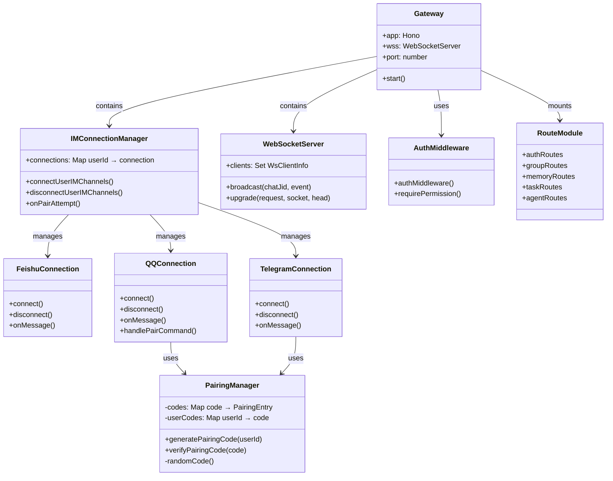

# HappyClaw Gateway Codemap: HTTP/WebSocket Gateway with Pairing Mechanism

## Project Overview

HappyClaw Gateway is the **HTTP/WebSocket entry point** that handles:
- Webhook requests from IM platforms (Feishu, Telegram, QQ)
- REST API for the React web UI
- WebSocket upgrade for real-time streaming of agent output
- Per-user IM connection management
- Authentication and authorization via session cookies
- Pairing mechanism for binding IM chats to user accounts

**Official Resources:**
- GitHub Repository: [riba2534/happyclaw](https://github.com/riba2534/happyclaw)
- Based on: [Hono](https://hono.dev/) - Ultrafast web framework for Node.js

---

## Codemap: System Context

```
src/
├── web.ts                 # Main Hono gateway setup, WebSocket server
├── web-context.ts         # Shared state and dependency injection
├── index.ts               # Entry point: IM polling, IPC listener
├── middleware/auth.ts     # Authentication middleware
├── feishu.ts              # Feishu IM connection factory
├── telegram.ts            # Telegram IM connection factory
├── qq.ts                  # QQ IM connection factory (with pairing)
├── telegram-pairing.ts     # Pairing code generation/verification
├── im-manager.ts          # Per-user IM connection pool manager
├── routes/
│   ├── auth.ts            # Authentication routes (login/register)
│   ├── groups.ts          # Group/workspace CRUD
│   ├── memory.ts          # Memory search API
│   ├── tasks.ts           # Scheduled tasks CRUD
│   ├── agents.ts          # Sub-agent CRUD
│   ├── admin.ts           # Admin user/invite management
│   └── config.ts          # System configuration
└── shared/
    └── stream-event.ts    # Stream event type definition (single source of truth)
```

---

## Component Diagram



---

## Data Flow Diagram (Message Processing)


---

## 1. Gateway Architecture

HappyClaw Gateway uses **Hono for HTTP routing + ws library for WebSocket** serving both REST API and real-time streaming.

### Key Characteristics:

| Feature | Implementation |
|---------|----------------|
| **HTTP Framework** | Hono (Node.js) - ultrafast, small footprint |
| **WebSocket** | Separate `ws.WebSocketServer` attached to same HTTP server |
| **CORS** | Configurable allowed origins via middleware |
| **Authentication** | HMAC-signed cookies, 30-day sessions |
| **Rate Limiting** | 5 failed login attempts → 15-minute lockout |
| **Multi-IM Support** | Per-user connection pool, each user can have independent Feishu/Telegram/QQ |

### HTTP API Structure

```
GET/POST /api/auth/*        - Authentication (login/logout/register/profile)
GET/POST /api/groups/*     - Group/workspace management
GET/POST /api/memory/*     - Memory file access and search
GET/POST /api/tasks/*      - Scheduled tasks
GET/POST /api/agents/*     - Sub-agent management
GET/POST /api/admin/*      - Admin user/invite management
GET/POST /api/config/*     - System configuration
GET/POST /api/browse/*     - Directory browsing (mount-allowlist constrained)
WS /ws                      - WebSocket for real-time streaming
```

---

## 2. Pairing Mechanism

Pairing mechanism **binds external IM chats (QQ/Telegram) to a specific user account** so that messages from that IM chat are routed to the correct user's workspace. This is needed because IM platforms don't natively authenticate to HappyClaw user accounts.

### HappyClaw Pairing Design

**File**: `src/telegram-pairing.ts` (used by QQ connection)

### Core Data Structures

```typescript
// From: src/telegram-pairing.ts:L11-L22
interface PairingEntry {
  userId: string;
  expiresAt: number; // epoch ms
}

// code → entry
const codes = new Map<string, PairingEntry>();
// userId → code  (ensures only one active code per user)
const userCodes = new Map<string, string>();
```

### Configuration Constants

```typescript
const PAIRING_TTL_MS = 5 * 60 * 1000; // 5 minutes
const CODE_LENGTH = 6;  // 6 uppercase alphanumeric characters
```

### Pairing Flow: User Perspective

**On Web UI (authenticated user)**:
1. User goes to QQ settings page
2. Clicks "Generate Pairing Code"
3. Gateway calls `generatePairingCode(userId)`
4. 6-digit code displayed to user, expires in 5 minutes
5. User goes to QQ client, finds the chat to pair, sends `/pair <code>`

**On QQ Bot (unauthenticated)**:
1. QQ bot receives message starting with `/pair `
2. Extracts code, calls `verifyPairingCode(code)`
3. If valid and not expired → binds this QQ chat to the user account
4. Replies success/failure to the QQ chat

### Code: Generate Pairing Code

```typescript
// From: src/telegram-pairing.ts:L35-L54
export function generatePairingCode(userId: string): {
  code: string;
  expiresAt: number;
  ttlSeconds: number;
} {
  // Revoke any previous code for this user
  const prev = userCodes.get(userId);
  if (prev) codes.delete(prev);

  let code: string;
  do {
    code = randomCode();
  } while (codes.has(code)); // extremely unlikely collision

  const expiresAt = Date.now() + PAIRING_TTL_MS;
  codes.set(code, { userId, expiresAt });
  userCodes.set(userId, code);

  return { code, expiresAt, ttlSeconds: PAIRING_TTL_MS / 1000 };
}
```

### Code: Verify and Consume Pairing Code

```typescript
// From: src/telegram-pairing.ts:L56-L73
export function verifyPairingCode(code: string): { userId: string } | null {
  const entry = codes.get(code.toUpperCase());
  if (!entry) return null;
  if (Date.now() > entry.expiresAt) {
    // Expired — clean up
    codes.delete(code.toUpperCase());
    if (userCodes.get(entry.userId) === code.toUpperCase()) {
      userCodes.delete(entry.userId);
    }
    return null;
  }
  // Consume (single use)
  codes.delete(code.toUpperCase());
  if (userCodes.get(entry.userId) === code.toUpperCase()) {
    userCodes.delete(entry.userId);
  }
  return { userId: entry.userId };
}
```

### Code: Secure Random Code Generation

```typescript
// From: src/telegram-pairing.ts:L24-L33
function randomCode(): string {
  const chars = 'ABCDEFGHIJKLMNOPQRSTUVWXYZ0123456789';
  const limit = 256 - (256 % chars.length); // 252 — eliminates modulo bias
  let result = '';
  while (result.length < CODE_LENGTH) {
    const byte = crypto.randomBytes(1)[0];
    if (byte < limit) result += chars[byte % chars.length];
  }
  return result;
}
```

**Note**: The calculation `256 - (256 % chars.length)` eliminates **modulo bias** that would make some characters more likely than others when using `crypto.randomBytes()` directly. This is a security best practice for generating random codes.

### HappyClaw Pairing vs RUA Gateway Pairing

| Aspect | HappyClaw (QQ/Telegram) | RUA Gateway (TUI) |
|--------|--------------------------|-------------------|
| **Code Length** | 6 characters | 8 characters |
| **Expiry** | 5 minutes | One-time (server restart invalidates) |
| **Storage** | In-memory (lost on restart) | In-memory |
| **Per-user Limit** | One active code per user | One active code overall |
| **Uses** | Bind IM chats to existing user | Authenticate new TUI client to get token |
| **Result** | Chat JID added to user's paired chats | Client receives long-lived access token |

### HappyClaw QQ Pairing Flow in Code

```typescript
// From: src/qq.ts:L697-L712
// ── /pair <code> command ──
const pairMatch = content.match(/^\/pair\s+(\S+)/i);
if (pairMatch && opts.onPairAttempt) {
  const code = pairMatch[1];
  try {
    const success = await opts.onPairAttempt(jid, chatName, code);
    const reply = success
      ? '配对成功！此聊天已连接到你的账号。'
      : '配对码无效或已过期，请在 Web 设置页重新生成。';
    await sendQQMessage('c2c', userOpenId, reply);
  } catch (err) {
    logger.error({ err, jid }, 'QQ pair attempt error');
    await sendQQMessage('c2c', userOpenId, '配对失败，请稍后重试。');
  }
  return;
}

// ── Authorization check ──
if (!opts.isChatAuthorized(jid)) {
  const now = Date.now();
  const lastReject = rejectTimestamps.get(jid) ?? 0;
  if (now - lastReject >= REJECT_COOLDOWN_MS) {
    await sendQQMessage(
      'c2c',
      userOpenId,
      '此聊天尚未配对。请发送 /pair <code> 进行配对。\n' +
        '你可以在 Web 设置页生成配对码。',
    );
  }
  return;
}
```

### Security Properties of HappyClaw Pairing

1. **Single-use**: Code is consumed after one verification → can't be reused if intercepted
2. **Short TTL**: 5-minute expiry window limits exposure
3. **One code per user**: Generating a new code invalidates any previous code
4. **Cryptographically secure**: Uses `crypto.randomBytes()` for entropy, eliminates modulo bias
5. **Case-insensitive verification**: User can enter lowercase even though generated uppercase
6. **Lazy cleanup**: Expired codes are cleaned up on access → no periodic GC needed

---

## 3. WebSocket Streaming Protocol

The gateway uses **WebSocket to stream agent output** to the web UI in real-time. All agent events (text delta, thinking delta, tool use) are streamed as they happen.

### Outbound Message Types (Server → Client)

| Type | Purpose |
|------|---------|
| `new_message` | New message arrived from IM |
| `agent_reply` | Final agent reply complete |
| `typing` | Indicate agent is typing |
| `status_update` | System status (active containers, queue length) |
| `stream_event` | Incremental streaming event (text, tool, thinking) |
| `agent_status` | Sub-agent status changed |
| `terminal_output` | Terminal session output |
| `docker_build_log` | Docker image build log |

### Inbound Message Types (Client → Server)

| Type | Purpose |
|------|---------|
| `send_message` | Send new message to agent |
| `terminal_start/input/resize/stop` | Interactive terminal control |

---

## 4. Key Source Files & Implementation Points

| File | Line Range | Purpose |
|------|------------|---------|
| **`src/web.ts`** | entire | Main Hono gateway setup, WebSocket server initialization |
| **`src/middleware/auth.ts`** | entire | Session authentication middleware, permission checking |
| **`src/im-manager.ts`** | entire | Per-user IM connection pool management |
| **`src/feishu.ts`** | entire | Feishu WebSocket connection factory |
| **`src/telegram.ts`** | entire | Telegram long polling connection factory |
| **`src/qq.ts`** | entire | QQ Bot API v2 connection with pairing support |
| **`src/telegram-pairing.ts`** | 1-74 | Pairing code generation/verification core logic |
| **`src/routes/auth.ts`** | entire | Authentication API endpoints |
| **`src/routes/config.ts`** | entire | System/IM configuration endpoints |
| **`shared/stream-event.ts`** | entire | Single source of truth for streaming event types |

---

## Summary of Key Design Choices

### Gateway Architecture
- **Hono for HTTP**: Small and fast compared to Express, good for Node.js API
- **Separate WebSocket server**: Shares the same port with HTTP, handles upgrade explicitly
- **Per-user IM connections**: Each user has independent IM bots, allows multiple users on same server
- **Connection pooling**: LRU deduplication for incoming messages, prevents duplicate processing

### Pairing Mechanism
- **Short-lived single-use codes**: Security tradeoff - convenience vs risk. Users don't need long-term credentials for pairing.
- **In-memory only**: Simplicity, no database bloat. Codes don't survive restart but that's acceptable since pairing is rare.
- **One code per user**: Prevent multiple concurrent codes, reduce attack surface.
- **Cryptographically secure random**: Proper elimination of modulo bias for uniform distribution.

### Security Features
- **HMAC-signed cookies**: Stateless session authentication, no session database needed for validation
- **bcrypt password hashing**: 12 rounds, standard practice
- **Rate limiting on login**: Prevent brute force password guessing
- **CORS configurable**: Allow specific origins only in production
- **Mount whitelist/blocklist**: Delegated to container-runner for filesystem access control

### Tradeoffs
- **In-memory pairing codes**: Simplicity vs persistence - codes lost on restart, user just generates another. Acceptable for low-frequency operation.
- **Per-user IM connections**: Isolation vs resource usage - each user gets own connection, uses more connections but properly isolated.
- **WebSocket broadcasting**: Push-based real-time vs polling - lower latency for streaming, needs persistent connection.

HappyClaw gateway makes **pragmatic security and simplicity choices** for a self-hosted multi-user system, with pairing being a clean minimal design that solves the problem of binding external unauthenticated IM chats to internal user accounts.
