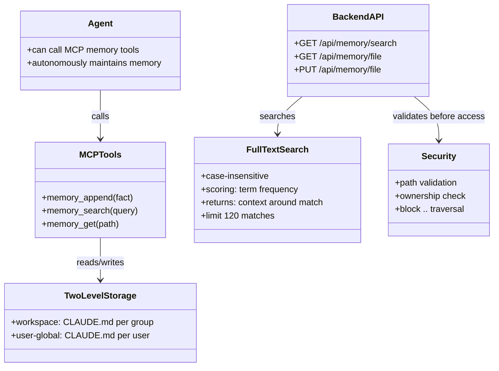

# HappyClaw Memory Mechanism Codemap: Hybrid Agent-autonomous Persistent Memory

## Overview

HappyClaw uses a **hybrid memory system** where:
1.  The **agent autonomously maintains** its own memory in markdown files (`CLAUDE.md`)
2.  SQLite stores **metadata and full message history**
3.  **MCP tools** allow the agent to append, search, and retrieve memory
4.  **Two-level memory**: Workspace-level + User-global (cross-workspace) memory

This design lets the agent itself decide what information is important enough to remember across conversations, while still providing persistent searchable storage.

**Sources:**
- MCP tools: `container/agent-runner/src/mcp-tools.ts`
- API: `src/routes/memory.ts`
- Backend search: `src/routes/memory.ts`

---

## Codemap: System Context

```
container/agent-runner/src/
└── mcp-tools.ts            # MCP tool definitions: memory_append, memory_search, memory_get

src/
├── routes/memory.ts         # Backend API: memory search, file read/write
└── db.ts                   # Database for message history

Filesystem:
data/
├── groups/{folder}/
│   └── CLAUDE.md           # Workspace-level memory
└── groups/user-global/{userId}/
    └── CLAUDE.md           # User-global memory (cross-workspace)
```

---

## Component Diagram



---

## 1. Two-level Memory Architecture

### Level 1: Workspace Memory

- **Location**: `data/groups/{folder}/CLAUDE.md`
- **Scope**: Specific to one workspace/group
- **Purpose**: Project-specific facts, decisions, notes that only matter for this workspace

### Level 2: User-global Memory

- **Location**: `data/groups/user-global/{userId}/CLAUDE.md`
- **Scope**: All workspaces for this user
- **Purpose**: User preferences, personal facts, habits that apply everywhere
- **Mounting**: Every container/agent run by this user gets this directory mounted at `/workspace/global`

### Storage Properties

| Property | Value |
|----------|-------|
| Format | Plain markdown (plain text) |
| Max file size | 500KB (global), 512KB per file |
| Editing | Agent can append and rewrite via MCP tools |
| Ownership | Isolated per user/group - users can't access each other's memory |

---

## 2. MCP Tools for Memory Access

The agent can access memory via three MCP tools that run in-process:

### 1. `memory_append` - Append a new fact to memory

**Arguments:**
- `content`: Text content to append (markdown supported)
- `path`: Optional relative path - defaults to `CLAUDE.md` (workspace memory), use `global:CLAUDE.md` for user-global

**Flow:**
1. Validate path and user ownership
2. Ensure parent directory exists
3. Append content to file with newline separation
4. Return success/failure

```typescript
// Atomic write pattern used for all IPC:
const tempPath = `${filepath}.tmp`;
fs.writeFileSync(tempPath, newContent);
fs.renameSync(tempPath, filepath);  // Atomic rename → no partial reads
```

### 2. `memory_search` - Full-text search across memory

**Arguments:**
- `query`: Search query text

**Flow:**
1. Recursively scan memory directory for matching files (`.md`, `.txt`, etc.)
2. For each file, read content, split into terms
3. Count term frequency for each file
4. Collect matching contexts (surrounding text around each match)
5. Sort by score (number of matches)
6. Return top 120 results with context

### 3. `memory_get` - Retrieve full content of a memory file

**Arguments:**
- `path`: Relative path to the file

**Returns:** Full text content of the file.

---

## 3. Backend Memory API

The web UI also has access to memory via REST API:

| Endpoint | Method | Purpose |
|----------|--------|---------|
| `GET /api/memory/sources` | GET | List available memory sources (workspace + global) |
| `GET /api/memory/search` | GET | Full-text search across all accessible memory files |
| `GET /api/memory/file` | GET | Read a memory file |
| `PUT /api/memory/file` | PUT | Write to a memory file |

### Search Implementation

```typescript
// From: src/routes/memory.ts
// Recursively search directory for matching terms
function searchDirectory(
  dir: string,
  terms: string[],
  hits: MemorySearchHit[],
  user: AuthUser,
): void {
  for (const entry of fs.readdirSync(dir)) {
    const fullPath = path.join(dir, entry);
    const stat = fs.statSync(fullPath);
    if (stat.isDirectory()) {
      if (skipDirs.has(entry)) continue;
      searchDirectory(fullPath, terms, hits, user);
      continue;
    }
    const ext = path.extname(entry).toLowerCase();
    if (!allowedExtensions.has(ext)) continue;
    // Check file size and read
    const content = fs.readFileSync(fullPath, 'utf-8').toLowerCase();
    let score = 0;
    for (const term of terms) {
      const matches = content.matchAll(new RegExp(term, 'g'));
      score += Array.from(matches).length;
    }
    if (score > 0) {
      // Extract context around each match
      hits.push({ path: relativePath, score, context });
    }
  }
}
```

### Security Checks

All memory access goes through security validation:

```typescript
// From: src/routes/memory.ts:L48-L53
function isWithinRoot(targetPath: string, rootPath: string): boolean {
  const relative = path.relative(rootPath, targetPath);
  return (
    relative === '' ||
    (!relative.startsWith('..') && !path.isAbsolute(relative))
  );
}
```

1. **No path traversal**: `..` is rejected, normalized path must stay within allowed root
2. **Ownership check**: Non-admin users can only access their own user-global memory and groups they are members of
3. **Allowed extensions**: Only text-based files are searchable

---

## 4. Filesystem Layout

```
data/groups/
├── {workspace-folder}/
│   ├── CLAUDE.md              # Main workspace memory
│   ├── logs/                  # Container/agent execution logs
│   ├── conversations/         # Archived full conversations (pre-compaction)
│   └── downloads/             # IM downloads (images, files)
├── user-global/
│   └── {userId}/
│       └── CLAUDE.md          # User-global memory for this user
└── main/
    └── CLAUDE.md              # Admin main workspace memory

data/memory/
└── {folder}/                # Additional memory storage per folder
```

---

## 5. Daily Summary

HappyClaw automatically runs **daily summary** at 2-3 AM per user:
- Agent summarizes the day's activity
- Writes summary to `HEARTBEAT.md` in the user-global memory
- Provides a chronological recap of what happened each day

---

## 6. Key Source Files & Implementation Points

| File | Lines | Purpose |
|------|-------|---------|
| `container/agent-runner/src/mcp-tools.ts` | entire | MCP tool definitions for memory_append/search/get |
| `src/routes/memory.ts` | entire | Backend REST API, full-text search implementation |
| `src/container-runner.ts` | 209-228 | Mounts user-global memory into container |

---

## Summary of Key Design Choices

### Hybrid Design: Agent-autonomous + Markdown

| Advantage | Reasoning |
|-----------|-----------|
| **Agent decides what to remember** | The agent knows what information it will need later better than any fixed schema |
| **Markdown is human-editable** | Users can easily read/edit the memory files directly in a text editor |
| **Full-text search works everywhere** | Doesn't require a separate search engine - simple recursive search works for self-hosted |
| **Two-level organization** | Separates project-specific facts from user preferences - clean organization |

### Security

- **Path validation** prevents directory traversal attacks
- **Ownership checking** ensures users can only access their own memory
- **File size limits** prevent filling disk with huge memory files
- **Atomic writes** (`.tmp` then rename) prevent partial reads when multiple writes happen concurrently

### Tradeoffs

| Tradeoff | Reasoning |
|----------|-----------|
| **Recursive full-text search vs dedicated search engine**: Simple, no extra dependencies vs not the fastest for 1000+ files - acceptable for self-hosted |
| **Agent-autonomous vs curated by user**: Agent can autonomously build its own memory, user can edit if needed |
| **Markdown vs database**: Human-readable, easy to backup/migrate vs not as structured - markdown is more flexible for an agent to edit |

HappyClaw's memory design is **ideal for self-hosted persistent memory** where the agent gradually builds up its own knowledge over time, with the flexibility for user intervention when needed. The two-level organization correctly separates project-specific knowledge from general user preferences.
