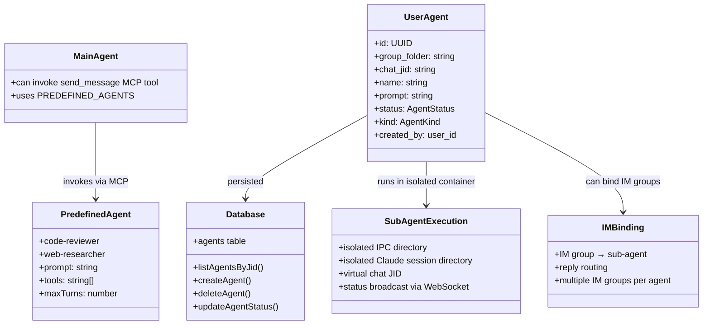

# HappyClaw Sub-agent Codemap: Specialized Agent System

## Overview

HappyClaw implements a **two-level sub-agent system** built on top of the Claude Agent SDK's native sub-agent support:
1.  **Predefined Sub-agents**: Built-in specialized agents (code-reviewer, web-researcher) that any main agent can invoke via MCP tools
2.  **User-configurable Sub-agents**: Users can create custom conversation agents through the web UI, bind IM groups to them, and run them in parallel with the main conversation

Each sub-agent has its **own isolated session, filesystem workspace, and prompt-based "soul" (persona)**.

**Sources:**
- Predefined: `container/agent-runner/src/agent-definitions.ts`
- API: `src/routes/agents.ts`
- Database: `agents` table (see database codemap)

---

## Codemap: System Context

```
container/agent-runner/src/
├── agent-definitions.ts    # Predefined sub-agent definitions
└── mcp-tools.ts            # MCP tool definitions (send_message to sub-agent)

src/
├── routes/agents.ts         # Web API for user-configured sub-agents
├── db.ts                    # Database CRUD for agents
├── types.ts                # Type definitions (SubAgent, AgentStatus, AgentKind)
└── web.ts                  # WebSocket status broadcasting
```

---

## Component Diagram



---

## 1. Predefined Sub-agents

Predefined sub-agents are **built into the agent runner** and available to any main agent via the MCP `send_message` tool:

```typescript
// From: container/agent-runner/src/agent-definitions.ts:L10-L27
export const PREDEFINED_AGENTS: Record<string, AgentDefinition> = {
  'code-reviewer': {
    description: 'Code review agent that analyzes code quality, best practices, and potential issues',
    prompt:
      'You are a strict code reviewer. Focus on correctness, security, performance, and maintainability. ' +
      'Point out specific issues with file:line references. Be concise and actionable.',
    tools: ['Read', 'Glob', 'Grep'],
    maxTurns: 15,
  },
  'web-researcher': {
    description: 'Web research agent that searches and extracts information from web pages',
    prompt:
      'You are an efficient web researcher. Search for information, extract key facts, and summarize findings. ' +
      'Always cite sources with URLs. Prefer authoritative sources.',
    tools: ['WebSearch', 'WebFetch', 'Read', 'Write'],
    maxTurns: 20,
  },
};
```

### Key Characteristics:

| Property | Purpose |
|----------|---------|
| `description` | Human-readable description shown to the main agent for when to use it |
| `prompt` | System prompt that defines the agent's behavior - this is its "soul" |
| `tools` | Allowlist of tools the sub-agent can use - security containment |
| `maxTurns` | Maximum number of turns to prevent infinite loops |

These are registered via the Claude Agent SDK's native `agents` option when the main agent calls `query()`, so the SDK handles all the sub-agent invocation routing natively.

---

## 2. User-configurable Sub-agents (Conversation Agents)

Users can create **custom conversation agents** through the web UI. Each is:
- Stored in the database `agents` table
- Gets its own isolated IPC directory
- Gets its own isolated Claude session directory
- Can have multiple IM groups bound to it (all messages from those groups go to this agent)
- Status is tracked and broadcast via WebSocket to the web UI

### Database Schema

```sql
CREATE TABLE IF NOT EXISTS agents (
  id TEXT PRIMARY KEY,
  group_folder TEXT NOT NULL,
  chat_jid TEXT NOT NULL,
  name TEXT NOT NULL,
  prompt TEXT NOT NULL,
  status TEXT NOT NULL DEFAULT 'running',
  created_by TEXT,
  created_at TEXT NOT NULL,
  completed_at TEXT,
  result_summary TEXT,
  last_im_jid TEXT
);
```

### Creation Flow (Web API)

```typescript
// From: src/routes/agents.ts:L74-L163
POST /api/groups/:jid/agents
  1. Validate user has access to group
  2. Generate random UUID for agent ID
  3. Create agent record in database
  4. Create isolated IPC directories:
     data/ipc/{group_folder}/agents/{agentId}/
       ├── input/
       ├── messages/
       └── tasks/
  5. Create isolated Claude session directory:
     data/sessions/{group_folder}/agents/{agentId}/.claude/
  6. Create virtual chat record for this agent's messages
  7. Broadcast agent_status (idle) via WebSocket
  8. Return agent to client
```

### Deletion Flow

```typescript
DELETE /api/groups/:jid/agents/:agentId
  1. Validate ownership
  2. Check if agent has active IM bindings - block deletion if yes
  3. If running, stop the process via group queue
  4. Delete IPC directories recursively
  5. Delete session directory recursively
  6. Delete virtual chat messages if conversation kind
  7. Delete from database
  8. Broadcast removal via WebSocket
```

---

## 3. IM Group Binding

Users can **bind entire IM groups to a specific sub-agent**:
- All messages from the bound IM group are routed directly to that sub-agent
- One sub-agent can have multiple IM groups bound
- You can also bind IM groups to the workspace's main conversation

### API Endpoints:

| Endpoint | Method | Purpose |
|----------|--------|---------|
| `GET /api/groups/:jid/im-groups` | GET | List available IM groups user can bind |
| `PUT /api/groups/:jid/agents/:agentId/im-binding` | PUT | Bind an IM group to this agent |
| `DELETE /api/groups/:jid/agents/:agentId/im-binding/:imJid` | DELETE | Unbind an IM group |
| `PUT /api/groups/:jid/im-binding` | PUT | Bind IM group to workspace main conversation |
| `DELETE /api/groups/:jid/im-binding/:imJid` | DELETE | Unbind from main conversation |

### Binding Conflicts

If an IM group is already bound elsewhere:
- The API returns 409 Conflict with error message
- User must explicitly confirm with `force: true` to rebind
- Prevents accidental binding overwrites

---

## 4. Isolation Guarantees

| Isolation Layer | Sub-agent | Main Conversation |
|-----------------|-----------|------------------|
| Database | Isolated `agents` record | Shared with group |
| IPC Directory | `data/ipc/{group}/agents/{agentId}/` | `data/ipc/{group}/` |
| Claude Session | `data/sessions/{group}/agents/{agentId}/.claude/` | `data/sessions/{group}/.claude/` |
| Execution | Separate container/process | Separate container/process |

This means:
- Sub-agent context doesn't interfere with main conversation context
- Multiple sub-agents can run in parallel
- Each sub-agent has its own context window

---

## 5. Status Tracking & Real-time Updates

Every sub-agent has a **status** tracked in database and broadcast via WebSocket:

```typescript
// From: src/types.ts
export type AgentStatus = 'idle' | 'running' | 'completed' | 'error';
export type AgentKind = 'task' | 'conversation';
```

| Status | Meaning |
|--------|---------|
| `idle` | Created but not running, ready to receive messages |
| `running` | Currently executing |
| `completed` | Finished execution successfully |
| `error` | Execution failed with error |

When status changes, gateway **broadcasts to all connected Web clients**:

```typescript
// From: src/web.ts
broadcastAgentStatus(jid, agentId, status, name, prompt, resultSummary);
```

WebSocket message format:
```json
{
  "type": "agent_status",
  "chatJid": "jid",
  "agentId": "uuid",
  "status": "running",
  "kind": "conversation",
  "name": "Agent Name",
  "prompt": "system prompt",
  "resultSummary": "..."
}
```

---

## 6. Key Source Files & Implementation Points

| File | Lines | Purpose |
|------|-------|---------|
| `container/agent-runner/src/agent-definitions.ts` | 1-28 | Predefined sub-agent definitions |
| `src/routes/agents.ts` | 1-646 | Complete Web API CRUD + IM binding |
| `src/db.ts` | CREATE TABLE agents | Database schema |
| `src/types.ts` | 278-295 | Type definitions |
| `src/container-runner.ts` | 267-287 | IPC/session directory structure |

---

## Summary of Key Design Choices

### Design Points

1. **Leverage Claude Agent SDK native sub-agents**: Doesn't reinvent the wheel - uses the official SDK implementation
2. **Prompt-based identity**: Sub-agent "personality" is entirely defined by the system prompt - simple and flexible
3. **Tool allowlist per sub-agent**: Each sub-agent can only use the tools it's allowed - security containment for specialized tasks
4. **Full isolation**: Every sub-agent gets its own session directory and IPC - no context cross-contamination
5. **IM binding**: Bind any IM group to any sub-agent - great for creating specialized bots for specific channels
6. **Status broadcasting**: Real-time status updates via WebSocket - UI always current

### Tradeoffs

| Tradeoff | Reasoning |
|----------|-----------|
| **Isolated directories per sub-agent**: Strong isolation vs more disk usage - acceptable since each agent's session is compressed |
| **Database persisted**: User agents survive restart - good for long-running conversations |
| **Virtual chat JID**: Separate message history per agent - easier to follow conversation in web UI |
| **Predefined agents fixed in code**: No persistence needed, always available - simple, users can create their own if they need more |

The sub-agent system is **a clean extension of the Claude Agent SDK's native capabilities** that adds user configurability and IM routing while maintaining strong isolation between agents. This enables parallel execution of multiple specialized agents within the same HappyClaw instance.
