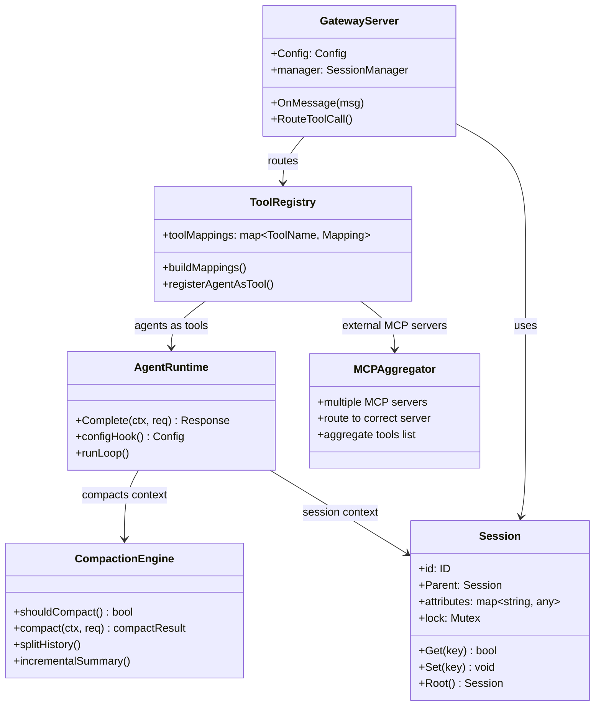

# Nanobot Codemap: Standalone MCP Host with Agent Composition

This research analyzes **Nanobot** - a standalone open-source MCP (Model Context Protocol) host that enables building agents with MCP and MCP-UI. Unlike built-in MCP hosts in applications like VSCode or Claude, Nanobot is designed to be an open-source, deployable solution that combines multiple MCP servers with LLMs to create agent experiences through various interfaces (chat, voice, SMS, etc.).

## Research Scope

For each core module, we examined:
1.  **Architecture Overview** - How the module fits into the overall system
2.  **Data Structures and Type System** - Key types in Go
3.  **Complete Operation Flow** - Step-by-step process for key operations
4.  **Code Maps** - Key source files with line numbers and core algorithm snippets
5.  **Design Choices & Tradeoffs** - Why it was built this way

## Core Modules Researched

| Module | Architecture | Main Approach | Report |
|--------|--------------|---------------|--------|
| [Gateway Mechanism](codemap/gateway-codemap.md) | MCP HTTP Gateway | Aggregates multiple MCP servers into single endpoint, routes tool calls | [codemap/gateway-codemap.md](codemap/gateway-codemap.md) |
| [Sub-agent Mechanism](codemap/subagent-codemap.md) | MCP-based Composition | Agents defined in config, exposed as callable tools | [codemap/subagent-codemap.md](codemap/subagent-codemap.md) |
| [Context Trimming](codemap/context-trimming-codemap.md) | Incremental Summarization | Token-based triggering, incremental compaction of conversation history | [codemap/context-trimming-codemap.md](codemap/context-trimming-codemap.md) |
| [Context Isolation](codemap/context-isolation-codemap.md) | Session Tree with Inheritance | Per-connection session tree with attribute isolation and parent inheritance | [codemap/context-isolation-codemap.md](codemap/context-isolation-codemap.md) |
| [Memory Mechanism](codemap/memory-codemap.md) | In-session with Compaction | Transient in-session memory, compaction with archival, extensible via MCP | [codemap/memory-codemap.md](codemap/memory-codemap.md) |

## Summary Table - Key Characteristics

| Module | Storage Approach | Isolation | Key Feature |
|--------|------------------|-----------|-------------|
| **Gateway** | In-memory aggregation | Per-session | Multi-MCP-server aggregation into one endpoint |
| **Sub-agent** | YAML config | MCP-based | Any agent can invoke any other agent as tool |
| **Context Trimming** | In-memory with archival | N/A | Incremental summarization, doesn't discard archived messages |
| **Context Isolation** | Session tree with attributes | Per-session with parent inheritance | Thread-safe attribute storage, cancellation propagation |
| **Memory** | In-memory session | Per-session | No built-in vector DB, relies on MCP extensions |

## Overview: Architecture Summary

Nanobot is a **clean, modular MCP host implementation** that:

1.  **Protocol-first Design**: Everything is MCP - agents are MCP servers, tools come from MCP servers, the gateway speaks MCP
2.  **Aggregated Gateway**: Exposes multiple MCP servers and agents through a single MCP endpoint
3.  **Hierarchical Sub-agents**: Any agent can invoke any other agent as a tool through MCP
4.  **Incremental Context Compaction**: Only summarizes messages since last compaction, keeping prompt size bounded
5.  **Session Tree Isolation**: Each connection gets isolated session with attribute inheritance for sub-agents

### High-level Architecture Diagram



## Directory Structure

```
~/my-research/claw/nanobot/
├── README.md                 # This file - overview and comparison
└── codemap/                  # Detailed codemap for each core module
    ├── gateway-codemap.md          # MCP gateway aggregation
    ├── subagent-codemap.md         # Sub-agent composition via MCP
    ├── context-trimming-codemap.md  # Incremental compaction algorithm
    ├── context-isolation-codemap.md  # Session tree and attributes
    └── memory-codemap.md           # Memory architecture
```

## Reading the Reports

Each codemap file follows the same structure:
1.  Module overview and official links
2.  Architecture diagrams (class and data flow)
3.  Complete storage/layout description
4.  Step-by-step operation flow for key operations
5.  Key source files with line numbers
6.  Core code snippets showing key algorithms
7.  Summary of design choices and tradeoffs

## References

[^1]: GitHub Repository - [https://github.com/nanobot-ai/nanobot](https://github.com/nanobot-ai/nanobot)
[^2]: Nanobot CLAUDE.md - https://github.com/nanobot-ai/nanobot/blob/main/CLAUDE.md
