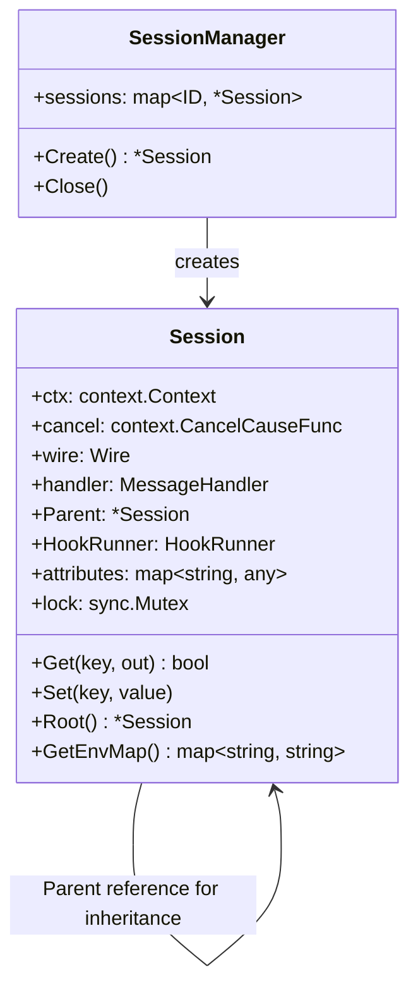
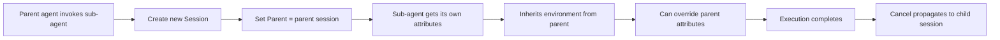

# Nanobot Context Isolation Codemap: Session Tree with Attribute Inheritance

## Overview

Nanobot uses **session-based context isolation** where each MCP connection gets its own independent session with isolated state. Sessions form a tree with parent-child relationships for sub-agent invocations, enabling environment inheritance with isolation.

**Official Resources:**
- GitHub Repository: [nanobot-ai/nanobot](https://github.com/nanobot-ai/nanobot)
- Source Locations: `pkg/mcp/session.go`, `pkg/session/`

---

## Codemap: System Context

```
pkg/
├── mcp/
│   └── session.go            # Session implementation with attributes
└── session/
    └── manager.go            # Session manager
```

---

## Component Diagram



---

## Data Flow Diagram (Sub-agent Session Creation)



---

## 1. Session Structure

Each connection gets its own **isolated session**:

```go
// From: pkg/mcp/session.go
type Session struct {
	ctx               context.Context
	cancel            context.CancelCauseFunc
	wire              Wire
	handler           MessageHandler
	pendingRequest    PendingRequests
	InitializeResult  InitializeResult
	InitializeRequest InitializeRequest
	Parent            *Session  // Parent session for sub-agents
	HookRunner        HookRunner
	attributes        map[string]any  // Isolated attributes storage
	lock              sync.Mutex
	// ... other fields
}
```

---

## 2. Attribute Get/Set with Inheritance

The `Get` method **falls back to parent if not found in this session**:

```go
// From: pkg/mcp/session.go
// Get retrieves a value from session attributes, falling back to parent
func (s *Session) Get(key string, out any) (ret bool) {
	if s == nil {
		return false
	}
	defer func() {
		if !ret && s != nil && s.Parent != nil {
			ret = s.Parent.Get(key, out)
		}
	}()

	s.lock.Lock()
	defer s.lock.Unlock()
	v, ok := s.attributes[key]
	if !ok {
		return false
	}
	// copy into out via reflection
	return true
}

// Set stores a value in this session's attributes
func (s *Session) Set(key string, value any) {
	if s == nil {
		return
	}
	s.lock.Lock()
	defer s.lock.Unlock()
	if s.attributes == nil {
		s.attributes = make(map[string]any)
	}
	s.attributes[key] = value
}
```

**Root access** gets the root session by following parent links:

```go
// From: pkg/mcp/session.go
// Root returns the root session by following parent links
func (s *Session) Root() *Session {
	if s == nil {
		return nil
	}
	if s.Parent == nil {
		return s
	}
	return s.Parent.Root()
}
```

---

## 3. Environment Inheritance

Environment variables are **inherited from parent but can be overridden** in the child session:

```go
// From: pkg/mcp/session.go
func (s *Session) GetEnvMap() map[string]string {
	result := make(map[string]string)
	s.lock.Lock()
	env, _ := s.attributes[SessionEnvMapKey].(map[string]string)
	maps.Copy(result, env)
	s.lock.Unlock()

	if s.Parent != nil {
		parentEnv := s.Parent.GetEnvMap()
		for k, v := range parentEnv {
			if _, exists := env[k]; !exists {
				result[k] = v
			}
		}
	}

	return result
}
```

This gives a **good balance**:
- Child inherits environment from parent (good for sub-agents)
- Child can override specific variables if needed (flexible)
- Isolation: changes in child don't affect parent

---

## 4. Cancellation Propagation

Since each session has its own `context.CancelFunc`, **cancellation propagates** from parent to children:

- When parent is canceled, all child sessions are also canceled
- Prevents orphaned goroutines
- Clean resource management when user cancels a request

---

## 5. Docker Sandbox Isolation

Nanobot additionally supports **MCP servers running in Docker containers** for additional process-level isolation:

- Location: `pkg/mcp/sandbox/`
- Each MCP server runs in its own container
- Network can be isolated
- Filesystem is read-only unless explicitly mounted
- Provides process-level isolation beyond session-level isolation

This is **defense in depth**:
- Session-level isolation for logical separation
- Container-level isolation for process/OS separation
- Useful for untrusted MCP servers

---

## 6. Key Source Files & Implementation Points

| File | Purpose |
|------|---------|
| **`pkg/mcp/session.go`** | Session struct, Get/Set with inheritance, root, env |
| **`pkg/session/manager.go`** | Session creation and lifecycle management |
| **`pkg/mcp/sandbox/`** | Docker container sandbox for MCP servers |

---

## Summary of Key Design Choices

### Session Tree with Inheritance

- **Per-connection isolation**: Each client connection gets its own isolated session
- **Parent-child hierarchy**: Sub-agents get their own session but inherit from parent
- **Attribute fallthrough**: Get looks in current session, then parent, etc. - natural inheritance
- **Overridable**: Child can override parent attributes without affecting parent
- **Thread-safe**: All attribute access protected by mutex - safe for concurrent access

### Cancellation Propagation

- **Context cancellation propagates**: When parent cancels, all children cancel
- **Clean resource management**: No orphaned goroutines
- **Go native**: Uses standard Go context cancellation mechanism

### Defense in Depth

- **Session-level isolation**: Logical isolation between connections
- **Docker sandbox optional**: Additional process-level isolation for untrusted code
- **MCP sandboxing**: MCP servers can't access the host filesystem unless explicitly allowed

### Tradeoffs

- **Parent linked-list traversal on Get**: Every Get traverses parent links until found. Since attributes aren't usually accessed thousands of times per call, this is acceptable. If it becomes a problem, you could cache at each level, but that adds complexity.
- **In-memory attributes**: Simple and fast, doesn't need database. Session state is gone when connection closes - that's what you want for a stateless gateway.

Nanobot's context isolation is **clean and Go-idiomatic**, using composition and inheritance through parent references rather than complex copying. This gives natural isolation for sub-agents while enabling convenient inheritance of environment from parent.
