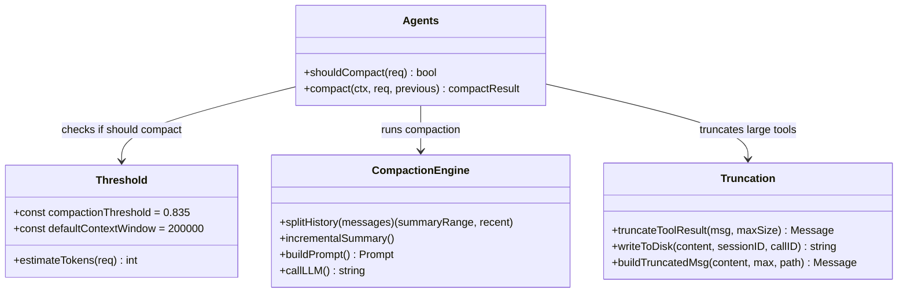
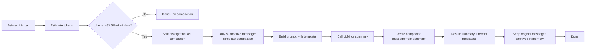

# Nanobot Context Trimming Codemap: Incremental Summarization Compaction

## Overview

Nanobot uses a **two-level context management strategy**:
1.  **Incremental summarization compaction** for conversation history when token thresholds are exceeded
2.  **Size-based truncation with disk overflow** for large tool outputs

This approach keeps conversations going indefinitely within context window limits while preserving as much context as possible.

**Official Resources:**
- GitHub Repository: [nanobot-ai/nanobot](https://github.com/nanobot-ai/nanobot)
- Source Locations: `pkg/agents/compact.go`, `pkg/agents/truncate.go`

---

## Codemap: System Context

```
pkg/agents/
├── compact.go               # Incremental conversation compaction by summarization
├── truncate.go               # Large tool output truncation to disk
└── run.go                    # Compaction triggering check
```

---

## Component Diagram



---

## Data Flow Diagram (Compaction)



---

## 1. Compaction Triggering

Compaction triggers when **estimated tokens exceed 83.5% of configured context window**:

```go
// From: pkg/agents/run.go
const compactionThreshold = 0.835
const defaultContextWindow = 200_000

// shouldCompact returns true if estimated tokens > threshold% of context window
func shouldCompact(req types.CompletionRequest, contextWindowSize int) bool {
	if contextWindowSize <= 0 {
		return false
	}

	estimated := estimateTokens(req.Input, req.SystemPrompt, req.Tools)
	threshold := int(float64(contextWindowSize) * compactionThreshold)
	return estimated > threshold
}
```

**Why 83.5%?** Leaves enough room for the summary to be generated and the model response to fit.

---

## 2. Incremental Compaction Algorithm

The key insight in Nanobot is **incremental compaction** - only messages since the last compaction get summarized, keeping the summarization prompt bounded:

```go
// From: pkg/agents/compact.go
func (a *Agents) compact(
	ctx context.Context,
	req types.CompletionRequest,
	currentRequestInput []types.Message,
	previousCompacted []types.Message,
) (*compactResult, error) {
	history, newInput := splitHistoryAndNewInput(req.Input, currentRequestInput)

	// Split history: find last compaction summary, only summarize what came after
	var previousSummaryText string
	var sinceLastSummary []types.Message
	lastSummaryIdx := -1
	for i, msg := range history {
		if IsCompactionSummary(msg) {
			lastSummaryIdx = i
			if len(msg.Items) > 0 && msg.Items[0].Content != nil {
				previousSummaryText = msg.Items[0].Content.Text
			}
		}
	}
	if lastSummaryIdx >= 0 {
		sinceLastSummary = history[lastSummaryIdx+1:]
	} else {
		sinceLastSummary = history
	}

	// Get summary from LLM using structured prompt
	summaryReq := types.CompletionRequest{
		Model: req.Model,
		Input: []types.Message{
			// prompt with transcript goes here
		},
	}

	resp, err := a.completer.Complete(ctx, summaryReq)
	// ... extract summary and build compacted input

	// Result: summary + new messages since last compaction
	compactedInput := []types.Message{summaryMessage}
	compactedInput = append(compactedInput, newInput...)

	// Keep all archived messages in memory for potential recovery
	archivedMessages := make([]types.Message, 0, len(previousCompacted)+len(history))
	archivedMessages = append(archivedMessages, previousCompacted...)
	archivedMessages = append(archivedMessages, history...)

	return &compactResult{
		compactedInput:   compactedInput,
		archivedMessages: archivedMessages,
	}, nil
}
```

### Why Incremental?

- **Prompt size stays bounded**: Even with very long conversations, you never summarize more than one compaction interval
- **Previous summary is incorporated**: The LLM updates the previous summary with new information
- **Memory is preserved**: Original messages are still in memory, can be recovered if needed

---

## 3. Large Tool Output Truncation

Separate from conversation compaction, Nanobot **truncates large tool outputs** to prevent them from consuming all the context window:

```go
// From: pkg/agents/truncate.go
const maxToolResultSize = 50 * 1025 // ~50 KiB

// truncateToolResult stores full output to disk when too large
func truncateToolResult(ctx context.Context, toolName, callID string, msg *types.Message) *types.Message {
	// ... check size
	if size <= maxToolResultSize {
		return msg
	}

	// Store full output to disk: sessions/<sessionID>/truncated-outputs/...
	filePath := filepath.Join(sessionsDir, sessionID, "truncated-outputs", fileName)
	writeFullResult(content, filePath)
	truncated := buildTruncatedContent(content, maxToolResultSize, filePath)

	// Return truncated message with reference to full file on disk
	return &types.Message{
		ID:   msg.ID,
		Role: msg.Role,
		Items: []types.CompletionItem{
			{
				ID: msg.Items[0].ID,
				ToolCallResult: &types.ToolCallResult{
					CallID: result.CallID,
					Output: newOutput,
				},
			},
		},
	}
}
```

**Characteristics:**
- Truncated output gets a note saying full output is at path
- Doesn't discard the information - just moves it off the context
- Agent can read the full file if it needs it
- 50 KiB limit prevents single huge tool output from eating all context

---

## 4. Key Source Files & Implementation Points

| File | Purpose |
|------|---------|
| **`pkg/agents/compact.go`** | Incremental compaction algorithm |
| **`pkg/agents/truncate.go`** | Large tool output truncation |
| **`pkg/agents/run.go:577-599`** | Compaction triggering check |

---

## Summary of Key Design Choices

### Incremental vs Full Recompaction

- **Incremental**: Only summarizes new messages since last compaction - prompt size bounded
- **Full recompaction**: Every compaction summarizes everything - prompt grows with conversation
- **Nanobot choice**: Incremental works better for long conversations, keeps prompt size manageable

### Threshold Triggering

- **Token-based**: Triggers when estimated tokens exceed 83.5% of context window
- **Model-agnostic**: Uses whatever LLM model the agent is already configured for for summarization
- **No extra model dependency**: Doesn't need a separate summarization model

### Archiving Instead of Deletion

- **Original messages preserved in memory**: If you need to recover, they're still there
- **Only the active context gets compacted**: History not lost
- **Memory tradeoff**: Uses more memory but preserves information - acceptable for most cases

### Disk Overflow for Tool Outputs

- **Large tool outputs don't have to be entirely in context**: Very large outputs go to disk
- **Agent can retrieve when needed**: Still accessible if needed
- **Prevents single large output from blowing context**: Good defense against context overflow from grep/find output

### Comparison to Other Approaches

| Aspect | Nanobot | OpenCode | ZeroClaw |
|--------|---------|----------|----------|
| **Algorithm** | Incremental summarization + disk overflow | Pruning + full compaction | Dual trigger auto-compaction + hard trimming |
| **Incremental** | Yes | No (pruning incremental) | Yes (keeps recent 20) |
| **Large tools** | Truncate to disk | Pruned from context | Truncation with fallback |
| **Archiving** | Yes, keep in memory | No, pruned | No, trimmed |

Nanobot's approach **prioritizes context preservation** - information is only moved, not completely dropped. This works well for long conversations where you might need to refer back to old information.
