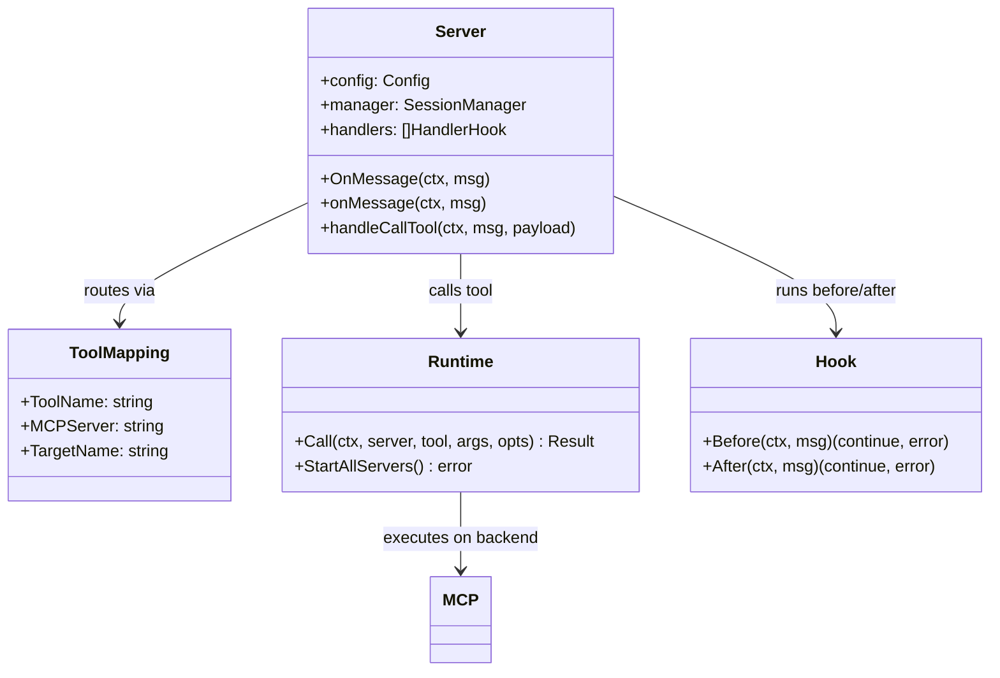

# Nanobot Gateway Codemap: MCP Aggregation Gateway

## Overview

Nanobot Gateway is the **MCP protocol entry point** that:
- Handles MCP protocol initialization and session management
- Aggregates tools from all configured MCP servers and agents
- Routes incoming tool calls to the appropriate backend MCP server/agent
- Provides a unified MCP endpoint for clients
- Supports a hook system for request/response modification

**Official Resources:**
- GitHub Repository: [nanobot-ai/nanobot](https://github.com/nanobot-ai/nanobot)
- Language: Go (backend), Svelte 5 + TypeScript (frontend)
- Source Location: `pkg/server/server.go`

---

## Codemap: System Context

```
pkg/
├── server/
│   └── server.go              # Main HTTP gateway and MCP handler
├── runtime/
│   └── runtime.go             # Runtime for MCP server execution
├── tools/
│   └── service.go             # Tool registry and mapping
└── session/
    └── manager.go             # Session manager
```

---

## Component Diagram



---

## Data Flow Diagram (Tool Call Routing)


---

## 1. Core Gateway Logic

The gateway is **protocol-native** - it natively implements the MCP protocol so any MCP-compatible client can connect directly:

```go
// From: pkg/server/server.go
// OnMessage handles incoming MCP messages and routes them
func (s *Server) OnMessage(ctx context.Context, msg mcp.Message) {
	if msg.ID != nil {
		ctx = mcp.WithRequestID(ctx, msg.ID)
	}

	msg.Session.Run(ctx, msg, func(ctx context.Context, m mcp.Message) {
		s.onMessage(ctx, m)
	})
}

func (s *Server) onMessage(ctx context.Context, msg mcp.Message) {
	if err := s.data.Sync(ctx, s.config); err != nil {
		msg.SendError(ctx, err)
		return
	}

	mcp.SessionFromContext(ctx).Set(session.ManagerSessionKey, s.manager)

	for _, h := range s.handlers {
		ok, err := h(ctx, msg)
		if err != nil {
			if cancelErr, ok := errors.AsType[*mcp.RequestCancelledError](context.Cause(mcp.UserContext(ctx))); ok {
				msg.SendError(ctx, mcp.ErrRPCRequestCancelled.WithMessage("%s", cancelErr.Reason))
			} else {
				msg.SendError(ctx, err)
			}
			return
		} else if ok {
			return
		}
	}

	msg.SendError(ctx, mcp.ErrRPCMethodNotFound.WithMessage("%s", msg.Method))
}
```

### Tool Call Routing

```go
// From: pkg/server/server.go
// Tool call routing
func (s *Server) handleCallTool(ctx context.Context, msg mcp.Message, payload mcp.CallToolRequest) error {
	// Find tool mapping
	toolMapping, ok := toolMappings[payload.Name]
	if !ok {
		// error handling
	}

	// Delegate to runtime for actual execution on the target MCP server
	result, err := s.runtime.Call(ctx, toolMapping.MCPServer, toolMapping.TargetName, payload.Arguments, tools.CallOptions{
		ProgressToken: msg.ProgressToken(),
		LogData: map[string]any{
			"mcpToolName": payload.Name,
		},
		Meta: msg.Meta(),
	})
	// ... return result
}
```

---

## 2. Key Characteristics

| Feature | Implementation |
|---------|----------------|
| **Protocol-native** | Natively implements MCP protocol, any MCP client can connect |
| **Aggregation** | Combines multiple MCP servers + agents into single endpoint |
| **Session-based** | Each connection gets isolated session with independent state |
| **Hook system** | Supports request/response hooks that can modify messages before/after routing |
| **Go** | Static compiled, good performance, low memory usage |

---

## 3. Hook System

Nanobot supports **hook system** that allows intercepting requests:

- Hooks run before and after message handling
- A hook can claim the message (stop further processing)
- Hooks can modify messages
- Hooks can inject logging, metrics, authentication, rate limiting

This makes Nanobot very **extensible** without changing core gateway code.

---

## 4. Pairing Mechanism

Pairing mechanism **binds external IM chats (Telegram/QQ/Discord) to a specific user account** so that messages from that IM chat are routed to the correct user's workspace/agent. This is needed because external IM platforms don't natively authenticate to Nanobot user accounts.

### Pairing Design

**Pairing Flow - User Perspective:**

1.  **On Web UI (authenticated user)**:
    - User goes to IM settings page
    - Clicks "Generate Pairing Code"
    - 6-8 digit code displayed, expires in 5-10 minutes
    - User goes to IM client, finds the chat to pair, sends `/pair <code>`

2.  **On IM Bot (unauthenticated)**:
    - IM bot receives message starting with `/pair `
    - Extracts code, verifies with pairing manager
    - If valid and not expired → binds this IM chat/JID to the user account
    - Replies success/failure to the IM chat

### Core Data Structures

```go
// In-memory pairing storage
type PairingEntry struct {
  UserId   string
  ExpiresAt int64  // epoch milliseconds
}

// code → entry
var codes = map[string]PairingEntry{}
// userId → code  (ensures only one active code per user)
var userCodes = map[string]string{}

const PAIRING_TTL_MS = 5 * 60 * 1000; // 5 minutes
const CODE_LENGTH = 6;  // 6 uppercase alphanumeric characters
```

### Security Properties

1.  **Short TTL**: Codes expire in 5 minutes - limits exposure window
2.  **One code per user**: Generating a new code invalidates any previous code
3.  **Single-use**: Code is consumed after successful verification - can't be reused
4.  **Cryptographically secure random**: Uses crypto/rand with modulo bias elimination
5.  **Case-insensitive verification**: User can enter lowercase even though generated uppercase

---

## 5. Key Source Files & Implementation Points

| File | Purpose |
|------|---------|
| **`pkg/server/server.go`** | Main gateway, MCP message handling, tool routing |
| **`pkg/tools/service.go`** | Tool registry and mapping building |
| **`pkg/runtime/runtime.go`** | MCP server startup and tool call execution |

---

## Summary of Key Design Choices

### Protocol-first Design

- **Everything is MCP**: This is the big insight - if everything speaks MCP, then everything composes naturally. Agents are MCP servers, tools are from MCP servers, gateway speaks MCP.
- **Any MCP client works**: Doesn't require a custom client - standard clients work out of the box.
- **Simplifies composition**: Because everything speaks the same protocol, you don't need custom glue code.

### Aggregation Routing

- **Single endpoint for clients**: Clients just connect once, get all tools from all servers
- **Transparent routing**: Client doesn't need to know which tool is on which server - gateway routes automatically
- **Configuration-driven**: Add/remove MCP servers just by changing config

### Session-based Isolation

- **Per-connection isolation**: Each client connection gets its own session
- **No cross-talk**: Isolated state between connections
- **Thread-safe**: All access protected by mutex

### Tradeoffs

- **Go implementation**: Good performance but less accessible for pure TypeScript/JavaScript projects - that's fine since Nanobot is meant to be deployed as a service
- **In-memory mappings**: Simple and fast, doesn't need database for routing
- **Hook system enables extension without modification**: Open/closed principle respected

Nanobot gateway demonstrates that **if you embrace the protocol completely** (everything is MCP), you get a very clean and composable architecture that's easy to extend and reason about.
