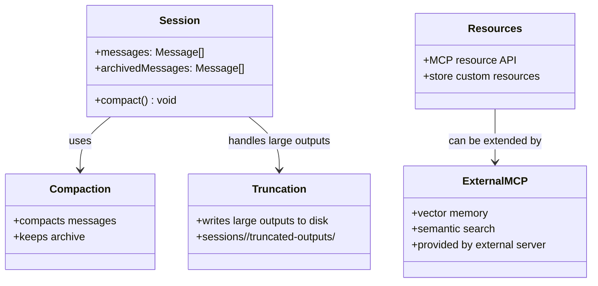
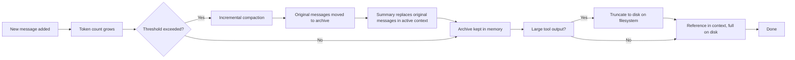

# Nanobot Memory Codemap: In-session Compaction with Extensible Design

## Overview

Nanobot does **not** include a built-in long-term persistent vector memory system like some other agent frameworks. Instead:
1.  **In-session memory**: Conversation history kept in session object with compaction
2.  **Archived messages preserved**: Original messages kept after compaction in memory
3.  **File-based overflow**: Large tool outputs truncated to disk in session directory
4.  **MCP resource system**: Custom resources can be stored via MCP resource API
5.  **Extensible via MCP servers**: Long-term memory can be added via an external MCP server that provides memory capabilities

**Official Resources:**
- GitHub Repository: [nanobot-ai/nanobot](https://github.com/nanobot-ai/nanobot)
- Source Locations: `pkg/resources/`, `pkg/agents/compact.go`

---

## Codemap: System Context

```
pkg/
├── resources/               # Built-in resource management
└── agents/
    └── compact.go           # Compaction with archival
```

---

## Component Diagram



---

## Data Flow Diagram



---

## 1. In-session Memory Organization

Within a session:

- **Active context**: Messages currently sent to LLM, includes recent messages plus any compaction summary
- **Archived messages**: Original messages that were compacted are kept in memory - not sent to LLM every turn, but available if needed for recovery
- **Truncated outputs**: Large tool outputs stored on disk, only reference kept in context

This is **transient memory** - tied to the session lifecycle. When the session ends, memory is gone.

---

## 2. No Built-in Long-term Persistent Memory

The Nanobot design philosophy is **modular**:

- **Core Nanobot** provides the MCP gateway, agent runtime, session isolation
- **Long-term memory** is considered a capability that can be provided by an external MCP server
- This keeps core Nanobot smaller and simpler
- Users can choose which memory system they want
- You can add a vector memory MCP server if you need long-term semantic memory

**Current built-in memory options**:
- MCP resources for custom resources (key-value)
- File system for truncated outputs
- Session archival in memory

---

## 3. Key Characteristics

| Characteristic | Design |
|----------------|--------|
| **Persistence** | In-memory per session, truncated outputs on disk |
| **Vector Search** | Not built-in → use external MCP |
| **Compaction** | Incremental summarization, preserves archive |
| **Overflow** | Large tool outputs to disk |
| **Long-term** | Via external MCP extension |

---

## 4. Key Source Files & Implementation Points

| File | Purpose |
|------|---------|
| **`pkg/agents/compact.go`** | Compaction with archival of original messages |
| **`pkg/agents/truncate.go`** | Truncation of large tool outputs to disk |
| **`pkg/resources/`** | Built-in MCP resource management |

---

## Summary of Key Design Choices

### Modular Extensible Design

- **Do one thing well**: Nanobot does MCP aggregation and agent runtime well
- **Externalize what doesn't need to be core**: Long-term memory is a separable capability
- **Users choose**: Different users have different memory needs - let them pick the implementation
- **MCP is the interface**: Any MCP-compatible memory server works

### Compaction with Archival

- **Don't throw information away**: Even after compaction, original messages still in memory
- **Active context stays bounded**: Only summary + recent messages go to LLM each turn
- **Tradeoff**: Uses more memory, but information isn't lost - acceptable for most deployments

### Disk Overflow for Tool Outputs

- **Prevents context bloat**: One huge tool output can't blow the entire context window
- **Information preserved**: Full output still on disk if agent needs it
- **Minimal overhead**: Just a reference in context

### Comparison to Other Approaches

| Aspect | Nanobot | ZeroClaw | HappyClaw |
|--------|---------|----------|-----------|
| **Built-in persistent memory** | No (external via MCP) | Yes (pluggable trait with multiple backends) | Yes (hybrid markdown + SQLite) |
| **Long-term vector search** | External MCP | Yes built-in (multiple backends) | Via MCP server |
| **In-session compaction** | Yes incremental | Yes hybrid | Yes via PreCompact hook |
| **Architecture** | Modular - core + extensions | Monolithic with pluggable backends | Integrated with database |

Nanobot's approach is **the most minimal**, focusing on being a great MCP host/agent runtime and letting external MCP servers provide extra capabilities like long-term memory. This follows the Unix philosophy: "do one thing well".
