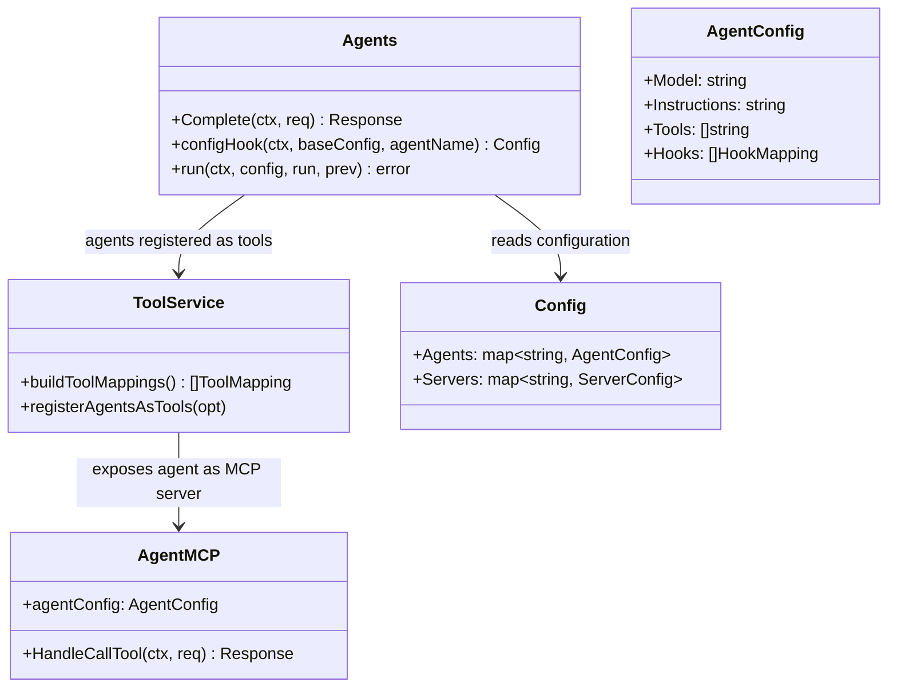
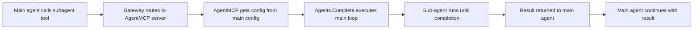

# Nanobot Sub-agent Codemap: MCP-based Hierarchical Composition

## Overview

Nanobot implements **sub-agents as MCP servers that are exposed as callable tools**. Any agent can invoke any other agent as a tool, enabling hierarchical sub-agent composition. Agents are defined declaratively in YAML configuration with their own model, tools, and instructions.

**Official Resources:**
- GitHub Repository: [nanobot-ai/nanobot](https://github.com/nanobot-ai/nanobot)
- Source Locations: `pkg/agents/run.go`, `pkg/tools/service.go`, `pkg/servers/agent/server.go`

---

## Codemap: System Context

```
pkg/
├── agents/
│   ├── run.go                # Main agent execution loop
│   ├── compact.go            # Context compaction
│   └── types.go              # Agent and config types
├── tools/
│   └── service.go            # Agent registration as tools
└── servers/
    └── agent/
        └── server.go         # Agent exposition as MCP server
```

---

## Component Diagram



---

## Data Flow Diagram (Sub-agent Invocation)



---

## 1. Agent Registration as Tool

When building tool mappings, **agents are treated like any other MCP server** and registered as tools:

```go
// From: pkg/tools/service.go
// When building tool mappings, agents are added as callable tools
for _, agentName := range opt.Servers {
	agent, ok := config.Agents[agentName]
	if !ok {
		continue
	}

	tools := filterTools(&mcp.ListToolsResult{
		Tools: []mcp.Tool{
			{
				Name:        types.AgentTool + agentName,
				Description: agent.Description,
				InputSchema: types.ChatInputSchema,
			},
		},
	}, opt.Tools)
	// ... add to result
}
```

The pattern is:
- Agent tool name = prefix + agentName: `agent--myagent`
- Input schema is always a simple chat input (user prompt)
- Description from agent config helps LLM decide when to use it

---

## 2. Main Agent Execution Loop

The main agent execution loop supports **sub-agent invocation with config hooks**:

```go
// From: pkg/agents/run.go
// Main agent completion loop with sub-agent support
func (a *Agents) Complete(ctx context.Context, req types.CompletionRequest, opts ...types.CompletionOptions) (_ *types.CompletionResponse, err error) {
	// ... session initialization
	for {
		config, err := a.configHook(ctx, baseConfig, currentRun.Request.GetAgent())
		if err != nil {
			return nil, err
		}

		ctx := types.WithConfig(ctx, config)

		if err := a.run(ctx, config, currentRun, previousRun, opts); err != nil {
			return nil, err
		}

		if currentRun.Done {
			// ... return final response
		}

		previousRun = currentRun
		currentRun = &types.Execution{
			Request: req.Reset(),
		}
	}
}
```

---

## 3. Config Hook for Sub-agents

Before each execution, a **config hook** retrieves the agent configuration and applies any session-level modifications:

```go
// From: pkg/agents/run.go
// Config hook that loads agent configuration with session inheritance
func (a *Agents) configHook(ctx context.Context, baseConfig types.Config, agentName string) (types.Config, error) {
	session := mcp.SessionFromContext(ctx).Root()
	var sessionInit types.SessionInitHook
	session.Get(types.SessionInitSessionKey, &sessionInit)

	agent := baseConfig.Agents[agentName]
	if !slices.ContainsFunc(agent.Hooks, func(hook mcp.HookMapping) bool {
		return hook.Name == "config" && slices.Contains(hook.Targets, "nanobot.system/config")
	}) {
		agent.Hooks = append(agent.Hooks, mcp.HookMapping{Name: "config", Targets: []string{"nanobot.system/config"}})
	}
	hookResult, err := mcp.InvokeHooks(ctx, a.registry, agent.Hooks, &types.AgentConfigHook{
		Agent:     &agent.HookAgent,
		Meta:      sessionInit.Meta,
		SessionID: session.ID(),
	}, "config", nil)
	// ... apply modifications and return
	return baseConfig, nil
}
```

Key points:
- Sub-agents inherit configuration from parent session
- Hooks can modify configuration before execution
- Hooks enable dynamic customization

---

## 4. Key Characteristics

### Design Features

1.  **MCP-based composition**: Sub-agents are just MCP servers that expose a chat capability - same as any other tool
2.  **Configuration-driven**: Agents are completely defined in YAML configuration
3.  **Hierarchical**: Any agent can invoke any other agent as a sub-agent - no depth limit (other than token limits)
4.  **No fixed "identity" design**: Identity comes from the agent's instructions and configuration - no separate identity object model needed
5.  **Hook support**: Config hooks allow dynamic modification before execution

---

## 5. Key Source Files & Implementation Points

| File | Purpose |
|------|---------|
| **`pkg/agents/run.go`** | Main agent execution loop |
| **`pkg/tools/service.go`** | Agent registration as callable tools |
| **`pkg/servers/agent/server.go`** | Agent exposition as MCP server |
| **`pkg/agents/compact.go`** | Context compaction (covered separately) |

---

## Summary of Key Design Choices

### Everything is MCP

- **Consistency**: Same protocol for everything - tools, agents, servers
- **Composition naturally falls out**: If agents are MCP servers, they get automatically included in the gateway tool list
- **No special composition logic needed**: Just works with the existing gateway routing

### Configuration-driven

- **No code needed to add agents**: Just add YAML config entry
- **Easy for users to customize**: Users can add their own agents
- **Declarative vs imperative**: Clear separation of what (config) vs how (code)

### Hierarchical Invocation

- **Unlimited flexibility**: You can build deep hierarchies if needed
- **Each agent has its own configuration**: Different agents can use different models
- **Inheritance through context**: Sub-agents inherit session context from parent
- **Tradeoff**: Deep hierarchies consume more tokens - but that's inherent to the problem, not the design

### Comparison to Other Approaches

| Aspect | Nanobot | OpenCode | pi-mono |
|--------|---------|----------|---------|
| **Definition** | YAML config in main config | Config entries | Markdown files |
| **Composition** | MCP-based, any can call any | Task tool parallel | @mention invocation |
| **Hierarchy** | Fully hierarchical | Parallel tasks | Single-level |
| **Protocol-native** | Yes (everything MCP) | No (ACP) | No (custom) |

Nanobot's sub-agent design is **the most protocol-consistent** - by treating agents as just another MCP server, you get composition for free without any additional mechanism. This is the beauty of the "everything is MCP" approach.
