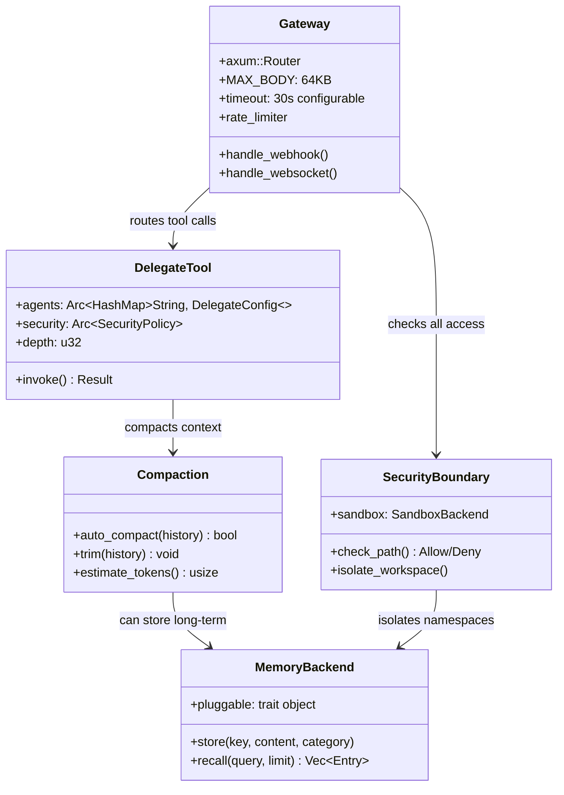

# ZeroClaw Codemap: Security-first Rust Autonomous Agent Runtime

This research analyzes **ZeroClaw** - a Rust-first autonomous agent runtime optimized for performance, efficiency, stability, extensibility, sustainability, and security. It's part of the Claw ecosystem of AI agent frameworks, focusing heavily on security through multiple layers of sandboxing and isolation.

## Research Scope

For each core module, we examined:
1.  **Architecture Overview** - How the module fits into the overall system
2.  **Data Structures and Type System** - Key types in Rust
3.  **Complete Operation Flow** - Step-by-step process for key operations
4.  **Code Maps** - Key source files with line numbers and core algorithm snippets
5.  **Design Choices & Tradeoffs** - Why it was built this way

## Core Modules Researched

| Module | Architecture | Main Approach | Report |
|--------|--------------|---------------|--------|
| [Gateway Mechanism](codemap/gateway-codemap.md) | Axum-based HTTP with security hardening | Entry point with size limits, timeouts, rate limiting for webhooks/REST/WebSocket | [codemap/gateway-codemap.md](codemap/gateway-codemap.md) |
| [Sub-agent / Identity](codemap/subagent-codemap.md) | Declarative config with delegate tool | Pre-configured sub-agents with depth tracking, two identity formats (openclaw/aieos) | [codemap/subagent-codemap.md](codemap/subagent-codemap.md) |
| [Context Trimming](codemap/context-trimming-codemap.md) | Hybrid auto-compaction + hard trimming | Dual-trigger (token/message count), LLM summarization with deterministic fallback | [codemap/context-trimming-codemap.md](codemap/context-trimming-codemap.md) |
| [Context Isolation](codemap/context-isolation-codemap.md) | Multi-layered isolation | Workspace + session + OS-level sandboxing (bubblewrap/firejail/docker) | [codemap/context-isolation-codemap.md](codemap/context-isolation-codemap.md) |
| [Memory Mechanism](codemap/memory-codemap.md) | Pluggable trait with multiple backends | Trait abstraction with SQLite/markdown/Postgres/Qdrant/mem0 backends | [codemap/memory-codemap.md](codemap/memory-codemap.md) |

## Summary Table - Key Characteristics

| Module | Storage Approach | Isolation | Key Feature |
|--------|------------------|-----------|-------------|
| **Gateway** | Axum HTTP + WebSocket | Stateless with shared Arc/Mutex | Security hardening (size limit, timeout, rate limiting) |
| **Sub-agent** | Declarative config | Per-subagent with depth tracking | Supports openclaw and AIEOS identity formats |
| **Context Trimming** | Hybrid two-stage | N/A | Auto-compaction then deterministic trimming |
| **Context Isolation** | Multi-layer: workspace + session + OS | Configurable per workspace | Multiple sandbox backends (bubblewrap, firejail, docker) |
| **Memory** | Pluggable trait | Session/workspace namespacing | Multiple backends from markdown to vector DB |

## Overview: Architecture Summary

ZeroClaw is a **security-first Rust-based autonomous agent framework** that:

1.  **Security-hardened Gateway**: Axum-based HTTP gateway with proper size limits, timeouts, and rate limiting against common attacks like slow-loris and memory exhaustion
2.  **Declarative Sub-agent Delegation**: Pre-configured specialized sub-agents with depth tracking to prevent infinite recursion, supports multiple identity/persona formats
3.  **Hybrid Context Compaction**: Dual-trigger compaction when either token budget or message count exceeds threshold, with LLM summarization and deterministic fallback
4.  **Defense-in-depth Isolation**: Multiple configurable isolation layers - workspace memory/secrets isolation, per-session scoping, and multiple OS-level sandbox backends
5.  **Pluggable Memory Architecture**: Trait abstraction enabling multiple storage backends from simple markdown to PostgreSQL+Qdrant for semantic search, with session and workspace isolation

### High-level Architecture Diagram



## Directory Structure

```
~/my-research/claw/zeroclaw/
├── README.md                 # This file - overview and comparison
└── codemap/                  # Detailed codemap for each core module
    ├── gateway-codemap.md          # Axum HTTP gateway with security hardening
    ├── subagent-codemap.md         # Sub-agent delegation with identity formats
    ├── context-trimming-codemap.md  # Hybrid compaction + trimming
    ├── context-isolation-codemap.md  # Multi-layer security isolation
    └── memory-codemap.md           # Pluggable memory backends
```

## Reading the Reports

Each codemap file follows the same structure:
1.  Module overview and official links
2.  Architecture diagrams (class and data flow)
3.  Complete storage/layout description
4.  Step-by-step operation flow for key operations
5.  Key source files with line numbers
6.  Core code snippets showing key algorithms
7.  Summary of design choices and tradeoffs

## References

[^1]: GitHub Repository - [https://github.com/zeroclaw-labs/zeroclaw](https://github.com/zeroclaw-labs/zeroclaw)
