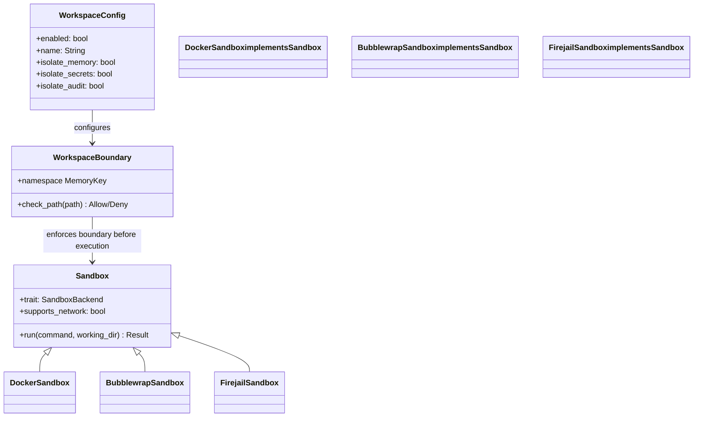
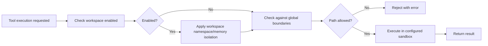

# ZeroClaw Context Isolation Codemap: Multi-layered Defense in Depth

## Overview

ZeroClaw provides **multi-layered context and file-system isolation** at multiple levels:
1.  **Workspace-level isolation** for multi-tenant deployments
2.  **Per-session memory isolation**
3.  **OS-level sandboxing** for tool execution
4.  **Docker-level network isolation** optional

This defense-in-depth approach provides strong security for untrusted code execution.

**Official Resources:**
- GitHub Repository: [zeroclaw-labs/zeroclaw](https://github.com/zeroclaw-labs/zeroclaw)
- Source Location: `src/config/schema.rs`, `src/security/`

---

## Codemap: System Context

```
src/
├── config/
│   └── schema.rs             # Workspace configuration schema
└── security/
    ├── workspace_boundary.rs  # Workspace path boundary enforcement
    ├── traits.rs             # Sandbox trait definition
    ├── docker.rs              # Docker sandbox backend
    ├── bubblewrap.rs         # Bubblewrap sandbox backend
    └── firejail.rs           # Firejail sandbox backend
```

---

## Component Diagram



---

## Data Flow Diagram (Tool Execution with Isolation)



---

## 1. Workspace-level Isolation Configuration

ZeroClaw allows **configurable workspace isolation**:

```rust
// From: src/config/schema.rs
/// Multi-client workspace isolation configuration.
/// When enabled, each client engagement gets an isolated workspace with
/// isolated memory, audit, and secrets.
pub struct WorkspaceConfig {
    /// Enable workspace isolation. Default: false.
    #[serde(default)]
    pub enabled: bool,
    /// Enable memory namespace prefix for isolation.
    pub name: String,
    /// Memory isolation: prefixes all memory keys with the workspace namespace,
    /// so cross-workspace memory recall is not possible unless explicitly enabled.
    pub isolate_memory: bool,
    /// Isolate secrets: secrets from this workspace can't be accessed by other workspaces.
    pub isolate_secrets: bool,
    /// Audit logs isolated to this workspace.
    pub isolate_audit: bool,
    // ...
}
```

### Isolation Levels You Can Configure:

| Level | Isolation | What it does |
|-------|-----------|--------------|
| **Memory** | All memory keys prefixed with workspace namespace | Prevents cross-workspace memory leakage |
| **Secrets** | Secrets are isolated per workspace | Secrets from one workspace can't be accessed by another |
| **Audit** | Audit logs isolated per workspace | Separate audit trails for different workspaces |

This is designed for **multi-tenant deployments** where multiple independent users share the same ZeroClaw server.

---

## 2. Filesystem Boundary Enforcement

All file tool operations are **checked against the workspace boundary**:

- ZeroClaw keeps track of the allowed workspace root
- Any file access outside the workspace is blocked
- Prevents path traversal attacks (`../../etc/passwd`)
- Symlinks are checked and resolved before validation

Location: `src/security/workspace_boundary.rs`

---

## 3. OS-level Sandbox Backends

ZeroClaw supports **multiple sandbox backends** for tool execution:

| Backend | Description | Use Case |
|---------|-------------|----------|
| **Bubblewrap** | User-namespace isolation via unshare (Linux/macOS) | Desktop/server Linux deployments |
| **Firejail** | Additional DAC and seccomp-bpf security | Extra-hardened security on Linux |
| **Docker** | Full container isolation with optional network isolation | Multi-tenant deployments, untrusted code |
| **None** | No additional isolation | Trusted environments, development |

All backends implement the same trait:

```rust
// From: src/security/traits.rs
pub trait SandboxBackend: Send + Sync {
    fn run(
        &self,
        command: &str,
        working_dir: &str,
        env: &[(String, String)],
    ) -> Result<(i32, String, String)>;
    fn name(&self) -> &str;
    fn is_available(&self) -> bool;
}
```

### Landlock LSM Support

On Linux, ZeroClaw supports **Landlock LSM** (Linux Security Module) for kernel-level filesystem sandboxing:
- System call-level enforcement
- Fine-grained filesystem access control
- Additional layer of protection beyond user-namespace isolation

---

## 4. Per-thread and Per-session Isolation

- In channels like Discord/Slack, **each thread gets its own isolated session context**
- In memory backends like SQLite, **session boundaries are enforced** so memories from different sessions can't leak
- Each session has its own execution context independent of other sessions

---

## 5. Key Source Files & Implementation Points

| File | Purpose |
|------|---------|
| **`src/config/schema.rs:L378-L396`** | Workspace configuration schema |
| **`src/security/workspace_boundary.rs`** | Filesystem boundary checking |
| **`src/security/traits.rs`** | Sandbox trait definition |
| **`src/security/docker.rs`** | Docker sandbox implementation |
| **`src/security/bubblewrap.rs`** | Bubblewrap sandbox implementation |
| **`src/security/firejail.rs`** | Firejail sandbox implementation |

---

## Summary of Key Design Choices

### Defense in Depth

ZeroClaw uses **multiple overlapping layers** of isolation:

1.  **Workspace configuration isolation**: Memory/secrets/audit isolation at the logical level
2.  **Filesystem boundary checking**: All file access checked before execution
3.  **OS-level sandboxing**: User-namespace or container isolation prevents escape
4.  **Landlock LSM** (Linux): Kernel-level enforcement for filesystem access

If one layer fails, the other layers still provide protection.

### Multiple Sandbox Backends

- **Choice**: Users can pick the sandbox that works for their environment
- **Fallbacks**: If Docker isn't available, Bubblewrap works on most Linux systems
- **Same trait interface**: Adding a new backend just requires implementing the trait
- **Tradeoff**: More code to maintain, but more flexible for different deployment environments

### Configurable Isolation

- **Can disable for trusted environments**: No overhead when not needed
- **Per-workspace configuration**: Some workspaces can be more trusted than others
- **Incremental adoption**: You can start with less isolation and add more as needed

### Comparison to Other Approaches

| Aspect | ZeroClaw | Nanobot | HappyClaw |
|--------|----------|---------|----------|
| **Workspace-level isolation** | Yes built-in | No (session-level only) | Per-group isolation |
| **Multiple sandbox backends** | Yes (3+ none) | Docker sandbox optional for MCP | Docker optional |
| **Landlock LSM support** | Yes | No | No |
| **Configurable per workspace** | Yes | No | Per-group |
| **Secrets isolation** | Yes per workspace | No | Per-group |

ZeroClaw provides **the most comprehensive multi-layered isolation**, making it suitable for public-facing or multi-tenant deployments where security is a top priority. The defense-in-depth approach means that even if one layer is bypassed, other layers still provide protection.
