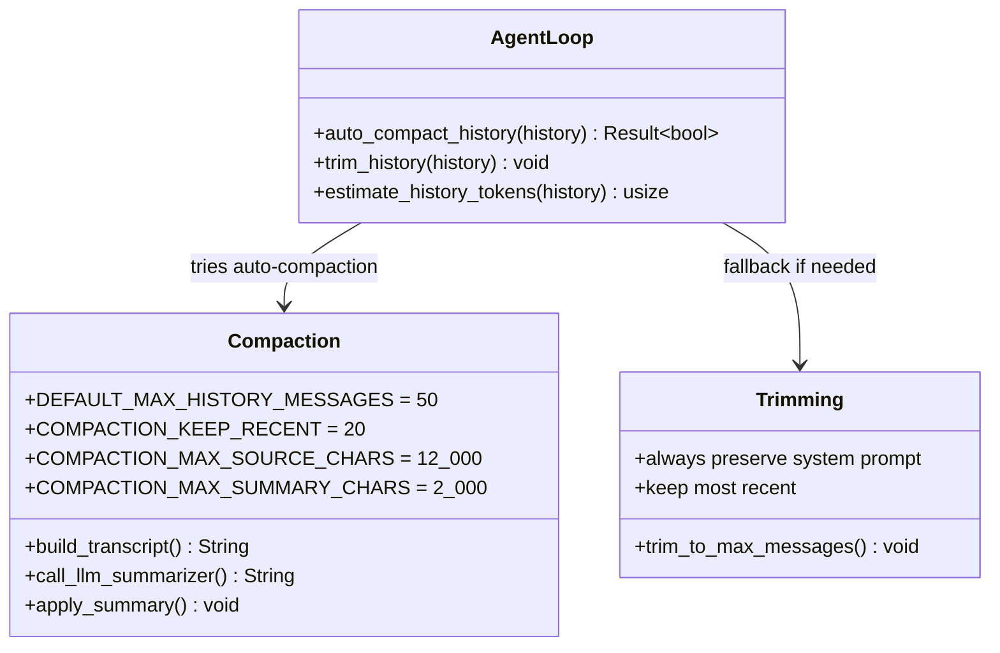
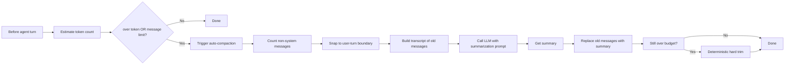

# ZeroClaw Context Trimming Codemap: Hybrid Auto-compaction + Hard Trimming

## Overview

ZeroClaw implements a **hybrid two-stage context trimming strategy**:
1.  **LLM-based auto-compaction** when token or message thresholds are exceeded
2.  **Deterministic hard trimming** as a fallback when compaction fails or still over budget

This guarantees that context will always fit within the model's context window, while trying to preserve as much information as possible via LLM summarization.

**Official Resources:**
- GitHub Repository: [zeroclaw-labs/zeroclaw](https://github.com/zeroclaw-labs/zeroclaw)
- Source Location: `src/agent/loop_.rs`

---

## Codemap: System Context

```
src/agent/
└── loop_.rs                # Main agent loop with compaction
```

---

## Component Diagram



---

## Data Flow Diagram (Compaction)



---

## 1. Compaction Configuration Constants

```rust
// From: src/agent/loop_.rs
/// Default trigger for auto-compaction when non-system message count exceeds this threshold.
const DEFAULT_MAX_HISTORY_MESSAGES: usize = 50;

/// Keep this many most-recent non-system messages after compaction.
const COMPACTION_KEEP_RECENT_MESSAGES: usize = 20;

/// Safety cap for compaction source transcript passed to the summarizer.
const COMPACTION_MAX_SOURCE_CHARS: usize = 12_000;

/// Max characters retained in stored compaction summary.
const COMPACTION_MAX_SUMMARY_CHARS: usize = 2_000;
```

---

## 2. Token Estimation Heuristic

ZeroClaw uses a **simple 4-characters-per-token heuristic** that's effective without depending on a full tokenizer:

```rust
// From: src/agent/loop_.rs
/// Estimate token count for a message history using ~4 chars/token heuristic.
/// Includes a small overhead per message for role/framing tokens.
fn estimate_history_tokens(history: &[ChatMessage]) -> usize {
    history
        .iter()
        .map(|m| {
            // ~4 chars per token + ~4 framing tokens per message (role, delimiters)
            m.content.len().div_ceil(4) + 4
        })
        .sum()
}
```

This is **fast and accurate enough** for triggering compaction.

---

## 3. Auto-compaction Algorithm

```rust
// From: src/agent/loop_.rs:L349-L409
async fn auto_compact_history(
    history: &mut Vec<ChatMessage>,
    provider: &dyn Provider,
    model: &str,
    max_history: usize,
    max_context_tokens: usize,
) -> Result<bool> {
    let has_system = history.first().map_or(false, |m| m.role == "system");
    let non_system_count = if has_system {
        history.len().saturating_sub(1)
    } else {
        history.len()
    };

    let estimated_tokens = estimate_history_tokens(history);

    // Trigger compaction when either token budget OR message count is exceeded.
    if estimated_tokens <= max_context_tokens && non_system_count <= max_history {
        return Ok(false);
    }

    let start = if has_system { 1 } else { 0 };
    let keep_recent = COMPACTION_KEEP_RECENT_MESSAGES.min(non_system_count);
    let compact_count = non_system_count.saturating_sub(keep_recent);
    if compact_count == 0 {
        return Ok(false);
    }

    let mut compact_end = start + compact_count;

    // Snap compact_end to a user-turn boundary so we don't split mid-conversation.
    while compact_end > start && history.get(compact_end).map_or(false, |m| m.role != "user") {
        compact_end -= 1;
    }
    if compact_end <= start {
        return Ok(false);
    }

    let to_compact: Vec<ChatMessage> = history[start..compact_end].to_vec();
    let transcript = build_compaction_transcript(&to_compact);

    let summarizer_system = "You are a conversation compaction engine. Summarize older chat history into concise context for future turns. Preserve: user preferences, commitments, decisions, unresolved tasks, key facts. Omit: filler, repeated chit-chat, verbose tool logs. Output plain text bullet points only.";

    let summary_raw = provider
        .chat_with_system(Some(summarizer_system), &transcript, model, 0.2)
        .await
        .unwrap_or_else(|_| {
            // Fallback to deterministic local truncation when summarization fails.
            truncate_with_ellipsis(&transcript, COMPACTION_MAX_SUMMARY_CHARS)
        });

    let summary = truncate_with_ellipsis(&summary_raw, COMPACTION_MAX_SUMMARY_CHARS);
    apply_compaction_summary(history, start, compact_end, &summary);

    Ok(true)
}
```

---

## 4. Key Algorithm Insights

### Dual Triggering

Compaction triggers when **either** condition is true:
1.  Estimated tokens exceeds context budget **OR**
2.  Number of non-system messages exceeds maximum

This catches both:
- **Long messages with few turns**: Token trigger catches it
- **Many short turns**: Message count trigger catches it

### User-turn Alignment

Compaction always **snaps to a user-turn boundary**:
- Never splits a conversation in the middle of a turn
- Keeps `user → assistant → user → assistant` structure intact
- Prevents half-turns that confuse the LLM

### Keep Recent Messages Uncompacted

ZeroClaw always **keeps the most recent 20 messages uncompacted**:
- Recent conversation is most relevant
- Doesn't compact what's being talked about right now
- Only compacts older history that's less relevant

### Character Caps

- **12,000 chars max for source transcript**: Prevents overwhelming the summarizer
- **2,000 chars max for resulting summary**: Keeps compacted context bounded

### Graceful Fallback

If LLM summarization fails (network error, timeout, etc.), ZeroClaw falls back to **deterministic truncation** - it just truncates the transcript to the character limit with an ellipsis. This means compaction **always succeeds** one way or another, guaranteeing context will fit.

---

## 5. Hard Trimming Fallback

If after compaction we're still over the limit, do deterministic hard trimming that **always preserves the system prompt and most recent messages**:

```rust
// From: src/agent/loop_.rs:L305-L323
/// Trim conversation history to prevent unbounded growth.
/// Preserves the system prompt (first message if role=system) and the most recent messages.
fn trim_history(history: &mut Vec<ChatMessage>, max_history: usize) {
    // Nothing to trim if within limit
    let has_system = history.first().map_or(false, |m| m.role == "system");
    let non_system_count = if has_system {
        history.len() - 1
    } else {
        history.len()
    };

    if non_system_count <= max_history {
        return;
    }

    let start = if has_system { 1 } else { 0 };
    let to_remove = non_system_count - max_history;
    history.drain(start..start + to_remove);
}
```

**Key properties**:
- **System prompt always preserved**: Never gets trimmed, it's foundational
- **Most recent messages always preserved**: Cuts oldest messages, not newest
- **Always guarantees fit**: After trimming, you're guaranteed under the message limit

---

## 6. Key Source Files & Implementation Points

| File | Purpose |
|------|---------|
| **`src/agent/loop_.rs`** | Entire compaction and trimming implementation |

---

## Summary of Key Design Choices

### Two-stage Hybrid Approach

- **Try LLM compaction first**: Preserves more context information through summarization
- **Fallback to deterministic trimming**: Guarantees we always fit, even if LLM fails
- **Never fails**: One way or another, context gets under limit
- **Tradeoff**: LLM compaction uses a little token budget, but preserves more information

### Dual Triggering

- **Token-based**: Catches long messages that exceed context even with few turns
- **Message count-based**: Catches many short turns that add up
- **Either is enough**: Triggers if either exceeds limit

### User-turn Alignment

- **Prevents half-completed conversations**: Always keeps turns complete
- **LLMs get confused by mid-turn cuts**: This avoids that whole class of problems
- **Small extra cut is worth it**: The coherence gain outweighs the tiny extra truncation

### Always Keep Recent

- **Most recent conversation is most relevant**: Kept full, uncompacted
- **Older history gets compacted**: That's okay because it's less relevant right now
- **Incremental compaction**: Older gets compacted, new stays fresh

### 4 chars/token Heuristic

- **No tokenizer dependency**: Smaller binary, no need to bundle large tokenizer
- **Fast**: Estimation is just integer division
- **Accurate enough**: Good enough for triggering compaction, doesn't need to be perfect
- **Tradeoff**: Some estimation error, but that's okay because we leave a reserve buffer

### Comparison to Other Approaches

| Aspect | ZeroClaw | Nanobot | OpenCode |
|--------|----------|---------|----------|
| **Algorithm** | Auto-compaction + hard trimming | Incremental summarization + disk overflow | Pruning + compaction |
| **Dual trigger** | Yes (tokens + messages) | Yes (tokens only) | Yes (implicit via pruning) |
| **Guaranteed fit** | Yes (compaction → trimming fallback) | Yes via incremental | Yes via pruning |
| **User-turn alignment** | Yes | Implicit | Yes |
| **Keep recent uncompacted** | Yes (fixed 20) | Yes (keepRecentTokens) | Yes (pruning keeps recent) |

ZeroClaw's hybrid approach **guarantees context will always fit** while doing the best possible job of preserving information through LLM compaction. The deterministic fallback means you never get stuck because of LLM failure.
