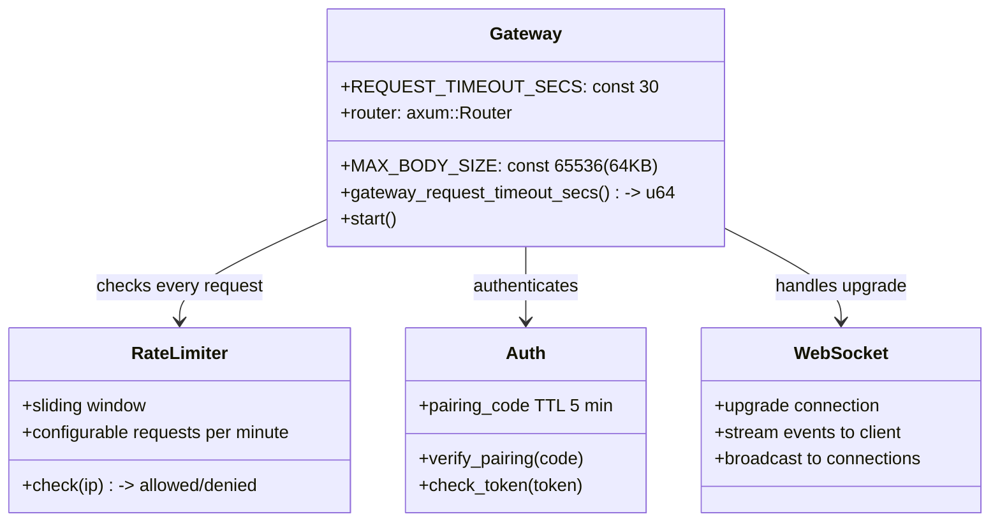
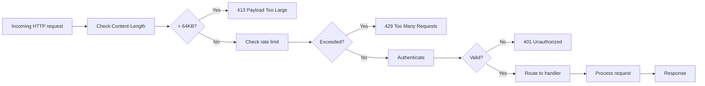

# ZeroClaw Gateway Codemap: Axum-based Security-hardened HTTP Gateway

## Overview

ZeroClaw uses an **Axum-based HTTP gateway** with comprehensive security hardening. The gateway is the primary entry point for:
- Webhook requests from messaging platforms (Telegram, Discord, Slack, etc.)
- REST API for machine-to-machine communication
- WebSocket connections for real-time streaming
- Static file serving for web UI

**Official Resources:**
- GitHub Repository: [zeroclaw-labs/zeroclaw](https://github.com/zeroclaw-labs/zeroclaw)
- Language: Rust
- Source Location: `src/gateway/mod.rs`, `src/gateway/api.rs`

---

## Codemap: System Context

```
src/gateway/
├── mod.rs                  # Gateway constants and main setup
├── api.rs                  # API route definitions and handlers
├── auth.rs                 # Authentication and pairing
└── ws.rs                   # WebSocket handling
```

---

## Component Diagram



---

## Data Flow Diagram (Incoming Request)



---

## 1. Security Configuration Constants

ZeroClaw builds security in from the beginning:

```rust
// From: src/gateway/mod.rs
// Maximum request body size (64KB) — prevents memory exhaustion.
pub const MAX_BODY_SIZE: usize = 65_536;
/// Default request timeout (30s) — prevents slow-loris attacks.
pub const REQUEST_TIMEOUT_SECS: u64 = 30;

/// Read gateway request timeout from `ZEROCLAW_GATEWAY_TIMEOUT_SECS` env var
/// at runtime, falling back to [`REQUEST_TIMEOUT_SECS`].
///
/// Agentic workloads with tool use (web search, MCP tools, sub-agent
/// delegation) regularly exceed 30 seconds. This allows operators to
/// increase the timeout without recompiling.
pub fn gateway_request_timeout_secs() -> u64 {
    std::env::var("ZEROCLAW_GATEWAY_TIMEOUT_SECS")
        .ok()
        .and_then(|v| v.parse().ok())
        .unwrap_or(REQUEST_TIMEOUT_SECS)
}
```

### Key Security Choices

| Choice | Reason |
|--------|--------|
| **64KB max body** | Prevents memory exhaustion attacks from huge payloads |
| **30s default timeout** | Prevents slow-loris attacks that hold connections open |
| **Configurable via env var** | Agent workloads often need longer timeouts - can increase without recompiling |
| **Rate limiting** | Sliding window prevents brute force attacks on authentication |

---

## 2. Supported Endpoint Types

| Type | Purpose |
|------|---------|
| **REST JSON API** | Machine-to-machine communication |
| **Webhook endpoints** | Callbacks from messaging platforms (Telegram, Discord, Slack) |
| **WebSocket** | Real-time streaming of agent output |
| **Server-Sent Events (SSE)** | Progress updates |
| **Static file serving** | Web UI serving |

### Pairing Security

ZeroClaw uses **public endpoint pairing** for secure authentication between clients and the gateway:
- Generates short-lived pairing codes (typically 5-10 minutes)
- Binds external IM chats to specific user accounts
- Prevents unauthorized users from connecting

---

## 3. Architecture and Sharing

Gateway uses **stateless shared state with thread-safe containers**:

```rust
// Shared state wrapped in Arc, interior mutability via Mutex/RwLock
state: Arc<SharedState>
```

This allows:
- Tokio async runtime handles concurrent connections
- Thread-safe access to shared state
- Good scalability on multi-core machines

---

## 4. Key Source Files & Implementation Points

| File | Purpose |
|------|---------|
| **`src/gateway/mod.rs`** | Gateway constants and main setup |
| **`src/gateway/api.rs`** | API route definitions and handlers |
| **`src/gateway/auth.rs`** | Authentication and pairing |
| **`src/gateway/ws.rs`** | WebSocket handling |

---

## Summary of Key Design Choices

### Security-first Design

- **Defense in depth**: Multiple layers of protection:
  1.  Content-Limit check first (fails fast)
  2.  Rate limiting prevents brute force
  3.  Timeouts prevent slow-loris
  4.  Authentication before any processing
- **Small maximum body size**: Most webhook callbacks are small, this prevents memory exhaustion
- **Configurable timeout**: Security defaults but flexibility for agent workloads

### Axum Framework

- **Built on Tokio**: High-performance async runtime
- **Good defaults for security**: Header sanitization handled by axum/hyper out of the box
- **Macro-based routing**: Clean and maintainable route definitions
- **Rust ownership**: Memory safety out of the box

### Stateless Shared State

- **Arc/Mutex for shared state**: Simple thread-safe concurrency
- **All connections share same state**: Low memory footprint
- **Scales well with Tokio**: Multiple concurrent connections handled efficiently

### Tradeoffs

- **64KB limit blocks large legitimate requests**: But that's okay because this is just the gateway - large payloads go through other channels. The gateway only receives webhook callbacks and API commands.
- **Default timeout 30s**: Some agent runs take longer - but that's why it's configurable via environment variable.
- **Stateless vs sticky sessions**: For most messaging webhooks, stateless is fine - each request is independent.

ZeroClaw gateway demonstrates **solid security engineering** where every design decision considers potential attacks and builds in protection from the start.
