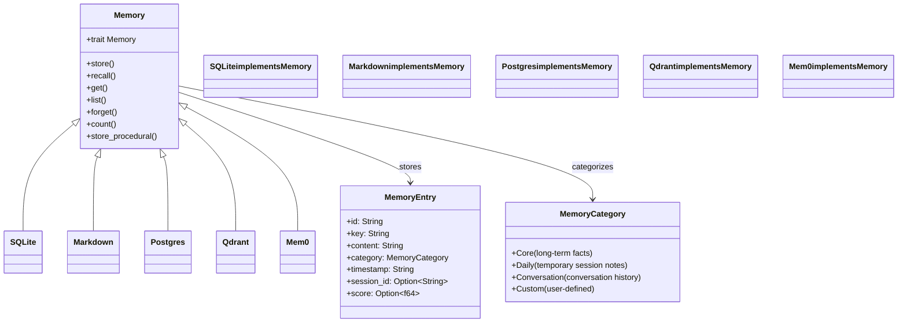

# ZeroClaw Memory Codemap: Pluggable Trait-based Multiple Backends

## Overview

ZeroClaw uses a **pluggable trait-based memory system** with multiple backend implementations. Memory is categorized into core (long-term facts), daily (session notes), conversation (context), and custom categories. All backends support optional session scoping for isolation.

**Official Resources:**
- GitHub Repository: [zeroclaw-labs/zeroclaw](https://github.com/zeroclaw-labs/zeroclaw)
- Source Location: `src/memory/`

---

## Codemap: System Context

```
src/memory/
├── traits.rs               # Memory trait definition
├── sqlite.rs               # SQLite backend implementation
├── markdown.rs             # Flat-file markdown backend
├── postgres.rs             # PostgreSQL backend
├── qdrant.rs               # Qdrant vector database backend
├── mem0.rs                 # mem0 procedural memory backend
└── lucid.rs                # Lucid hybrid search backend
```

---

## Component Diagram



---

## Data Flow Diagram (Memory Store)

```mermaid
flowchart LR
    A[store(key, content, category, session_id)] --> B[Apply workspace namespace if enabled]
    B --> C[Backend-specific storage]
    C --> D[Return result]
```

```mermaid
flowchart LR
    A[recall(query, limit, session_id)] --> B[Apply session/workspace filter]
    B --> C[Backend executes query (keyword/vector/hybrid)]
    C --> D[Return ranked memory entries]
```

---

## 1. Memory Trait Definition

The `Memory` trait defines the interface that all backends must implement:

```rust
// From: src/memory/traits.rs
pub trait Memory: Send + Sync {
    /// Backend name
    fn name(&self) -> &str;

    /// Store a memory entry, optionally scoped to a session
    async fn store(
        &self,
        key: &str,
        content: &str,
        category: MemoryCategory,
        session_id: Option<&str>,
    ) -> anyhow::Result<()>;

    /// Recall memories matching a query (keyword search), optionally scoped to a session
    async fn recall(
        &self,
        query: &str,
        limit: usize,
        session_id: Option<&str>,
    ) -> anyhow::Result<Vec<MemoryEntry>>;

    /// Get a specific memory by key
    async fn get(
        &self,
        key: &str,
    ) -> anyhow::Result<Option<MemoryEntry>>;

    /// List all memory keys, optionally filtered by category and/or session
    async fn list(
        &self,
        category: Option<&MemoryCategory>,
        session_id: Option<&str>,
    ) -> anyhow::Result<Vec<MemoryEntry>>;

    /// Remove a memory by key
    async fn forget(
        &self,
        key: &str,
    ) -> anyhow::Result<bool>;

    /// Count total memories
    async fn count(
        &self,
    ) -> anyhow::Result<usize>;

    /// Health check
    async fn health_check(&self) -> bool;

    /// Store a conversation trace as procedural memory.
    ///
    /// Backends that support procedural storage (e.g. mem0) override this
    /// to extract "how to" patterns from tool-calling turns.  The default
    /// implementation is a no-op.
    async fn store_procedural(
        &self,
        _messages: &[ProceduralMessage],
        _session_id: Option<&str>,
    ) -> anyhow::Result<()> {
        Ok(())
    }
}
```

---

## 2. Memory Entry Structure

```rust
// From: src/memory/traits.rs
/// A single memory entry
#[derive(Clone, Serialize, Deserialize)]
pub struct MemoryEntry {
    pub id: String,
    pub key: String,
    pub content: String,
    pub category: MemoryCategory,
    pub timestamp: String,
    pub session_id: Option<String>,
    pub score: Option<f64>,
}
```

### Memory Categories

ZeroClaw categorizes memory into standard categories:

| Category | Purpose |
|----------|---------|
| **Core** | Long-term facts, user preferences, decisions - permanent storage |
| **Daily** | Daily session notes, temporary information |
| **Conversation** | Conversation history context |
| **Custom** | User-defined categories with string names |

This categorization allows the agent to **filter by category** when recalling, improving relevance.

---

## 3. Available Backends

| Backend | Type | Best For | Supports Vector Search |
|---------|------|----------|------------------------|
| **SQLite** | Embedded relational database | Default single-user deployments | Yes (with vector extensions) |
| **markdown** | Flat-file markdown | Simple deployments, human-readable | No (keyword only) |
| **PostgreSQL** | Client-server relational | Multi-user deployments | Yes (pgvector extension) |
| **Qdrant** | Dedicated vector DB | High-performance semantic search | Yes (native) |
| **mem0** | Procedural memory | Learning from conversation patterns | Yes |
| **Lucid** | Hybrid ranking | Hybrid keyword + vector search | Yes |

---

## 4. Isolation Features

### Workspace Namespacing

When workspace isolation is enabled, **all memory keys are prefixed with the workspace namespace**:
- Prevents cross-workspace memory leakage
- Even on shared backends, workspaces can't read each other's memories
- Configurable per workspace

### Optional Session Scoping

Every memory operation can be **optionally scoped to a session**:
- `store(..., session_id)` - stores with session id
- `recall(..., session_id)` - only recalls from this session
- Provides additional isolation between concurrent conversations
- Especially useful in multi-user deployments

---

## 5. Procedural Memory Support

ZeroClaw has **special support for procedural memory** (learning how to do tasks from conversation history):

```rust
// Default implementation is no-op
// Only backends like mem0 override it
async fn store_procedural(
    &self,
    _messages: &[ProceduralMessage],
    _session_id: Option<&str>,
) -> anyhow::Result<()> {
    Ok(())
}
```

Procedural memory extracts **"how-to" patterns** from past tool usage:
- Over time, the agent learns how to repeat successful patterns
- Improves performance on similar tasks
- Currently implemented by the mem0 backend

---

## 6. Key Source Files & Implementation Points

| File | Purpose |
|------|---------|
| **`src/memory/traits.rs`** | Trait definition and base types |
| **`src/memory/sqlite.rs`** | SQLite backend implementation |
| **`src/memory/markdown.rs`** | Flat-file markdown backend |
| **`src/memory/qdrant.rs`** | Qdrant vector backend |
| **`src/memory/postgres.rs`** | PostgreSQL backend |
| **`src/memory/mem0.rs`** | mem0 procedural memory |

---

## Summary of Key Design Choices

### Trait-based Pluggable Architecture

- **Open/closed principle**: Add new backends without changing core code
- **Flexible deployment**: Can use simple SQLite for single-user, PostgreSQL+Qdrant for multi-user
- **Testable**: Easy to mock for testing
- **Tradeoff**: Some overhead from dynamic dispatch, but in Rust this is minimal for memory operations which aren't that frequent

### Categorization

- **Helps recall**: Agent can filter by category when searching
- **Different retention policies**: Core is permanent, daily can be cleaned up automatically
- **Organized storage**: Easier for humans to browse if needed

### Isolation by Design

- **Workspace namespacing**: Logical isolation even on shared infrastructure
- **Session scoping**: Additional isolation for concurrent conversations
- **Defense in depth**: Works with the other isolation layers (sandboxing, etc.)
- **Opt-in**: You don't need isolation for single-user deployments

### Multiple Backends

- **Choice**: Users can pick the backend that fits their needs and infrastructure
- **Start simple, scale up**: Begin with SQLite, add Qdrant later when you need semantic search
- **Avoids lock-in**: Can switch backends without changing core code
- **Tradeoff**: More code to maintain, but that's the cost of flexibility

### Procedural Memory Extension

- **Future-proof**: The trait has the hook, different backends can implement it differently
- **Default no-op**: Doesn't force you to use it if you don't want
- **Enables learning**: Over time can improve performance through experience

### Comparison to Other Approaches

| Aspect | ZeroClaw | Nanobot | HappyClaw |
|--------|----------|---------|-----------|
| **Pluggable backends** | Yes trait-based | No (external MCP only) | Hybrid markdown + SQLite |
| **Vector search** | Multiple backend options | No | Via external MCP |
| **Categorization** | Yes built-in | No | Implicit |
| **Workspace isolation** | Yes namespacing | No | Per-group |
| **Procedural memory** | Yes via mem0 backend | No | No |

ZeroClaw's memory architecture is **the most flexible and feature-rich** of the projects we examined, supporting everything from simple single-user markdown-based memory to high-performance multi-tenant vector search with procedural learning. The trait-based design means it can adapt to different deployment needs.
