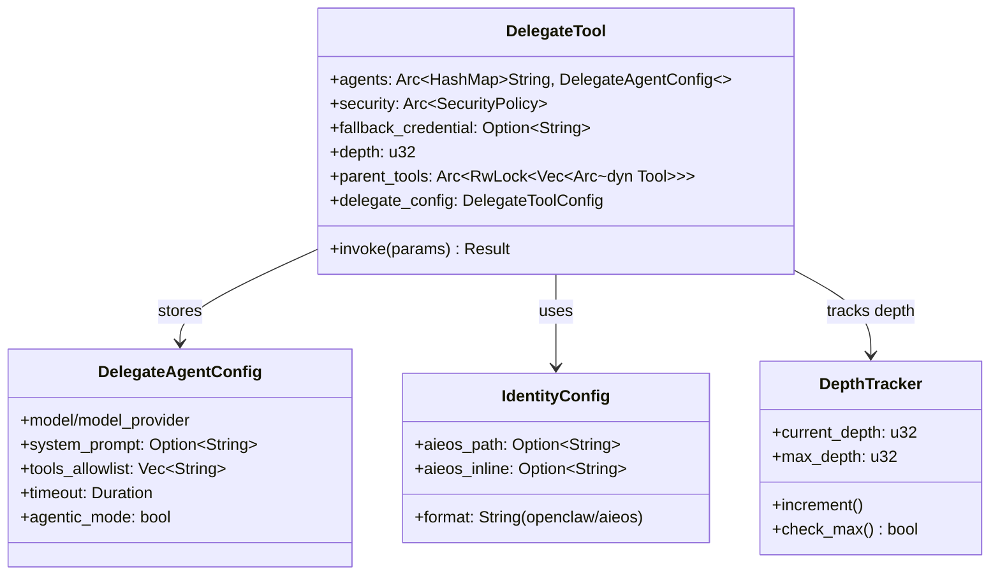
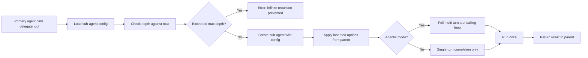

# ZeroClaw Sub-agent / Identity Codemap: Declarative Delegation with Depth Tracking

## Overview

ZeroClaw implements a **delegate tool-based sub-agent system** where specialized sub-agents can be configured declaratively and invoked via tool calls from a primary agent. Each agent has an identity configuration that supports both the default "openclaw" format and external AIEOS identity JSON format.

**Official Resources:**
- GitHub Repository: [zeroclaw-labs/zeroclaw](https://github.com/zeroclaw-labs/zeroclaw)
- Source Locations: `src/tools/delegate.rs`, `src/config/schema.rs`

---

## Codemap: System Context

```
src/
├── tools/
│   └── delegate.rs          # Delegate tool implementation
└── config/
    └── schema.rs            # Configuration schema including identity
```

---

## Component Diagram



---

## Data Flow Diagram (Sub-agent Delegation)



---

## 1. Identity Configuration

ZeroClaw supports **two identity formats** for maximum compatibility:

```rust
// From: src/config/schema.rs
pub struct IdentityConfig {
    /// Identity format: "openclaw" (default) or "aieos"
    #[serde(default = "default_identity_format")]
    pub format: String,
    /// Path to AIEOS JSON file (relative to workspace)
    #[serde(default)]
    pub aieos_path: Option<String>,
    /// Inline AIEOS JSON (alternative to file path)
    #[serde(default)]
    pub aieos_inline: Option<String>,
}

fn default_identity_format() -> String {
    "openclaw".into()
}

impl Default for IdentityConfig {
    fn default() -> Self {
        Self {
            format: default_identity_format(),
            aieos_path: None,
            aieos_inline: None,
        }
    }
}
```

### Formats

| Format | Description |
|--------|-------------|
| **openclaw** | Default native format - identity defined through system prompt in configuration |
| **AIEOS** | External identity/persona format from the AIEOS ecosystem - can load from file or inline JSON |

This allows ZeroClaw to **use existing persona collections** from the AIEOS ecosystem without conversion.

---

## 2. Delegate Tool Structure

The delegate tool is the **entry point for sub-agent invocation**:

```rust
// From: src/tools/delegate.rs
/// Tool that delegates a subtask to a named agent with a different
/// provider/model configuration. Enables multi-agent workflows where
/// a primary agent can hand off specialized work (research, coding,
/// summarization) to purpose-built sub-agents.
pub struct DelegateTool {
    agents: Arc<HashMap<String, DelegateAgentConfig>>,
    security: Arc<SecurityPolicy>,
    /// Global credential fallback (from config.api_key)
    fallback_credential: Option<String>,
    /// Provider runtime options inherited from root config.
    provider_runtime_options: providers::ProviderRuntimeOptions,
    /// Depth at which this tool instance lives in the delegation chain.
    depth: u32,
    /// Parent tool registry for agentic sub-agents.
    parent_tools: Arc<RwLock<Vec<Arc<dyn Tool>>>>,
    /// Inherited multimodal handling config for sub-agent loops.
    multimodal_config: crate::config::MultimodalConfig,
    /// Global delegate tool config providing default timeout values.
    delegate_config: DelegateToolConfig,
}
```

---

## 3. Key Characteristics

### Declarative Configuration

Each sub-agent is pre-configured in the main configuration file with:
- Custom model/provider settings
- Optional system prompt / identity
- Tool allowlist (security containment - sub-agent can only use allowed tools)
- Timeout configuration
- Agentic mode toggle (multi-turn tool calling vs single-turn completion)

### Depth Tracking

Delegation depth is **tracked and incremented** for nested sub-agent calls:
- Prevents infinite recursion (agent A delegates to agent B delegates back to agent A ...)
- Configurable maximum depth
- Fails fast if depth exceeded

### Two Modes of Operation

| Mode | Description | Use Case |
|------|-------------|----------|
| **Single-turn** | Delegate task, get one completion, return result | Simple classification, summarization |
| **Agentic (multi-turn)** | Full multi-turn tool-calling loop for the sub-agent to complete the task autonomously | Complex subtasks that need multiple steps |

### Tool Allowlist

The primary agent can **restrict which tools are available** to the sub-agent:
- Improves security - specialized sub-agent can only do what it's designed for
- Prevents accidental misuse
- Follows the principle of least privilege

---

## 4. Key Source Files & Implementation Points

| File | Purpose |
|------|---------|
| **`src/tools/delegate.rs`** | Delegate tool main implementation |
| **`src/config/schema.rs:L1354-L1378`** | Identity config schema |

---

## Summary of Key Design Choices

### Declarative Configuration

- **Pre-configure all sub-agents**: Everything defined in config, no dynamic creation
- **Predictable**: You know exactly what sub-agents exist
- **Security review easier**: Can audit the config
- **Tradeoff**: Less flexible than dynamic creation, but more secure for deployment

### Depth Tracking

- **Prevents infinite recursion**: Simple depth counter stops runaway delegation loops
- **Incremental on each hop**: Each delegation level increments depth
- **Configurable maximum**: Operator can set appropriate limit for their deployment

### Dual Identity Format Support

- **Backward/forward compatibility**: Supports native openclaw format and external AIEOS
- **Doesn't force ecosystem lock-in**: Users can use whichever persona collection they want
- **Flexible**: Load from file or inline in config

### Least Privilege Tool Allowlist

- **Each sub-agent only gets the tools it needs**: Security containment
- **Prevents privilege escalation**: Even if the sub-agent is compromised, damage limited
- **Defense in depth**: Additional layer beyond workspace isolation

### Comparison to Other Approaches

| Aspect | ZeroClaw | Nanobot | OpenCode |
|--------|----------|---------|----------|
| **Definition** | Declarative config | YAML in main config | Config entries |
| **Depth tracking** | Explicit prevent infinite recursion | Implicit via MCP | Implicit |
| **Identity formats** | Two formats (openclaw/AIEOS) | One format | One format |
| **Tool allowlist** | Yes per sub-agent | Via MCP | Yes per sub-agent |
| **Parallel execution** | No, single delegation | No, each MCP call is single | Yes via task tool |

ZeroClaw's sub-agent design is **security-first**, with depth tracking to prevent runaway recursion and tool allowlisting for containment. The dual identity format provides flexibility to use existing persona collections from other ecosystems.
