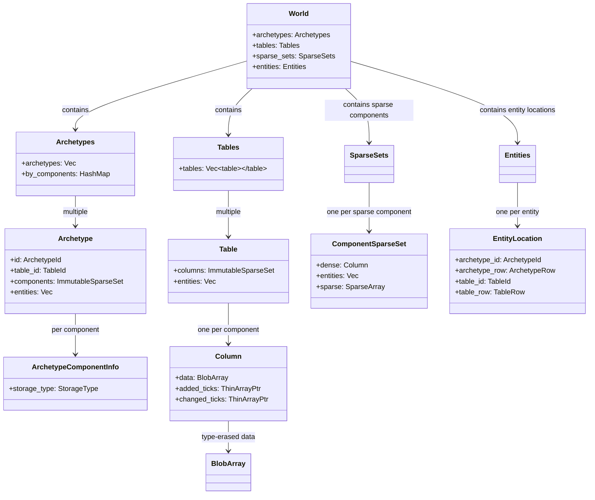
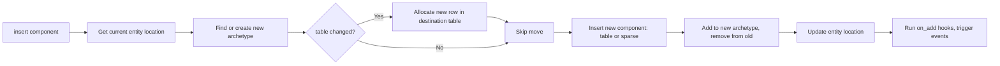

# bevy ECS Codemap: Component Storage & CRUD

## Project Overview

bevy is a data-driven game engine written in Rust. Its ECS implementation is the core of the engine and uses a hybrid archetype/sparse table approach.

**Official Resources:**
- GitHub Repository: [bevyengine/bevy](https://github.com/bevyengine/bevy)
- Crates.io: https://crates.io/crates/bevy_ecs

---

## Codemap: System Context

**File Locations:**
- `crates/bevy_ecs/src/storage/mod.rs`: Top-level storage definitions
- `crates/bevy_ecs/src/storage/table/mod.rs`: Table storage (default archetype SoA)
- `crates/bevy_ecs/src/storage/table/column.rs`: Column definition with change detection
- `crates/bevy_ecs/src/storage/sparse_set.rs`: Sparse set storage implementation
- `crates/bevy_ecs/src/storage/blob_array.rs`: Type-erased contiguous blob storage
- `crates/bevy_ecs/src/archetype.rs`: Archetype grouping and mapping
- `crates/bevy_ecs/src/world/entity_access/world_mut.rs`: Entity mutation with insert/remove

---

## Component Diagram



---

## Data Flow Diagram (Insert Component)



---

## 1. How Components are Stored in Memory

bevy ECS uses a **hybrid architecture** combining archetypes, tables (SoA), and sparse sets. You choose storage type **per component**:

### Two Storage Types

#### 1. **Table Storage** (default) - Structure of Arrays (SoA)

All entities with the same table components are grouped into a table. Each component gets its own column:

```
Table (archetype with components A, B, C - all table storage):

┌─────────────────────────────────────────┐
│  entities: [Entity₀, Entity₁, Entity₂, ...] │
└─────────────────────────────────────────┘
┌─────────────────────────────────────────┐
│  Column A: [A₀,       A₁,       A₂,   ...] │  ← Contiguous array (SoA)
└─────────────────────────────────────────┘
┌─────────────────────────────────────────┐
│  Column B: [B₀,       B₁,       B₂,   ...] │  ← Contiguous array
└─────────────────────────────────────────┘
┌─────────────────────────────────────────┐
│  Column C: [C₀,       C₁,       C₂,   ...] │  ← Contiguous array
└─────────────────────────────────────────┘
├─────────────────────────────────────────┤
│  Each Column also stores:                 │
│    added_ticks: [Tick, Tick, Tick, ...]  │  ← Change detection when added
│    changed_ticks: [Tick, Tick, Tick, ...]│  ← Change detection when modified
└─────────────────────────────────────────┘

This is pure Structure of Arrays (SoA) - all components of same type contiguous.
Great cache locality when iterating.
```

**Data Structures:**
```rust
// From: crates/bevy_ecs/src/storage/table/mod.rs
pub struct Table {
    columns: ImmutableSparseSet<ComponentId, Column>,
    entities: Vec<Entity>,
}

// From: crates/bevy_ecs/src/storage/table/column.rs
pub struct Column {
    pub(super) data: BlobArray,
    pub(super) added_ticks: ThinArrayPtr<UnsafeCell<Tick>>,
    pub(super) changed_ticks: ThinArrayPtr<UnsafeCell<Tick>>,
}

// From: crates/bevy_ecs/src/storage/blob_array.rs
pub(super) struct BlobArray {
    item_layout: Layout,
    data: NonNull<u8>,  // Contiguous allocation of bytes
    drop: Option<unsafe fn(OwningPtr<'_>)>,
};
```

#### 2. **Sparse Set Storage** (opt-in)

For components that are frequently added/removed:

```
ComponentSparseSet for component X:

Sparse mapping (entity index directly indexes sparse array):
┌───┬───┬──────┬───┬──────┬───┐
│   │ 2 │    │ 5 │    │   │ ... │
└───┴───┴──────┴───┴──────┴───┘
      │         │
      │         └── Entity 2 has X at row 1 in dense storage
      └─────────── Entity 5 has X at row 0 in dense storage

Dense storage:
┌─────────────┬─────────────┬─────────────┐
│ X (entity 5) │ X (entity 2) │ ...        │  ← Only stores entities that have X
└─────────────┴─────────────┴─────────────┘

O(1) lookup: entity index → sparse array → directly get row → direct access.
```

**Data Structures:**
```rust
// From: crates/bevy_ecs/src/storage/sparse_set.rs
pub struct ComponentSparseSet {
    dense: Column,  // Dense column with component data (same Column as table)
    entities: Vec<EntityIndex>,  // Dense list of entity indices
    sparse: SparseArray<EntityIndex, TableRow>,  // Sparse mapping
}
```

**Characteristics:**
- Pros: O(1) insert/remove without moving entity to new archetype/table
- Cons: Slower iteration because entities aren't grouped by full component composition

### Archetype Mapping

- `Archetype` = unique component combination (including both table and sparse components)
- Multiple archetypes can **share the same table** if they differ only by sparse components - this reduces fragmentation and duplication
- `EntityLocation` stores all information needed to locate entity:

```rust
// From: crates/bevy_ecs/src/entity/mod.rs
pub struct EntityLocation {
    pub archetype_id: ArchetypeId,
    pub archetype_row: ArchetypeRow,
    pub table_id: TableId,
    pub table_row: TableRow,
}
```

---

## 2. Complete Flow for Component CRUD Operations

### Create (Insert Component)

**Entry Point:** `WorldMut::insert_by_id()`

**Full Flow:**

1. Get current entity location from `Entities`
2. Determine new archetype by adding component to existing component set
3. Check if archetype already exists in `Archetypes`, create if not:
   - Separate table components from sparse set components
   - Get or create table in `Tables` if needed
   - Register new archetype
4. If table components changed (adding a table component):
   - Allocate new row in destination table via `Table::allocate()`
   - Move existing table components: `old_table.move_to_superset_unchecked()`
   - Each existing component is swap-removed from old table, initialized in new table
   - The swapped entity (that took this entity's place in old table) gets its location updated
5. Insert the new component:
   - If **table storage**: write component data to new row in table column, set added/changed ticks to current tick
   - If **sparse storage**: insert into `ComponentSparseSet::insert()` - updates sparse mapping and adds to dense column
6. Update archetype membership: add entity to new archetype, swap-remove from old archetype
7. Update entity location in `Entities` with new archetype/table information
8. Run `on_add` and `on_insert` component hooks, trigger `Add`/`Insert` events if observers registered

**Source:** `world_mut.rs:1047-1156`, `table/mod.rs:259-372`

### Read (Access Component)

**Entry Point:** `WorldMut::get<T>()` / `get_mut<T>()`

**Flow:**
1. Check archetype contains component via `Archetype::contains()`
2. Get storage type from archetype info
3. **If table storage**:
   - Get table from `tables` using location.table_id()
   - Get column from table by component_id
   - Get pointer to component data at location.table_row()
   - Wrap in `Mut` with change detection tracking for mutable access
4. **If sparse storage**:
   - Get sparse set from `sparse_sets` by component_id
   - Do sparse lookup: entity index → get row in dense storage
   - Return pointer to component data in dense column
   - Wrap in `Mut` for change detection

**Source:** `world_mut.rs:278-288`

### Update (Modify Component)

- When you get mutable access via `get_mut()`, the `Mut<T>` wrapper automatically updates the changed tick when you mutate through the deref
- `Mut` assigns the current change tick to `changed_ticks[row]` when you modify
- For `modify_component`, it temporarily removes, runs your mutable closure, then reinserts - this triggers all add/remove hooks

**Code:** `change_detection/mod.rs` has the `Mut` implementation that automatically tracks changes.

### Delete (Remove Component)

**Entry Point:** `WorldMut::remove()`

**Full Flow:**
1. Check current archetype contains the component
2. Determine new archetype by removing component from current set
3. Lookup or create new archetype
4. If storing the removed component in **table storage**:
   - Call `table.swap_remove_unchecked(entity_row)`
   - This swaps the entity row with the last row in table, drops the component, updates the swapped entity's location
5. If storing in **sparse set**:
   - Remove from `ComponentSparseSet::remove()` - swap-remove internally, updates sparse mapping
6. Move remaining table components to new table (same process as insert but in reverse)
7. Remove entity from old archetype, add to new archetype, update locations of swapped entities
8. Update entity location in `Entities`
9. Run `on_discard` and `on_remove` hooks, trigger `Discard`/`Remove` events

**Source:** `world_mut.rs:1228-1290`, `table/mod.rs:209-248`, `sparse_set.rs:325-429`

---

## 3. Memory Layout Diagrams

No built-in graphical diagrams in repository, here's the textual diagrams:

### Table Storage (SoA)

```
Table (all table components):

Table has one row per entity, one column per component:

Row 0 → Entity 0: components all at index 0 in each column
Row 1 → Entity 1: components all at index 1 in each column
...
```

### Sparse Set Storage

```
ComponentSparseSet:

Sparse array index = entity index → directly gives row in dense array
Only entities that actually have the component take up space in dense storage
```

### Overall Top-level

```
World
├── Entities: Entity → EntityLocation (archetype_id, table_id, row)
├── Archetypes: each unique combination of components (table + sparse)
├── Tables: each unique combination of table components → SoA table
├── SparseSets: each sparse component → ComponentSparseSet
└── Multiple archetypes can share the same table when only differing by sparse components
```

---

## 4. Key Source Files

| File | Lines | Purpose |
|------|-------|---------|
| `crates/bevy_ecs/src/storage/mod.rs` | 1-113 | Top-level `Storages` struct |
| `crates/bevy_ecs/src/storage/table/mod.rs` | 1-873 | `Table` definition, allocate, move, remove |
| `crates/bevy_ecs/src/storage/table/column.rs` | 1-443 | `Column` with change detection ticks |
| `crates/bevy_ecs/src/storage/sparse_set.rs` | 1-862 | `ComponentSparseSet` implementation |
| `crates/bevy_ecs/src/storage/blob_array.rs` | 1-308 | Type-erased contiguous blob storage |
| `crates/bevy_ecs/src/archetype.rs` | 1-988 | `Archetype`, `Archetypes` definition |
| `crates/bevy_ecs/src/entity/mod.rs` | 1210-1230 | `EntityLocation` |
| `crates/bevy_ecs/src/world/entity_access/world_mut.rs` | 1047-1290 | `insert` / `remove` implementation |

---

## Summary

bevy ECS takes a **pragmatic hybrid approach**:

1. **By default**: Archetype-based table storage with SoA - excellent cache locality for iteration
2. **Per-component opt-in**: You can mark components as `SparseSet` storage when they're frequently added/removed → O(1) insert/delete without moving
3. **Smart sharing**: Multiple archetypes that differ only by sparse components share the same table → no wasted space
4. **Built-in change detection**: Every component in every table has added/changed ticks for efficient system change detection
5. **Tradeoff**: More complex than pure approaches, but gives you the best of both worlds for common game development patterns.

This design recognizes that **most components don't change composition frequently** (so benefit from table SoA), but **some components are frequently added/removed** (like tags, status effects) so benefit from sparse storage. By allowing per-component selection, bevy gets better performance overall than a one-size-fits-all approach.
