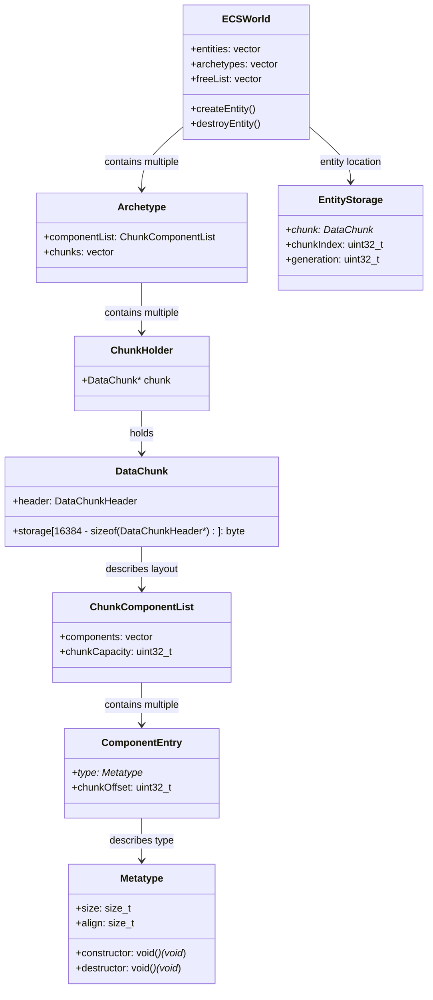

# decs ECS Codemap: Component Storage & CRUD

## Project Overview

decs is a **minimalist single-header** archetype-based ECS implementation inspired by Unity ECS. It focuses on simple, cache-friendly contiguous chunk storage.

**Official Resources:**
- GitHub Repository: [vblanco20-1/decs](https://github.com/vblanco20-1/decs)
- Size: 55.8KB single header

---

## Codemap: System Context

All code lives in one file:
- `src/decs.h`: Everything - ECS world, archetype, chunk storage, component management, CRUD operations

---

## Component Diagram



---

## Data Flow Diagram (Component Add)


---

## 1. Memory Storage Layout

decs is an archetype-based ECS that uses **Structure of Arrays (SoA)** storage organized in **16KB fixed-size chunks**.

### Memory Layout Inside a 16KB DataChunk

Each chunk is exactly **16KB**:

```
┌─────────────────────────────────────────────────────────────┐
│  DataChunk (16KB total)                                       │
│  ┌─────────────────────────────────────────────────────────┐ │
│  │  storage (available after header)                         │ │
│  │                                                             │ │
│  │  Offset:                                                    │ │
│  │   0 → EntityID array[capacity]  (all entities in chunk)  │ │
│  │   capacity * sizeof(EntityID) → aliveness bitfield        │ │
│  │        (1 bit per entity slot, 64 bits per word)           │ │
│  │                                                             │ │
│  │   For each component:                                      │ │
│  │     [alignment padding]                                     │ │
│  │     component T[capacity]  (all contiguous!)              │ │
│  │                                                             │ │
│  └─────────────────────────────────────────────────────────┘ │
└─────────────────────────────────────────────────────────────┘
```

**Key Points:**
- **Pure SoA (Structure of Arrays)**: All components of the same type are stored contiguously
- Each archetype (unique component combination) gets its own chunks
- Fixed-size 16KB chunks → good cache behavior
- Proper alignment is respected for each component type

**Component Offset Calculation:**
```cpp
// From: src/decs.h:609-649
uint32_t offsets = 0;
// Reserve entity ids at the start
offsets += sizeof(EntityID) * itemCount;
// Add deletion bitfield (1 bit per entity = 8 bytes per 64 entities)
offsets += ((itemCount + 63)/ 64) * 8;
for (size_t i = 0; i < count; i++) {
    const Metatype* type = types[i];
    const bool is_zero_sized = type->align == 0;
    if (!is_zero_sized) {
        // Align properly for this component type
        size_t remainder = offsets % type->align;
        size_t oset = type->align - remainder;
        offsets += oset;
    }
    list->components.push_back({ type,type->hash,offsets });
    if (!is_zero_sized) {
        offsets += type->size * (itemCount);
    }
}
```

---

## 2. Complete Component CRUD Operations Flow

### Create (Adding a Component)

**Entry Point:** `add_component_to_entity` / `create_entity`

**Full Flow:**
1. When adding a component to an existing entity:
   - Get entity's current archetype
   - Create new archetype by adding the component to the old archetype's component list
   - If new archetype didn't exist before, create it and build its `ChunkComponentList` with proper offsets
2. Move the entity from the old chunk to the new archetype's chunk:
   - Find or create a chunk with free space in the new archetype
   - Find first free slot in chunk via bitmask scan
   - Mark slot as alive, increment alive count
   - Call constructors on all new component slots
   - Copy existing components from old chunk to new chunk via `memcpy`
   - Erase entity from old chunk
3. Update entity's `EntityStorage` locator to point to new chunk and index
4. Done.

**Source:** `/root/decs/src/decs.h` lines 898-960 (move_entity_to_archetype), 1353-1397 (insert_entity_in_chunk)

### Read (Accessing a Component)

**Entry Point:** `get_entity_component<C>(world, id)`

**Flow:**
1. Get entity location from `world->entities[id.index]` → gives chunk and chunk index
2. Get component array: linear search through chunk's `ChunkComponentList` to find matching component type
3. Calculate pointer to component: `(byte*)chunk + cmp.chunkOffset + (mtype->size * index)`
4. Return reference to component.

**Code:**
```cpp
template<typename C>
C& get_entity_component(ECSWorld* world, EntityID id) {
    EntityStorage& storage = world->entities[id.index];
    auto acrray = get_chunk_array<C>(storage.chunk);
    assert(acrray.chunkOwner != nullptr);
    return acrray[storage.chunkIndex];
}
```

**Source:** `/root/decs/src/decs.h:1124-1132`

### Update (Modifying a Component)

Trivial: after reading, just assign to the returned reference. No extra bookkeeping needed (change detection is not built-in).

```cpp
get_entity_component<Transform>(world, entity) = new_transform;
```

### Delete (Removing a Component or Entity)

**Removing a component:**
1. Get entity's current archetype
2. Create new archetype by removing the component
3. Move entity to new archetype (same process as adding, but one less component)
4. Copy remaining components to new chunk, destroy the removed component in old chunk
5. Update entity location

**Destroying entire entity:**
```cpp
inline void destroy_entity(ECSWorld* world, EntityID id) {
    assert(is_entity_valid(world, id));
    erase_entity_in_chunk(world->entities[id.index].chunk,
                         world->entities[id.index].chunkIndex, false);
    deallocate_entity(world, id);
}
```

Inside `erase_entity_in_chunk`:
1. Call destructors for all components
2. Clear aliveness bit
3. Decrement alive count in chunk
4. If chunk becomes empty, delete it from archetype
5. Entity ID returned to free list for reuse

**Source:** `/root/decs/src/decs.h:1400-1439`

---

## 3. Memory Layout Diagrams

There are no existing memory diagrams in decs documentation. Here is the conceptual organization:

```
ECSWorld
├── entities: vector<EntityStorage>  // Direct O(1) entity lookup
│   └── Each entry = (chunk, chunkIndex, generation)
├── archetypes: vector<Archetype>
│   └── Archetype (per unique component combination)
│       ├── componentList: ChunkComponentList
│       │   └── components: list of (type, hash, chunkOffset)
│       └── chunks: vector<ChunkHolder>
│           └── Each chunk = 16KB DataChunk (SoA storage)
               └── Inside chunk:
                   EntityID[capacity] → bitfield → C1[capacity] → C2[capacity] → ...
```

---

## 4. Key Source Files & Implementation Points

All code is in a single header:
**Main header**: `/root/decs/src/decs.h`

| Line Range | Purpose |
|------------|---------|
| **128-181** | `Metatype` - component type metadata storing size, alignment, constructor/destructor pointers |
| **192-214** | `DataChunkHeader` - chunk metadata |
| **215-234** | `DataChunk` - 16KB fixed-size chunk structure |
| **237-245** | `ChunkComponentList` - component list with offsets |
| **249-321** | `ComponentArray<T>` - wrapper for accessing contiguous component array |
| **323-338** | `Archetype` - archetype grouping |
| **340-352** | `EntityStorage` - entity location (chunk pointer + index) |
| **409-482** | `ECSWorld` - main world container |
| **609-649** | `build_component_list()` - calculates component offsets for SoA layout |
| **863-867** | `destroy_entity()` - entry point |
| **898-960** | `move_entity_to_archetype()` - moves when changing archetype |
| **1124-1132** | `get_entity_component()` - read access |
| **1353-1397** | `insert_entity_in_chunk()` - insert new entity |
| **1400-1439** | `erase_entity_in_chunk()` - delete entity |

---

## Summary of Key Points

- **Architecture**: Archetype-based (group-by-component-signature)
- **Memory model**: Pure **Structure of Arrays (SoA)**
- **Chunk size**: 16KB fixed-size blocks
- **Each chunk contains**: One archetype's worth of entities, with all components of each type stored contiguously
- **Entity lookup**: O(1) direct access via `world->entities[entity.index]` which gives chunk pointer and index
- **Free slots tracked via**: Bitmask (one bit per slot) in each chunk
- **Adding/removing components**: Requires copying all components to new archetype chunk → O(C) where C is number of components
- **Iteration**: Very fast - all matching component data is contiguous in memory per chunk, perfect cache locality.

**Design Tradeoffs:**
- Simplicity (single header) vs Features (no built-in change detection, no threading)
- Better iteration cache locality vs O(C) add/remove cost
