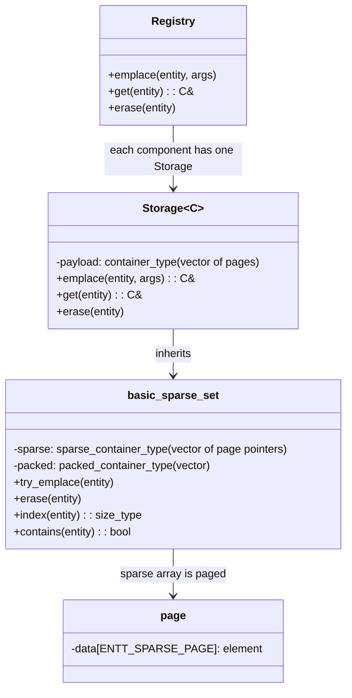

# ENTT Codemap: Component Storage & CRUD

## Project Overview

ENTT is a modern C++ minimal open-source ECS that uses a **pure sparse-set per-component** approach. It's one of the most popular sparse-set based ECS implementations.

**Official Resources:**
- GitHub Repository: [skypjack/entt](https://github.com/skypjack/entt)
- Documentation: https://github.com/skypjack/entt/wiki

---

## Codemap: System Context

**File Locations:**
- `src/entt/entity/sparse_set.hpp`: Core sparse set implementation
- `src/entt/entity/storage.hpp`: Extends sparse set with component storage
- `src/entt/entity/registry.hpp`: Top-level registry contains all component pools
- `src/entt/entity/component.hpp`: Component traits configuration

---

## Component Diagram



---

## Data Flow Diagram (CRUD)

```mermaid
flowchart LR
    A[emplace(entity)] --> B[try_emplace in sparse_set]
    B --> C[assure pages allocated]
    C --> D[construct in-place]
    D --> E[return ref]

    A2[get(entity)] --> B2[index from sparse]
    B2 --> C2[element_at(index)]
    C2 --> D2[return ref]

    A3[erase(entity)] --> B3[get position]
    B3 --> C3{deletion_policy?}
    C3 -->|swap_and_pop| D3[swap with last, pop]
    C3 -->|in_place| E3[mark tombstone, add to free list]
```

---

## 1. Memory Storage Architecture

ENTT uses **paged sparse-set** where **each component type has its own independent storage pool**. This is fundamentally different from archetype-based approaches.

### Layout Overview

For a single component type C:

```
+------------------+
|  Sparse Array    |   (paged, ENTT_SPARSE_PAGE = 4096 per page)
|  Page 0          |   [ entity 0 → packed index, ... ]
|  Page 1          |   [ ... continuing ... ]
|  ...             |
+------------------+
         |
         | (entity index maps to)
         v
+------------------+
|  Packed Entities |   [E3, E7, E1, E9, ...]  (entities that have this component)
+------------------+
         |
         | (packed index maps to)
         v
+------------------+
|  Component Pages|   (paged, ENTT_PACKED_PAGE = 1024 per page)
|  Page 0          |   [C3, C7, C1, C9, ... ]
|  Page 1          |   [ ... continuing ... ]
+------------------+

Each component type has ITS OWN storage pool. This is SoA (Structure of Arrays).
```

### Key Characteristics:

- **Paged Sparse Array**: `ENTT_SPARSE_PAGE = 4096` entries per page. Only allocates pages when needed → saves memory for sparse components.
- **Paged Component Storage**: `ENTT_PACKED_PAGE = 1024` components per page. Provides **pointer stability** - references to components never invalidate when storage grows.
- **Empty component optimization**: Empty types don't store any component data - only track presence in sparse set.
- **Configurable deletion policies**: Via component traits.

**Configuration:**
```cpp
// From: src/entt/config/config.h
#ifndef ENTT_SPARSE_PAGE
#    define ENTT_SPARSE_PAGE 4096
#endif

#ifndef ENTT_PACKED_PAGE
#    define ENTT_PACKED_PAGE 1024
#endif
```

**Data Structures:**

**Core sparse set:**
```cpp
// From: src/entt/entity/sparse_set.hpp
using sparse_container_type = std::vector<typename alloc_traits::pointer, ...>;
using packed_container_type = std::vector<Entity, Allocator>;
```

**Storage extends sparse set with component data:**
```cpp
// From: src/entt/entity/storage.hpp
container_type payload;  // vector of component pages
```

**Page allocation:**
```cpp
// From: src/entt/entity/storage.hpp:222-242
auto assure_at_least(const std::size_t pos) {
    const auto idx = pos / traits_type::page_size;
    if(!(idx < payload.size())) {
        payload.resize(idx + 1u, nullptr);
        for(curr = payload.size(); curr < last; ++curr) {
            payload[curr] = alloc_traits::allocate(allocator, traits_type::page_size);
        }
    }
    return payload[idx] + fast_mod(pos, traits_type::page_size);
}
```

---

## 2. Complete Component CRUD Operations Flow

### Create (Emplace - Add Component to Entity)

**Entry Point:** `storage::emplace<C>(entity, args...)`

**Flow:**
1. `emplace_element` calls `basic_sparse_set::try_emplace` to add entity to sparse/packed structures
2. Assure at least enough pages are allocated for the component at the new position
3. Construct component in-place using allocator with given arguments
4. Return reference to the newly constructed component

**Core code:**
```cpp
// From: src/entt/entity/storage.hpp:244-258
template<typename... Args>
auto emplace_element(const Entity entt, const bool force_back, Args &&...args) {
    const auto it = base_type::try_emplace(entt, force_back);

    ENTT_TRY {
        auto *elem = stl::to_address(assure_at_least(static_cast<size_type>(it.index())));
        entt::uninitialized_construct_using_allocator(elem, get_allocator(), std::forward<Args>(args)...);
    }
    ENTT_CATCH {
        base_type::pop(it, it + 1u);
        ENTT_THROW;
    }

    return it;
}
```

**Sparse set insertion handles three deletion policies:**
- `swap_and_pop` (default): push to back of packed array, update sparse mapping
- `in_place`: use free list from tombstones if available
- `swap_only`: specialized for entity storage

**Source:** `src/entt/entity/sparse_set.hpp:318-353`

### Read (Get Component from Entity)

**Entry Point:** `storage::get(entity)`

**Flow:**
1. Get packed index from sparse set: `base_type::index(entt)`
2. Get component reference using paged access: `element_at(index)`
3. Return the reference

**Code:**
```cpp
// From: src/entt/entity/storage.hpp
[[nodiscard]] const value_type &get(const entity_type entt) const noexcept {
    return element_at(base_type::index(entt));
}

[[nodiscard]] value_type &get(entity_type entt) noexcept {
    return const_cast<value_type &>(std::as_const(*this).get(entt));
}
```

**index() from sparse_set:**
```cpp
[[nodiscard]] size_type index(const entity_type entt) const noexcept {
    ENTT_ASSERT(contains(entt));
    return entity_to_pos(sparse_ref(entt));
}
```

### Update (Modify Component)

**Entry Point:** `storage::patch(entity, func...)`

Direct modification after get works too. `patch` is just a convenience:

```cpp
// From: src/entt/entity/storage.hpp:687-693
template<typename... Func>
value_type &patch(const entity_type entt, Func &&...func) {
    const auto idx = base_type::index(entt);
    auto &elem = element_at(idx);
    (std::forward<Func>(func)(elem), ...);
    return elem;
}
```

Direct access:
```cpp
Position& pos = registry.get<Position>(entity);
pos.x += 10;
```

### Delete (Remove Component from Entity)

ENTT supports **three deletion policies** configurable via component traits:

1. **swap_and_pop (default)**: Swap with last element, then pop
2. **in_place**: Leave tombstone, free list reuse (for pointer stability)
3. **swap_only**: Special case for entity storage

**Default swap_and_pop flow:**
1. Get position of entity in packed array
2. Swap component with the last component in packed array
3. Update sparse mapping for the swapped entity
4. Destroy the component (pop it)
5. Update sparse set to remove entity

**Code:**
```cpp
// From: src/entt/entity/storage.hpp:321-340
void pop(underlying_iterator first, underlying_iterator last) override {
    for(allocator_type allocator{get_allocator()}; first != last; ++first) {
        auto &elem = element_at(base_type::index(*first));

        if constexpr(traits_type::in_place_delete) {
            base_type::in_place_pop(*first);
            alloc_traits::destroy(allocator, std::addressof(elem));
        } else if constexpr(std::is_trivially_destructible_v<element_type>) {
            elem = std::move(element_at(base_type::size() - 1u));
            base_type::swap_and_pop(*first);
        } else {
            auto &other = element_at(base_type::size() - 1u);
            [[maybe_unused]] auto unused = std::exchange(elem, std::move(other));
            alloc_traits::destroy(allocator, std::addressof(other));
            base_type::swap_and_pop(*first);
        }
    }
}
```

**swap_and_pop in sparse_set:**
```cpp
void swap_and_pop(const Entity entt) {
    auto &elem = sparse_ref(entt);
    const auto pos = traits_type::to_entity(elem);
    sparse_ref(packed.back()) = traits_type::combine(pos, ...);
    packed[pos] = packed.back();
    packed.pop_back();
}
```

---

## 3. Memory Layout Diagrams

There are no existing image-based memory diagrams in ENTT documentation. Textual diagram:

```
Registry (top-level):
┌───────────────────────────────────────────────────┐
│  pools: [component_id → storage<C>*]              │
├───────────────────────────────────────────────────┤
│  storage for Position:                            │
│                                                   │
│  Sparse pages (4096 entries per page):            │
│  Page 0: [index: 0 → packed_idx 0, 1 → packed_idx 1, ...]
│  Page 1: [...]                                    │
│                                                   │
│  Packed entities: [e0, e5, e9, e2, ...]           │
│                                                   │
│  Component pages (1024 components per page):      │
│  Page 0: [ (x0,y0), (x5,y5), (x9,y9), (x2,y2) ]  │
│  Page 1: [ ... continuing ... ]                   │
└───────────────────────────────────────────────────┘
```

---

## 4. Key Source Files

| File | Lines | Purpose |
|------|-------|---------|
| `src/entt/entity/sparse_set.hpp` | 1-1082 | Core sparse set implementation |
| `src/entt/entity/storage.hpp` | 1-1228 | Extends sparse set with component storage |
| `src/entt/entity/component.hpp` | 1-60 | Component traits for customization |
| `src/entt/config/config.h` | 1-136 | Configuration constants |
| `src/entt/entity/registry.hpp` | 1-... | Top-level registry |

---

## Summary of Key Points

1. **Architecture**: Pure sparse-set per component (not archetype-based)
2. **Memory layout**: Each component has its own paged sparse-dense storage → SoA
3. **Paging benefits**: Reduces memory waste for sparse usage, provides pointer stability
4. **Three deletion policies**:
   - `swap_and_pop` default - keeps packed array contiguous for best iteration performance
   - `in_place` - tombstone + free list for pointer stability when deletion doesn't require compaction
5. **No archetypes**: Adding/removing components doesn't require moving any other components - O(1) operation
6. **Tradeoffs**:
   - **Pros**: Faster add/remove, no archetype explosion, simpler implementation
   - **Cons**: Worse cache locality when iterating over multiple components because entities aren't grouped by composition

ENTT is a great choice when you prioritize fast add/remove and simplicity over absolute maximum iteration cache performance.
