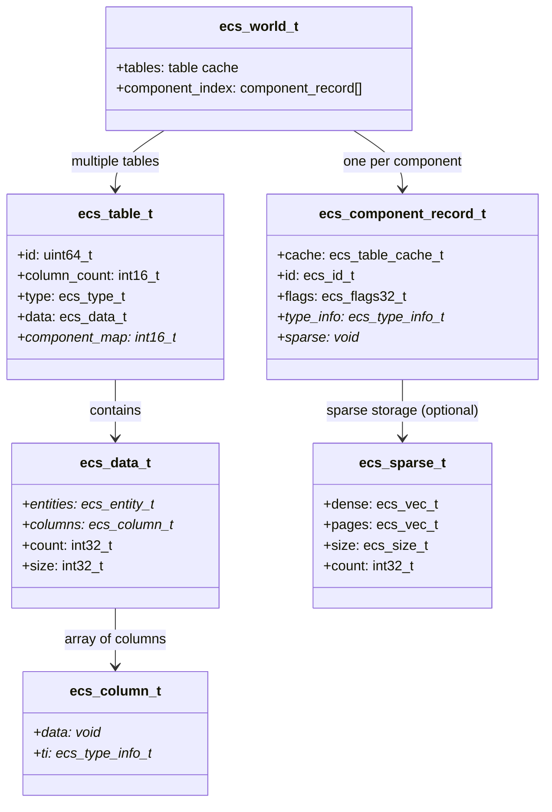

# flecs ECS Codemap: Component Storage & CRUD

## Project Overview

flecs is a high-performance ECS with a compact C API that uses **archetype-based table storage** with optional sparse storage for relationships. It's one of the most feature-complete modern ECS implementations.

**Official Resources:**
- GitHub Repository: [SanderMertens/flecs](https://github.com/SanderMertens/flecs)
- Website: https://flecs.dev/

---

## Codemap: System Context

**File Locations:**
- `src/storage/table.h` + `src/storage/table.c`: Table (archetype) core structures and operations
- `src/storage/component_index.h` + `src/storage/component_index.c`: Global component index
- `src/storage/sparse_storage.h` + `src/storage/sparse_storage.c`: Sparse component storage
- `src/entity.c`: Public API for add/get/set/remove operations
- `src/datastructures/sparse.h`: Paged sparse set implementation

---

## Component Diagram



---

## Data Flow Diagram (Add Component)

```mermaid
flowchart LR
    A[ecs_add_id(world, entity, component)] --> B[Get entity record]
    B --> C[Find new table with added component]
    C --> D[Move entity to new table in flecs_commit]
    D --> E[Copy existing components]
    E --> F[Construct added component]
    F --> G[Run on_add hook, notify OnAdd]
```

---

## 1. How Components are Stored in Memory

flecs uses an **archetype-based (table-based) storage model** with **Structure of Arrays (SoA)** layout for dense regular components. It also supports sparse storage for relationships and components that don't fit the archetype model.

### Table (Archetype) Storage (Default)

A table = one archetype = all entities with the same component set. Each component gets its own column (contiguous array):

```
Table (archetype with Position, Velocity):

entities: [e0, e1, e2, e3, ...]  ← one row per entity
Position: [{x0,y0}, {x1,y1}, {x2,y2}, {x3,y3}, ...]  ← contiguous array (column)
Velocity: [{dx0,dy0}, {dx1,dy1}, {dx2,dy2}, ...]  ← separate contiguous column
               ↑              ↑              ↑
               │              │              └─ e3's Velocity at row 3 in column
               │              └─ e2's Position at row 2 in column
               └─ e0's Position at row 0 in column

This is pure SoA (Structure of Arrays).
```

**Data Structures:**
```c
// From: src/storage/table.h
typedef struct ecs_column_t {
    void *data;                      // Array with component data (contiguous)
    ecs_type_info_t *ti;             // Component type info (size, alignment, etc)
} ecs_column_t;

struct ecs_data_t {
    ecs_entity_t *entities;            // Entity ids (one per row)
    ecs_column_t *columns;             // Columns - one per non-tag component
    int32_t count;                     // Current rows (entities)
    int32_t size;                      // Current capacity
};
```

- Tags (components without data) are not stored in columns - only recorded in table type
- O(1) column lookup for low component ids (< FLECS_HI_COMPONENT_ID) via `component_map` array

### Sparse Storage

Components marked as `Sparse` or `DontFragment` (like `ChildOf` relationships) are stored outside of tables in a **paged sparse set**:

```c
// From: include/flecs/datastructures/sparse.h
#define FLECS_SPARSE_PAGE_SIZE (1 << 12)  // 4096 elements per page

typedef struct ecs_sparse_page_t {
    int32_t *sparse;            // Sparse array with indices to dense
    void *data;                 // Component data stored with page
} ecs_sparse_page_t;

typedef struct ecs_sparse_t {
    ecs_vec_t dense;            // Dense array with indices to sparse
    ecs_vec_t pages;            // Chunks with sparse arrays and data
    ecs_size_t size;            // Element size
    int32_t count;              // Number of alive entries
};
```

- Used for one-to-many relationships that would cause excessive archetype fragmentation
- Paged storage similar to ENTT

### Summary:

| Storage Type  | Description | When Used |
|---|---|---|
| **Table (SoA)** | Dense contiguous columns per component | Default for all regular components |
| **Sparse Set** | Paged sparse storage | Sparse components, relationships like `ChildOf` |

---

## 2. Complete Flow for Component CRUD Operations

### Create (Add Component to Entity)

**Entry Point:** `ecs_add_id(world, entity, component)`

**Full Flow:**
1. Check if operations are deferred → if yes, add to command queue and return
2. Look up entity record from global entity index to get current table
3. Traverse table graph to find destination table that includes the new component
4. **Commit the change**: `flecs_commit` moves entity to new table
   - Append new row to destination table (`flecs_table_append`)
   - If destination table needs to grow, grow columns (`flecs_table_grow_data`)
   - Copy/move existing components from old table to new table (`flecs_table_move`)
   - Delete row from old table (`flecs_table_delete` - uses swap-with-last O(1))
   - Update entity record to point to new table & row
5. For dense table storage: component data is constructed in the new column slot
6. For sparse storage: insert into sparse set (`flecs_component_sparse_insert`)
7. Run `on_add` hook if provided
8. Notify `OnAdd` observers
9. Done.

**Source:** `src/entity.c:456-477`, `src/storage/table.c:1671-1758`

### Read (Get Component from Entity)

**Entry Point:** `ecs_get_id(world, entity, component)` / `ecs_get_mut_id(...)`

**Full Flow:**
1. Validate entity is alive and component is valid
2. Look up entity's table and row from entity record
3. Look up column:
   - For low component id (< FLECS_HI_COMPONENT_ID): O(1) via `table->component_map[component]`
   - For sparse components: get from sparse storage
4. If dense: calculate pointer `column->data[row * component_size]` from column
5. Return pointer to component data
6. For `get_mut`: if entity doesn't have component yet, automatically add it (`flecs_ensure`)

**Core Get Logic:**
```c
// From: src/entity.c
static flecs_component_ptr_t flecs_table_get_component(
    ecs_table_t *table, int32_t column_index, int32_t row)
{
    ecs_column_t *column = &table->data.columns[column_index];
    return (flecs_component_ptr_t){
        .ti = column->ti,
        .ptr = ECS_ELEM(column->data, column->ti->size, row)
        // ECS_ELEM = &((char*)column->data)[row * column->ti->size]
    };
}
```

**Source:** `src/entity.c:17-66`

### Update (Set Component Value)

**Entry Point:** `ecs_set_id(world, entity, component, size, ptr)`

**Flow:**
1. Validate parameters
2. If deferred, queue operation and return
3. `flecs_ensure` - adds component if not already present
4. Copy data to component pointer:
   - Fast path for low component ids: direct `memcpy`
   - General case: invoke copy with hooks
5. Mark table column as dirty for change detection
6. Invoke `on_set` hook, notify `OnSet` observers
7. Done

**Code:**
```c
// From: src/entity.c:2353-2395
void ecs_set_id(ecs_world *world, ecs_entity_t entity,
    ecs_id_t component, size_t size, const void *ptr) {
    ecs_record_t *r = flecs_entities_get(world, entity);
    flecs_component_ptr_t dst = flecs_ensure(world, entity, component, r, (int32_t)size);

    if (component < FLECS_HI_COMPONENT_ID && !world->non_trivial_set[component]) {
        ecs_os_memcpy(dst.ptr, ptr, size);
        goto done;
    }

    flecs_copy_id(world, entity, r, component, size, dst.ptr, ptr, dst.ti);

done:
    flecs_defer_end(world, stage);
}
```

### Delete (Remove Component from Entity)

**Entry Point:** `ecs_remove_id(world, entity, component)`

**Full Flow:**
1. If deferred, add to command queue and return
2. Get current entity record (current table)
3. Traverse table graph to find new table excluding the component
4. Before moving: notify `OnRemove` observers and run `on_remove` hook **before** destruction (data still valid)
5. Commit change - move entity to new table:
   - Invoke destructor on removed component
   - For sparse components: remove from sparse storage
   - Swap-with-last deletion from old table
   - Update entity record
6. If deleting last component, entity moves to the root (empty) table

**Swap-with-last O(1) Deletion:**
```c
// From: src/storage/table.c:1778-1887
void flecs_table_delete(ecs_world *world, ecs_table_t *table, int32_t row, bool destruct) {
    int32_t count = ecs_table_count(table);
    ecs_entity_t entity_to_move = ecs_table_entities(table)[count - 1];
    ecs_entity_t entity_to_delete = ecs_table_entities(table)[row];
    ecs_table_entities(table)[row] = entity_to_move;

    // Update moved entity's record to point to new row index
    ecs_record_t *record_to_move = flecs_entities_get(world, entity_to_move);
    record_to_move->row = ECS_ROW_TO_RECORD(row, row_flags);

    // Invoke destructors if needed
    if (destruct && (table->flags & EcsTableHasDtors)) {
        for (each column) {
            flecs_table_invoke_remove_hooks(...);
        }
    }

    table->data.count--;
}
```

**Source:** `src/entity.c:479-498`, `src/storage/table.c:1778-1887`

---

## 3. Memory Layout Diagrams

flecs has one existing diagram in the repository that shows component lifecycle:

**Location:** `docs/img/component_lifecycle_flow.png`

This diagram describes control flow:

```
Add/Set branch:
has(c)? ── No → [table move] → [ctor] → [on_add hook] → [OnAdd observers] → [is set?]
       │
       └── Yes → [is set?]
                  │
                  └── Yes → [on_set hook] → [OnSet observers]

Remove branch:
has(c)? ── Yes → [OnRemove observers] → [on_remove hook] → [dtor] → table move/delete
```

**Key points from diagram:**
- `OnAdd` triggers **after** component is constructed (data is valid)
- `OnRemove` triggers **before** component is destructed (data still valid)

---

## 4. Key Source Files

| File | Lines | Purpose |
|------|-------|---------|
| `src/storage/table.h` | 1-313 | Core table/column definitions |
| `src/storage/table.c` | 1-1900+ | Table append/delete/grow |
| `src/storage/component_index.h` | 1-193 | Global component index |
| `src/storage/sparse_storage.c` | 1-350+ | Sparse component operations |
| `src/datastructures/sparse.h` | 1-443 | Paged sparse set |
| `src/entity.c` | 1-3396 | Public API for all component operations |

---

## Summary

1. **Storage Model**: Archetype-based tables with SoA columns for default, sparse sets for special components
2. **Adding/removing components**: Always moves entity to new table, same as other archetype-based implementations
3. **O(1) deletion**: Swap-with-last technique keeps storage contiguous
4. **Fast lookup**: Direct array lookup for low component ids
5. **Lifecycle hooks in correct order**: Observers get notified when data is valid
6. **Designed for both bulk iteration and dynamic changes**: Good cache locality for iteration, sparse option for fragmented relationships

flecs is a full-featured production-quality ECS that balances performance with flexibility.
