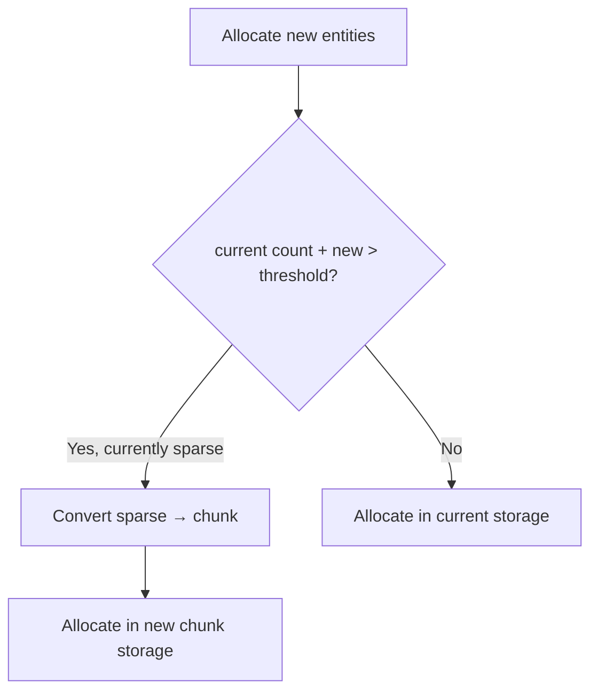

# HybridECS Codemap: Component Storage & CRUD

## Project Overview

HybridECS is a C++23 header-only hybrid ECS that combines archetype storage with automatic switching between sparse and chunk based on entity count.

**Official Resources:**
- GitHub Repository: [StellarWarp/HybridECS](https://github.com/StellarWarp/HybridECS)
- README contains **7 memory architecture diagrams** hosted externally.

---

## Codemap: System Context

The "hybrid" name refers to **two levels of hybridization**:

**File Locations:**
- `src/ecs/storage/archetype_storage.h`: Main hybrid storage container, auto-switching
- `src/ecs/storage/sparse_table.h`: Sparse table storage for small archetypes
- `src/ecs/storage/table.h`: Chunk-based SoA table storage for large archetypes
- `src/ecs/storage/component_storage.h`: Single-component sparse-dense storage
- `src/ecs/storage/entity_map.h`: Sparse-dense map implementation
- `src/ecs/type/component_group.h`: Component grouping (first level hybrid)

---

## Component Diagram

```mermaid
classDiagram
    class ArchetypeStorage {
        -m_table: variant<sparse_table, table>
        -sparse_to_chunk_convert_limit: uint32_t
        -chunk_to_sparse_convert_limit: uint32_t
        +get_allocate_accessor()
        +get_deallocate_accessor()
        +sparse_convert_to_chunk()
        +chunk_convert_to_sparse()
    }
    class sparse_table {
        -m_entities: vector<entity>
        -m_component_storages: vector<component_storage*>
        +get_allocate_accessor()
        +get_deallocate_accessor()
    }
    class table {
        -m_chunks: vector<chunk*>
        -m_notnull_components: table_comp_type_info[]
        -m_chunk_capacity: uint32_t
        +allocate_entity()
        +deallocate_entity()
        +phase_swap_back()
    }
    class component_storage {
        -m_storage: raw_entity_dense_map
        +at(entity): void*
        +allocate_value()
        +erase_component()
    }
    class raw_entity_dense_map {
        -m_sparse: entity_sparse_table_basic
        -m_dense: raw_segmented_vector
    }
    class chunk {
        -data[2048]: byte
        +entities(): entity*
    }

    ArchetypeStorage --> sparse_table : small count (< threshold)
    ArchetypeStorage --> table : large count (> threshold)
    sparse_table --> component_storage : each component separate
    component_storage --> raw_entity_dense_map : sparse-dense
    table --> chunk : multiple chunks
    table --> table_comp_type_info : component info with offset
```



---

## Data Flow Diagram (Auto-Conversion)



---

## 1. Component Storage Architecture & Memory Layout

### Two Levels of Hybrid Storage

1. **Component Groups (Modular Partitioning)**:
   - Components divided into functional groups (rendering, physics, AI, etc.)
   - Each group maintains its own archetype storage independently
   - Reduces archetype explosion: combinations per group instead of global product

2. **Hybrid Storage within each Archetype**:
   | Storage Mode | When used | Data Structure | Memory Layout |
   |--------------|-----------|----------------|--------------|
   | **Sparse Set** | Below threshold (few entities) | `sparse_table` with `component_storage` | Each component separate sparse-dense |
   | **Chunk-based Table** | Above threshold (many entities) | `table` with 2KB fixed chunks | SoA (Structure of Arrays) all packed into chunks |

**Automatic Conversion**: When entity count crosses threshold, automatically converts between storage modes. Single-component archetypes always remain sparse.

### Sparse-dense Storage (Sparse Mode)

**Component Storage (`component_storage.h`)**:
- Each component type gets one `component_storage`
- Uses `raw_entity_dense_map` which is a **paged sparse-dense map**:
  - **Sparse layer**: Paged sparse table `entity_sparse_table_basic` maps entity ID → (version, pointer/index)
  - **Dense layer**: `raw_segmented_vector` stores (entity + component data) tuples contiguously
- Each component stored independently in its own dense array → **AoS for entities, SoA across components**

**Page size**: 2048 bytes per page → ~64-256 entities per page depending on component size. Paged allocation handles fragmentation.

### Chunk-based SoA Storage (Large Archetypes)

When entity count exceeds threshold, switches to 2KB fixed-chunk SoA:

**Memory layout within a 2KB chunk**:
```
┌─────────────────────────────────────────────────────────────┐ 2048 bytes total
│  Entities[chunk_capacity]  │  Comp0[chunk_capacity]  │  Comp1[...]  │ ...
└─────────────────────────────────────────────────────────────┘
 ^        ^                  ^        ^
 |        |                  |        ├─ Each component's elements packed contiguously (SoA)
 |        |                  └─ Offset calculated: comp.offset() + chunk_offset * comp.size()
 |        └─ Entity ids stored first, sizeof(entity) * chunk_capacity bytes
 └─ Chunk begin
```

Components are sorted by alignment for better packing to avoid unnecessary padding.

**Layout Calculation:**
```cpp
// From: src/ecs/storage/table.h:164-206
size_t column_size = sizeof(entity);
size_t offset = 0;
uint32_t max_align = 4;
for (auto& type : components) {
    if (type.is_empty()) continue;
    column_size += type.size();
    max_align = std::max(type.alignment(), max_align);
}
m_chunk_capacity = component_table_chunk_traits::size / column_size;
offset = sizeof(entity) * m_chunk_capacity;

// Sort by alignment descending for optimal packing
vector<std::tuple<int, uint32_t, component_type_index>> storage_order_mapping;
for (auto& [index, _, type] : storage_order_mapping) {
    m_notnull_components[index] = table_comp_type_info{type, uint32_t(offset)};
    offset += type.size() * m_chunk_capacity;
}
```

### Special Storage for Tag Components

Tag components (empty structs, frequently added/removed) **always stored separately in sparse sets**, never in archetype chunk storage. This avoids memory waste and copying when tags change.

---

## 2. Complete Component CRUD Operations Flow

### Create (Add Component to Entity)

1. Entity is already allocated, get current archetype
2. Compute new archetype hash with added component, check if exists in registry
3. If not exists, create new archetype
4. Get allocate accessor from new archetype storage:
   - Check if need to convert sparse → chunk based on new size
   - Convert if needed
5. For sparse table: each component allocates individually in its own `component_storage`
6. For chunk table: allocate entity in chunk, pre-reserves space for all components
7. User constructs components in place via accessor
8. Call `notify_construct_finish()` → triggers callbacks to add entity to all interested queries
9. Update entity storage key with new location

**Source:** `src/ecs/registry/archetype_storage.h:387-403` (get_allocate_accessor), `src/ecs/storage/sparse_table.h:212-266` (sparse allocate), `src/ecs/storage/table.h:773-865` (chunk allocate)

### Read (Access Component)

1. Get entity's storage key from registry: encodes is_sparse + group + table + offset
2. If sparse storage: look up directly in `component_storage` → `raw_entity_dense_map::at(entity)` returns pointer
3. If chunk storage: decode chunk index + chunk offset → calculate component address:
   ```cpp
   // src/ecs/storage/table.h
   static byte* component_address(chunk* chunk, uint32_t chunk_offset,
                                  const table_comp_type_info& type) {
       return chunk->data() + type.offset() + chunk_offset * type.size();
   }
   ```
4. Return pointer/reference for direct access.

**Iteration for systems**: In chunk mode, iterate chunk-by-chunk, entity-by-entity. All components of same type contiguous → excellent cache locality.

### Update (Modify Component)

Direct modification through returned reference:
```cpp
Position& pos = get<Position>(entity);
pos.x = 100;
pos.y = 200;
```
No extra bookkeeping needed.

### Delete (Remove Component from Entity)

1. Create new archetype without the removed component
2. Get deallocate accessor
3. For sparse table: erase from each component storage, uses swap-with-back O(1)
4. For chunk table: destruct all components, mark slots free, compact chunk by moving last entities into free holes
5. After deletion: check if need to convert chunk → sparse when count drops below threshold, auto-convert if needed
6. `notify_destruct_finish()` → triggers callbacks to remove entity from queries

**Chunk Compaction:**
```cpp
// src/ecs/storage/table.h:333-417
void phase_swap_back() {
    while (!m_free_indices.empty()) {
        auto chunk_index = m_free_indices.m_free_chunks_indices.top();
        auto& free_indices = m_free_indices.m_free_indices[chunk_index];
        chunk* chunk = m_chunks[chunk_index];
        uint32_t last_entity_offset = chunk->size() - 1;

        // Move last entity into each hole from top to bottom
        while (true) {
            uint32_t head_hole = *free_indices.begin();
            if (head_hole == last_entity_offset) {
                chunk->decrease_size(1);
                break;
            }
            // Move last entity into hole, update storage keys
            ...
        }
    }
}
```

---

## 3. Memory Layout Diagrams from Documentation

The README contains 7 memory layout diagrams:

1. **Component Group Diagram**: https://cdn.jsdelivr.net/gh/StellarWarp/StellarWarp.github.io@main/img/image-20250102225937285.png
   - Shows modular partitioning into component groups

2. **Hybrid Storage Diagram**: https://cdn.jsdelivr.net/gh/StellarWarp/StellarWarp.github.io@main/img/image-20250102225914513.png
   - Illustrates automatic switching between sparse and chunk storage based on entity count

3. **Memory Access Model Diagram**: https://cdn.jsdelivr.net/gh/StellarWarp/StellarWarp.github.io@main/img/image-20250102225808834.png
   - Depicts query access model hierarchy: query → table tag → arch storage → (sparse table or table) → component storage

4. **Query Example Diagram**: https://cdn.jsdelivr.net/gh/StellarWarp/StellarWarp.github.io@main/img/image-20250102231558304.png
   - Example query accessing multiple archetypes

5. **Cross-Group Query Diagram**: https://cdn.jsdelivr.net/gh/StellarWarp/StellarWarp.github.io@main/img/image-20250102231322481.png
   - Shows how cross-group queries work

6. **Random Access Diagram**: https://cdn.jsdelivr.net/gh/StellarWarp/StellarWarp.github.io@main/img/image-20250103095400482.png
   - Random access memory layout

7. **Query Structure Diagram**: https://cdn.jsdelivr.net/gh/StellarWarp/StellarWarp.github.io@main/img/image-20250102230117513.png
   - Query node structure

---

## 4. Key Source Files

| File | Lines | Purpose |
|------|-------|---------|
| `src/ecs/storage/archetype_storage.h` | 1-513 | Main hybrid storage container |
| `src/ecs/storage/component_storage.h` | 1-334 | Single-component sparse-dense storage |
| `src/ecs/storage/entity_map.h` | 1-1184 | Sparse-dense map implementations |
| `src/ecs/storage/sparse_table.h` | 1-473 | Sparse table storage for small archetypes |
| `src/ecs/storage/table.h` | 1-1078 | Chunk-based SoA table storage |
| `src/ecs/storage/tag_archetype_storage.h` | 1-422 | Special storage for tags |
| `src/container/raw_segmented_vector.h` | 1-321 | Segmented chunked storage |
| `src/ecs/type/component_group.h` | 1-372 | Component group definition |

---

## Summary of Key Design Choices

1. **Two-level hybridization** is unique to HybridECS:
   - Modular component groups fight archetype explosion
   - Auto-adapting storage matches storage strategy to archetype size

2. **Threshold automatically calculated**:
   ```cpp
   if (component_storages.size() > 1) {
       sparse_to_chunk_convert_limit = 2048 / components_size;
       chunk_to_sparse_convert_limit = sparse_to_chunk_convert_limit / 2;
   } else {
       sparse_to_chunk_convert_limit = max_uint32;
   }
   ```
   Adapts to how much data actually fits in a 2KB chunk.

3. **Tags stored separately** avoids the cost of copying when tags are frequently added/removed - common case that many implementations don't optimize for.

4. **Cache-friendly**: When archetypes grow large, automatically switches to SoA chunk layout which is optimal for iteration.

5. **Tradeoff**: More complex implementation, but adapts to usage patterns automatically.
