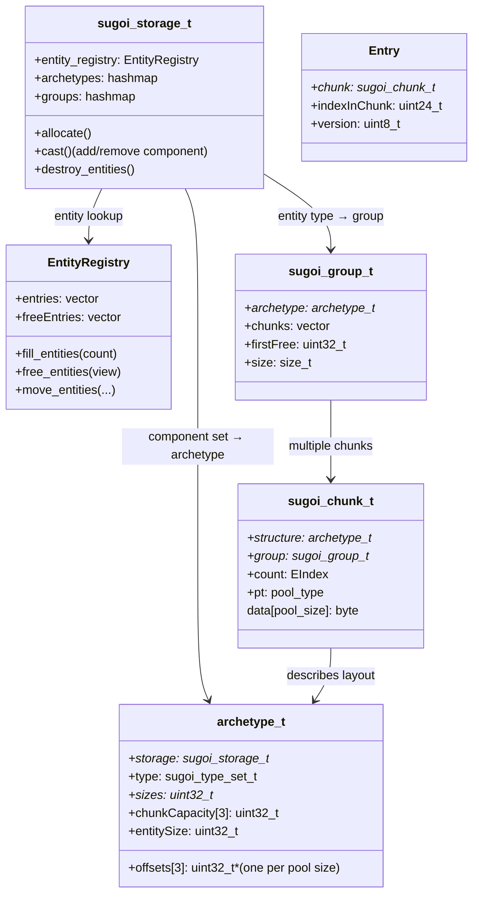

# SakuraEngine Sugoi ECS Codemap: Component Storage & CRUD

## Project Overview

SakuraEngine's ECS implementation is called **Sugoi** (Japanese for "awesome"). It's an archetype-based chunked ECS designed for modern multi-threaded game engines.

**Official Resources:**
- GitHub Repository: [SakuraEngine/SakuraEngine](https://github.com/SakuraEngine/SakuraEngine)
- Branch: `engine`

---

## Codemap: System Context

**File Locations:**
- `.../sugoi/sugoi_config.h`: Configuration and entity bit layout
- `.../sugoi/entity_registry.hpp`: Sparse entity lookup table
- `.../sugoi/chunk.hpp`: Chunk structure definition
- `.../sugoi/archetype.hpp`: Archetype and group definitions
- `.../sugoi/storage.hpp`: Main storage structure
- `.../sugoi/storage.cpp`: Storage implementation (allocation, destruction, casting)
- `.../sugoi/chunk_view.cpp`: CRUD operations (construct, destruct, move)

---

## Component Diagram



---

## Data Flow Diagram (Allocate Entity)

```mermaid
flowchart LR
    A[allocate(count)] --> B[Get or create group for archetype]
    B --> C[Find chunk with free space]
    C --> D[Allocate entities in chunk]
    D --> E[Allocate entity IDs from registry]
    E --> F[Construct components]
    F --> G[Invoke user callback for initialization]
```

---

## 1. Memory Storage Architecture

Sugoi uses an **archetype-based chunked SoA** approach with three fixed-size memory pools.

### Chunk Size Pools

Three fixed chunk sizes from which memory is allocated:

```cpp
// From: sugoi_types.h
static constexpr size_t kSmallBinSize = 1024;        // 1KB
static constexpr size_t kFastBinSize = 64 * 1024;   // 64KB (default)
static constexpr size_t kLargeBinSize = 512 * 1024; // 512KB
```

The appropriate pool is selected based on archetype entity capacity. This reduces fragmentation.

### Memory Layout within a Chunk

```
Chunk memory layout (total = pool size: 1KB/64KB/512KB):
┌─────────────────────────────────────────────────────────────────────┐
│  sugoi_chunk_t header (≈64 bytes)                                   │
├─────────────────────────────────────────────────────────────────────┤
│  Entities:  array of sugoi_entity_t  (capacity × sizeof(entity))    │
│  ╭─────────────╮╭─────────────╮╭─────────────╮╭─────────────╮        │
│  │  Entity 0  ││  Entity 1  ││  Entity 2  ││  Entity N  │        │
│  ╰─────────────╯╰─────────────╯╰─────────────╯╰─────────────╯        │
├─────────────────────────────────────────────────────────────────────┤
│  Component 0:  array of T0  (capacity × sizeof(T0))                 │
│  ╭──────╮╭──────╮╭──────╮╭──────╮                                  │
│  │ T0 0││ T0 1││ T0 2││ T0 N│                                  │
│  ╰──────╯╰──────╯╰──────╯╰──────╯                                  │
├─────────────────────────────────────────────────────────────────────┤
│  Component 1:  array of T1  (capacity × sizeof(T1))                 │
├─────────────────────────────────────────────────────────────────────┤
│  ...                                                               ...
├─────────────────────────────────────────────────────────────────────┤
│  Component M:  array of TM  (capacity × sizeof(TM))                 │
├─────────────────────────────────────────────────────────────────────┤
│  Slice Data:  array of slice_data_t  (ncomponents × 8 bytes)        │
│  ┌────────────────────────────┐                                     │
│  │ timestamp (4) + lock (2)    │  Each component gets a timestamp  │
│  │  (padding  2 bytes)         │  for change tracking + lock for  │
│  └────────────────────────────┘                                     │
└─────────────────────────────────────────────────────────────────────┘
```

**Key Points:**
- **SoA (Structure of Arrays)**: Each component is stored as a contiguous array
- All entities of same archetype grouped together in chunks
- Alignment is respected for each component type
- Per-component **timestamp** for change tracking (systems can process only changed entities)
- Per-component **reader-writer lock** in chunk for thread-safe parallel access

**Layout Calculation:**
```cpp
// From: archetype.cpp lines 121-157
size_t caps[] = { kSmallBinSize - sizeof(sugoi_chunk_t),
                  kFastBinSize - sizeof(sugoi_chunk_t),
                  kLargeBinSize - sizeof(sugoi_chunk_t) };
const uint32_t sliceDataSize = sizeof(sugoi::slice_data_t) * archetype.type.length;
forloop (i, 0, 3) {
    uint32_t* offsets = const_cast<uint32_t*>(archetype.offsets[i]);
    uint32_t& capacity = const_cast<uint32_t&>(archetype.chunkCapacity[i]);
    write_const(archetype.sliceDataOffsets[i],
                static_cast<uint32_t>(caps[i] - sliceDataSize));
    uint32_t ccOffset = (uint32_t)(caps[i] - sliceDataSize);

    // Place chunk-level components first
    forloop (j, 0, archetype.type.length) {
        ... calculate offsets ...
    }

    // Calculate capacity based on entity size
    capacity = (uint32_t)(ccOffset - padding) / archetype.entitySize;

    // Place per-entity components
    uint32_t offset = sizeof(sugoi_entity_t) * capacity;
    forloop (j, 0, archetype.type.length) {
        align and place ...
        offsets[id] = offset;
        offset += archetype.sizes[id] * capacity;
    }
}
```

### Entity Bit Layout

Entity is 32-bit `sugoi_entity_t`:
- Bits 0-23: Entity ID (24 bits → ~16 million max entities)
- Bits 24-31: Version (8 bits → 256 versions before reuse)

### Entity Lookup

`EntityRegistry` maintains a sparse array where **entity ID directly indexes**:
```cpp
struct Entry {
    sugoi_chunk_t* chunk;
    uint32_t indexInChunk : 24;
    uint32_t version : 8;
};
vector<Entry> entries;
vector<EIndex> freeEntries;  // Free list for reuse
```

O(1) direct lookup: `entries[entity_id]` gives chunk + index.

---

## 2. Complete Component CRUD Operations Flow

Sugoi is archetype-based so adding/removing components changes the archetype and requires moving the entity to a different group.

### Create (Allocate Entity with Components)

Entities are created in batches:

1. Call `sugoiS_allocate_type` → `storage->allocate()`
2. Lookup group for entity archetype in hash table. If doesn't exist:
   - Create archetype if doesn't exist (`constructArchetype`)
   - Calculate memory layout, offsets, capacity based on pool size
3. Allocate space in chunk:
   - Get first chunk with free space from group
   - If no free chunk, allocate new chunk from appropriate pool
   - Allocate `allocated = min(count, chunk_capacity - chunk_count)`
   - Resize chunk
4. Allocate entity IDs: `entity_registry.fill_entities(v)`
   - Uses free list if available, otherwise extends entries vector
   - Updates entry: `entries[id] = {chunk, indexInChunk, version}`
5. Construct components in place: `construct_view(v)` iterates all components, calls constructor callbacks
6. Invoke user callback with chunk view for user to initialize component values

**Entry Point:** `storage.cpp:44-62` (allocate), `chunk_view.cpp:400-433` (construct_view)

### Read (Access Component Data)

1. Get chunk view for entity: `storage->entity_view(entity)`
   - Lookup in entity_registry: `entry = entity_registry.try_get_entry(e)`
   - Check version matching
   - Returns `{chunk, indexInChunk, 1}`
2. Get component pointer: `sugoiV_get_owned_rw(&view, type)`
   - Lookup component index in archetype
   - If write access, update component timestamp for change tracking
   - Calculate pointer: `chunk->data() + structure->offsets[pool][id] + structure->sizes[id] * view.start`
   - Return pointer to first component in range

**Cached optimization for repeated random access:**
```cpp
// From: component.hpp:174-193
template <class Storage>
SKR_FORCEINLINE Storage* get(Entity entity)
{
    sugoi_chunk_view_t view = World->entity_view((sugoi_entity_t)entity);
    if (view.chunk == nullptr) return nullptr;
    // Cached pointer optimization - same chunk?
    if (CachedPtr != nullptr && CachedView.chunk == view.chunk) {
        auto Offset = (int64_t)view.start - (int64_t)CachedView.start;
        return ((Storage*)CachedPtr) + Offset;
    }
    // Get from chunk if different chunk
    Result = (Storage*)sugoiV_get_owned_rw(&view, Type);
    CachedView = view; CachedPtr = Result;
    return Result;
}
```

Caching the last accessed chunk speeds up consecutive accesses to entities in same chunk.

**Source:** `storage.hpp:80-86` (entity_view), `chunk_view.cpp:960-997` (get_owned)

### Update (Modify Component Data)

1. Same lookup process as read to get mutable pointer
2. When `sugoiV_get_owned_rw` (write access) is called:
   - Updates component timestamp: `chunk->set_timestamp_at(slot, storage->timestamp());`
   - This tracks changes so systems that only need to process changed entities can skip unchanged entities
3. Write directly to the returned pointer
4. For concurrent access: acquire lock first via `chunk->x_lock(type, view)`

**Thread-safety:** Each component in each chunk has its own reader-writer lock. Multiple readers can concurrent read, writers get exclusive access.

### Delete (Destroy Entity / Remove Component)

**Two scenarios:** Delete entire entity, or remove component (change archetype).

**Delete entire entity:**
1. `storage->destroy_entities(view)`
2. If entity has pinned components, move to dead group instead of freeing
3. `entity_registry.free_entities(view)` - adds ID to free list, increments version
4. `destruct_view(view)` - calls destructors for all components
5. `freeView(view)` - compacts chunk by moving last entities into free space, updates entity registry entries for moved entities
6. If chunk becomes empty, it's freed

**Remove / Add Component (Change Archetype):**
1. Create delta type specifying added/removed components
2. `storage->cast(source_view, destination_group, callback, user)` moves entities in batches to new chunks:
   - While entities remain: allocate space in new group chunks
   - Move entity registry entries: `entity_registry.move_entities(dst, srcChunk, srcStart)`
   - `cast_view(dstView, srcChunk, srcStart)`:
     - For removed components: call destructor on source
     - For added components: construct in destination
     - For kept components: move-construct in destination, destruct in source
   - Free source view after all entities moved

**Source:** `storage.cpp:140-155` (destroy), `chunk_view.cpp:561-758` (cast_view)

---

## 3. Memory Layout Diagrams

No existing diagrams in documentation, here's the generated layout:

### Overall Architecture

```
┌─────────────────────────────────────────────────────────────────────────┐
│  sugoi_storage_t                                                         │
│  ┌─────────────────────────────────────────────────────────────────────┐ │
│  │ EntityRegistry: entity id → (chunk, index, version)               │ │
│  └─────────────────────────────────────────────────────────────────────┘ │
│  ┌─────────────────────────────────────────────────────────────────────┐ │
│  │ Archetypes: hashmap of component_set → archetype                    │ │
│  │  Each archetype stores memory layout: offsets, capacities          │ │
│  └─────────────────────────────────────────────────────────────────────┘ │
│  ┌─────────────────────────────────────────────────────────────────────┐ │
│  │ Groups: hashmap of entity_type → group                             │ │
│  │   group_0 (archetype A) → [chunk_0, chunk_1, chunk_2, ...]        │ │
│  │   group_1 (archetype B) → [chunk_0, chunk_1, ...]                  │ │
│  └─────────────────────────────────────────────────────────────────────┘ │
└─────────────────────────────────────────────────────────────────────────┘
```

---

## 4. Key Source Files

### Headers
| File | Lines | Purpose |
|------|-------|---------|
| `.../sugoi/sugoi_config.h` | 1-52 | Config, entity bit layout |
| `.../sugoi/sugoi_types.h` | 1-72 | Type definitions, chunk size constants |
| `.../sugoi/entity_registry.hpp` | 1-88 | Sparse entity lookup |
| `.../sugoi/chunk.hpp` | 1-136 | Chunk structure |
| `.../sugoi/archetype.hpp` | 1-88 | Archetype/group definitions |
| `.../sugoi/storage.hpp` | 1-160 | Main storage |
| `.../ecs/component.hpp` | 1-323 | C++ accessors with cached optimization |

### Implementation
| File | Lines | Purpose |
|------|-------|---------|
| `.../sugoi/entities.cpp` | 1-282 | Entity registry implementation |
| `.../sugoi/archetype.cpp` | 1-724 | Archetype construction, layout calculation |
| `.../sugoi/chunk_view.cpp` | 400-1033 | Core CRUD: construct, destruct, cast (move), access |
| `.../sugoi/storage.cpp` | 1-1256 | Main storage implementation: allocate, destroy, cast |

---

## Summary

| Question | Answer |
|----------|--------|
| **Storage approach** | Archetype-based chunked SoA |
| **Chunk sizes** | Three fixed: 1KB, 64KB (default), 512KB from memory pools |
| **Memory layout** | SoA - each component is contiguous array in chunk |
| **Entity lookup** | Direct indexed sparse lookup O(1): entity id → (chunk, index) |
| **Add/remove component** | Requires moving to new archetype/group |
| **Change tracking** | Built-in per-component timestamps |
| **Thread safety** | Built-in per-component per-chunk reader-writer locks |
| **Special features** | Cached random access optimization, array components, shared components |

Sugoi is a modern high-performance ECS designed from the ground up for parallel execution and cache efficiency.
